# Connecting Users and Data

Galaxy has countless ways for users to connect with things that might be considered their "data" - file sources (aka "remote files"), object stores (aka "storage locations"), data libraries, the upload API, visualizations, display applications, custom tools, etc...

This document is going to discuss two of these (file sources and object stores) that are most important Galaxy administrators and how to build Galaxy configurations that allow administrators to let users tie into various pieces of infrastructure (local and publicly available).

```{contents} Table of Contents
:depth: 4
```

## Datasets vs Files

File sources in Galaxy are a sprawling concept but essentially they provide users access to simple files (stored hierarchically into folders) that can be navigated and imported into Galaxy. Importing a "file" into Galaxy generally creates a copy of that file into a Galaxy "object store". Once these files are stored in Galaxy,
they become "datasets". A Galaxy dataset is much more than a simple file - Galaxy datasets include various generic metadata a datatype, datatype specific metadata, and ownership and sharing rules managed by Galaxy.

Galaxy object stores (called "storage locations" in the UI) store datasets and global (accessible to all users) object stores are configured with the `galaxy.yml` property `object_store_config_file` (or `object_store_config` for a configuration embedded right in `galaxy.yml`) that defaults to `object_store_conf.xml` or `object_store_conf.yml` if either is present in Galaxy's configuration directory. Galaxy file sources provide users access to raw files and global files sources are configured with the `galaxy.yml` property `file_sources_config_file` (or `file_sources` for embedded configurations) that defaults to `file_sources_conf.yml` if that file is present in Galaxy's configuration directory.

Some of Galaxy's most updated and complete administrator documentation can be found in configuration sample files - this is definitely the case for object stores and file sources. The relevant sample configuration files include [file_sources_conf.yml.sample](https://github.com/galaxyproject/galaxy/blob/dev/lib/galaxy/config/sample/file_sources_conf.yml.sample) and [object_store_conf.sample.yml](https://github.com/galaxyproject/galaxy/blob/dev/lib/galaxy/config/sample/object_store_conf.sample.yml).

File sources and object stores configured with the above files essentially are available to all users of your Galaxy instance - hence this document describes them as "global" file sources and object stores. File source configurations do allow some templating that does allow the a global file source to be materialized differently for different users. For instance, you as an admin may setup a Dropbox file source and may explicitly add custom user properties that allow that single Dropbox file source to read from a user's preferences. Since there is just one Dropbox service and most people only have a single Dropbox account, this use case can be somewhat adequately addressed by the global file source and the global user preferences file. For a use case like Amazon S3 buckets though for instance, a single bucket file source that is parameterized one way is probably more clearly inadequate. For instance, users would very likely want to attach different buckets for different projects. Additionally, the Galaxy user interface doesn't tie the user preferences to the particular file source and so this method introduces a huge education burden on your Galaxy instance. Finally, the templating available to file sources are not available for object stores - and allowing users to describe how they would like datasets stored and to pay for their own dataset storage are important use cases.

This document is going to describe Galaxy configuration template libraries that allow the
administrator to setup templates for file sources and object stores that your users may instantiate
as they see fit. User's can instantiate multiple instances of any template, the template concept
can apply to both file source and object store plugins, and the user interface is unified from the
template configuration file (you as the admin do not need to explicitly declare user preferences and
your users do not need to navigate seemingly unrelated preferences to get plugins to work).

## Object Store Templates

Galaxy's object store templates are configured as a YAML list of template objects. This list
can be placed `object_store_templates.yml` in Galaxy configuration directory (or any path
pointed to by the configuration option `object_store_templates_config_file` in `galaxy.yml`).
Alternatively, the configuration can be placed directly into `galaxy.yml` using the
`object_store_templates` configuration option.

:::{admonition} Warning
:class: warning

Object store selection within Galaxy is available only when the primary object store is a
distributed object store. All the other object stores provide stronger guarantees about how
datasets are stored. Object Store Templates will not currently work if the primary
object store (usually defined by `object_store_config_file`) is a simple disk object
store, a hierarchal object store, or anything other than a `distributed` object store.

Ongoing discussion on this topic can be found at [this Galaxy Discussions post (#18157)](https://github.com/galaxyproject/galaxy/discussions/18157).
:::

A minimal object store template might look something like:

```{literalinclude} ../../../lib/galaxy/objectstore/templates/examples/simple_example.yml
:language: yaml
```

### Object Store Types

#### `disk`

This is the most basic sort of object store template that just makes disk paths available to users
for storing data. Paths can be built up from the user supplied variables, user details, supplied
environment variables, etc.. The simple example just uses a user supplied project name and the
user's username to produce a unique path for each user defined object store.

```{literalinclude} ../../../lib/galaxy/objectstore/templates/examples/simple_example.yml
:language: yaml
```

These sorts of object stores have no quota so be careful.

The syntax for the `configuration` section of `disk` templates looks like this.

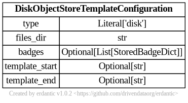

At runtime, after the `configuration` template is expanded, the resulting dictionary
passed to Galaxy's object store infrastructure looks like this and should match a subset
of what you'd be able to add directly to `object_store_conf.yml` (Galaxy's global object
store configuration).

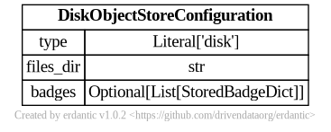

#### `boto3`

Object stores of the type `boto3` can be used to access a wide variety of S3
compatible storage services including AWS S3. How you template them can result in widely
different experiences for your users and can result in addressing a wide variety of use cases.

Here is an example that is tailored for a specific storage service (e.g. CloudFlare R2)
and exposes just the pieces of data CloudFlare users would need.

```{literalinclude} ../../../lib/galaxy/objectstore/templates/examples/cloudflare.yml
:language: yaml
```

Templates can be much more generic or much less generic than this.

In one direction, all the bells and whistles could be exposed to your Galaxy users to allow
them to connect to any S3 compatible storage. This requires a lot more sophistication from
your users but also allows them to connect to many more services. This template is available
here:

```{literalinclude} ../../../lib/galaxy/objectstore/templates/examples/production_generic_s3.yml
:language: yaml
```

On the other hand, you might run a small lab with a dedicate MinIO storage service and just trust
your user's to define individual buckets by name:

```{literalinclude} ../../../lib/galaxy/objectstore/templates/examples/minio_just_buckets.yml
:language: yaml
```

If you want to just target AWS S3 and let your users utilize that as quickly
and easily as possible that templates might look like this:

```{literalinclude} ../../../lib/galaxy/objectstore/templates/examples/production_aws_bucket.yml
:language: yaml
```

The syntax for the `configuration` section of `boto3` templates looks like this.

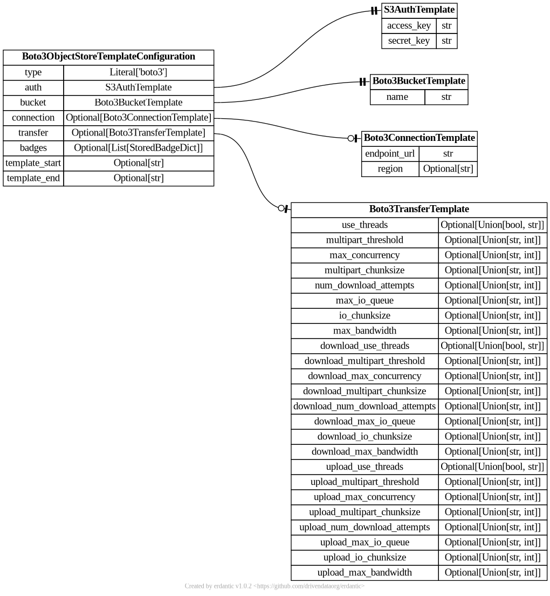

At runtime, after the `configuration` template is expanded, the resulting dictionary
passed to Galaxy's object store infrastructure looks like this and should match a subset
of what you'd be able to add directly to `object_store_conf.yml` (Galaxy's global object
store configuration).

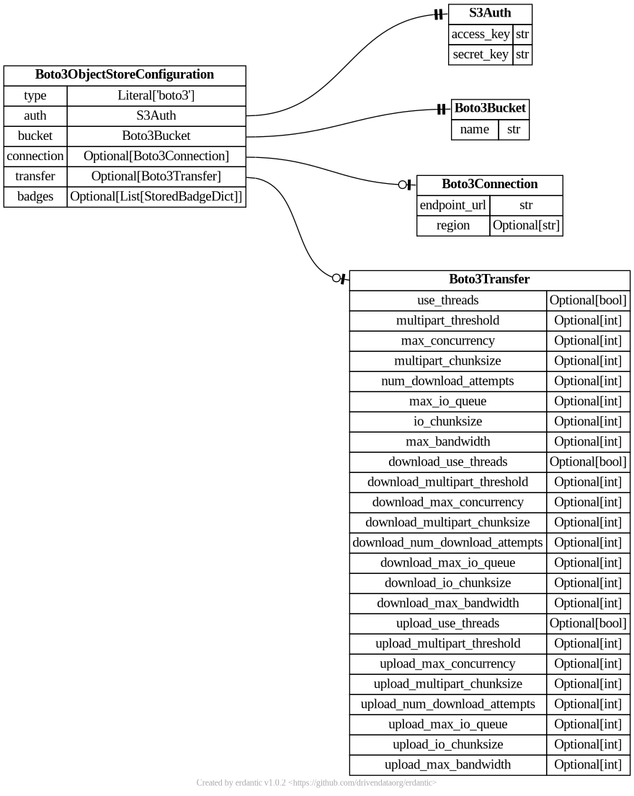

#### `azure_blob`

Here is a "production grade" Azure template that can be essentially used to connect to any
Azure storage container.

```{literalinclude} ../../../lib/galaxy/objectstore/templates/examples/production_azure_blob.yml
:language: yaml
```

This template might be adapted to hide connection details from say users of a individual lab
and just expose what container they should use. That might look something like:

```{literalinclude} ../../../lib/galaxy/objectstore/templates/examples/azure_just_container.yml
:language: yaml
```

This example is a little contrived though, if a small lab or institution has just a few containers
it would likely be a much easier user experience to just wrap them all in a Galaxy hierarchical
object store, document them there, and make them available to your whole Galaxy instance.

The syntax for the `configuration` section of `azure_blob` templates looks like this.


At runtime, after the `configuration` template is expanded, the resulting dictionary
passed to Galaxy's object store infrastructure looks like this and should match a subset
of what you'd be able to add directly to `object_store_conf.yml` (Galaxy's global object
store configuration).

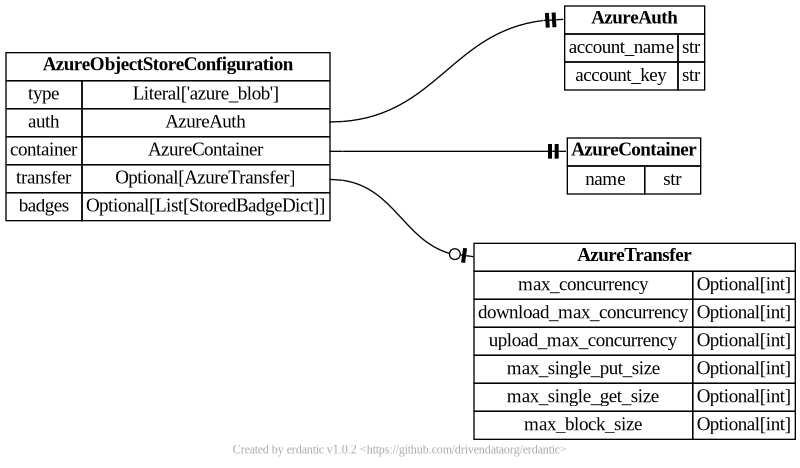

#### `aws_s3` (Legacy)

Object stores of the type `aws_s3` are be used to treat AWS Simple Storage Service (S3) buckets
as Galaxy object stores. See Amazon documentation for information on [S3](https://aws.amazon.com/s3/)
and [how to create buckets](https://docs.aws.amazon.com/AmazonS3/latest/userguide/create-bucket-overview.html)
and [how to create access keys](https://docs.aws.amazon.com/IAM/latest/UserGuide/id_credentials_access-keys.html).

```{literalinclude} ../../../lib/galaxy/objectstore/templates/examples/production_aws_s3_legacy.yml
:language: yaml
```

The `aws_s3` object store is older and more well tested than the `boto3` object store, but
the `boto3` object store is built using a newer, more robust, and more feature-rich client
library so it should probably be the object store you use instead of this.

The syntax for the `configuration` section of `aws_s3` templates looks like this.

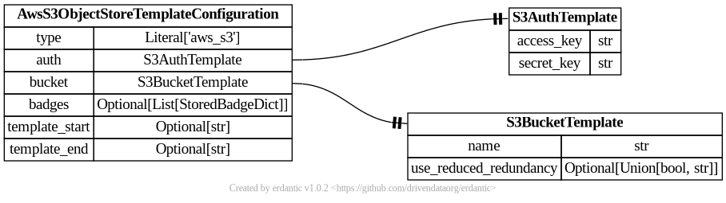

At runtime, after the `configuration` template is expanded, the resulting dictionary
passed to Galaxy's object store infrastructure looks like this and should match a subset
of what you'd be able to add directly to `object_store_conf.yml` (Galaxy's global object
store configuration).

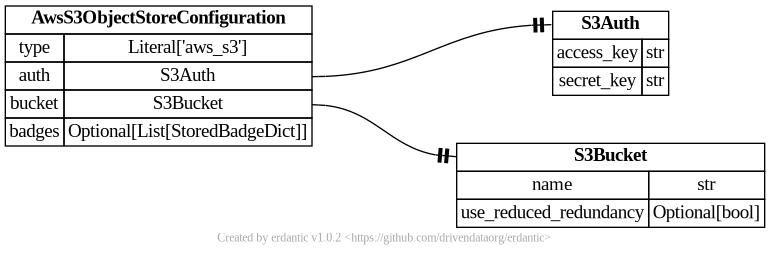

#### `generic_s3` (Legacy)

Object stores of the type `generic_s3` can be used to access a wide variety of S3
compatible storage services. How you template them can result in widely different
experiences for your users and can result in addressing a wide variety of use cases.

Here is an example that is tailored for a specific storage service (e.g. CloudFlare R2)
and exposes just the pieces of data CloudFlare users would need.

```{literalinclude} ../../../lib/galaxy/objectstore/templates/examples/cloudflare_legacy.yml
:language: yaml
```

Templates can be much more generic or much less generic than this.

In one direction, all the bells and whistles could be exposed to your Galaxy users to allow
them to connect to any S3 compatible storage. This requires a lot more sophistication from
your users but also allows them to connect to many more services. This template is available
here:

```{literalinclude} ../../../lib/galaxy/objectstore/templates/examples/production_generic_s3_legacy.yml
:language: yaml
```

On the other hand, you might run a small lab with a dedicate MinIO storage service and just trust
your user's to define individual buckets by name:

```{literalinclude} ../../../lib/galaxy/objectstore/templates/examples/minio_just_buckets_legacy.yml
:language: yaml
```

The syntax for the `configuration` section of `generic_s3` templates looks like this.

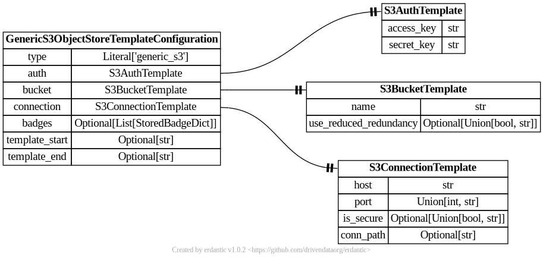

At runtime, after the `configuration` template is expanded, the resulting dictionary
passed to Galaxy's object store infrastructure looks like this and should match a subset
of what you'd be able to add directly to `object_store_conf.yml` (Galaxy's global object
store configuration).

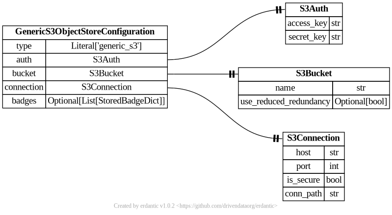

### YAML Syntax

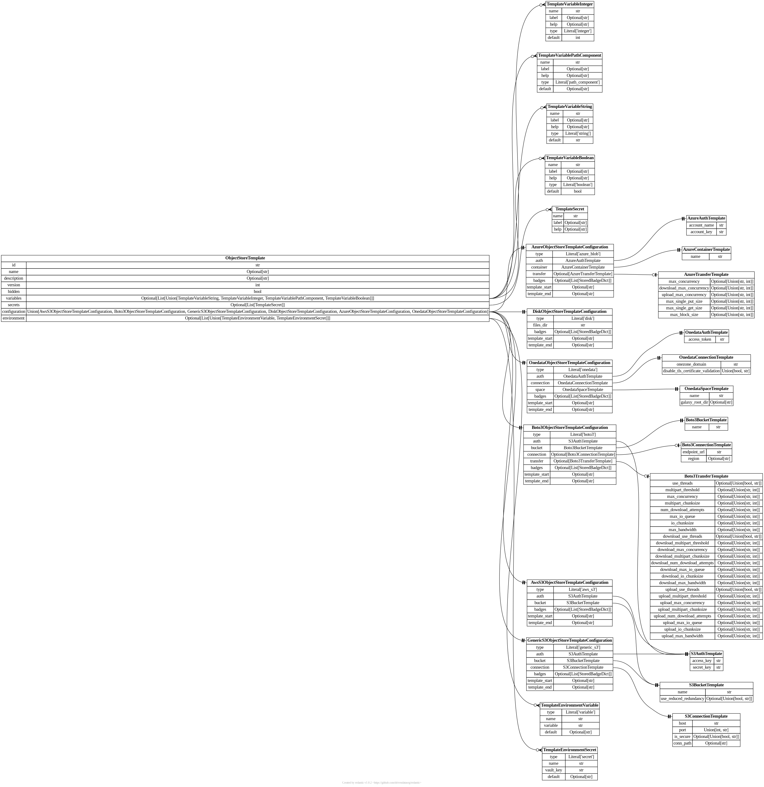

### Ready To Use Production Object Store Templates

The templates are sufficiently generic that they may make sense for a variety of
Galaxy instances, address a variety of potential use cases, and do not need any
additional tailoring, parameterization, or other customization. These assume your
Galaxy instance has [a Vault configured](https://docs.galaxyproject.org/en/master/admin/special_topics/vault.html)
and you're comfortable with it storing your user's secrets.

#### Allow Users to Define Azure Blob Storage as Object Stores

```{literalinclude} ../../../lib/galaxy/objectstore/templates/examples/production_azure_blob.yml
:language: yaml
```


#### Allow Users to Define Generic S3 Compatible Storage Services as Object Stores

```{literalinclude} ../../../lib/galaxy/objectstore/templates/examples/production_generic_s3.yml
:language: yaml
```

#### Allow Users to Define AWS S3 Buckets as Object Stores

```{literalinclude} ../../../lib/galaxy/objectstore/templates/examples/production_aws_s3.yml
:language: yaml
```


#### Allow Users to Define Google Cloud Provider S3 Interop Storage Buckets as Object Stores

This template includes descriptions of how to generate HMAC keys used by this interoperability
layer provided by Google and lots of links to relevant Google Cloud Storage documentation.

```{literalinclude} ../../../lib/galaxy/objectstore/templates/examples/production_gcp_s3.yml
:language: yaml
```


## File Source Templates

Galaxy's file source templates are configured as a YAML list of template objects. This list
can be placed `file_source_templates.yml` in Galaxy configuration directory (or any path
pointed to by the configuration option `file_source_templates_config_file` in `galaxy.yml`).
Alternatively, the configuration can be placed directly into `galaxy.yml` using the
`file_source_templates` configuration option.

### File Source Types

#### `posix`

The syntax for the `configuration` section of `posix` templates looks like this.

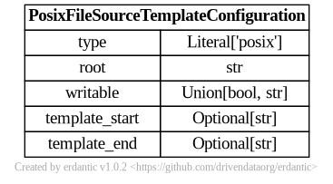

At runtime, after the `configuration` template is expanded, the resulting dictionary
passed to Galaxy's file source plugin infrastructure looks like this and should match a subset
of what you'd be able to add directly to `file_sources_conf.yml` (Galaxy's global file source
configuration).

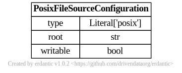

#### `s3fs`

```{literalinclude} ../../../lib/galaxy/files/templates/examples/production_s3fs.yml
:language: yaml
```

```{literalinclude} ../../../lib/galaxy/files/templates/examples/production_aws_public_bucket.yml
:language: yaml
```

```{literalinclude} ../../../lib/galaxy/files/templates/examples/production_aws_private_bucket.yml
:language: yaml
```

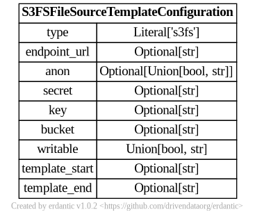

At runtime, after the `configuration` template is expanded, the resulting dictionary
passed to Galaxy's file source plugin infrastructure looks like this and should match a subset
of what you'd be able to add directly to `file_sources_conf.yml` (Galaxy's global file source
configuration).

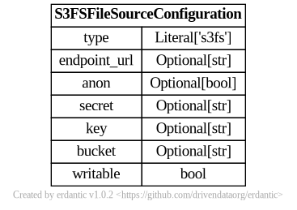

#### `ftp`

```{literalinclude} ../../../lib/galaxy/files/templates/examples/production_ftp.yml
:language: yaml
```

The syntax for the `configuration` section of `ftp` templates looks like this.

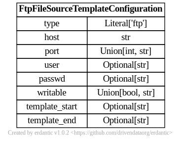

At runtime, after the `configuration` template is expanded, the resulting dictionary
passed to Galaxy's file source plugin infrastructure looks like this and should match a subset
of what you'd be able to add directly to `file_sources_conf.yml` (Galaxy's global file source
configuration).

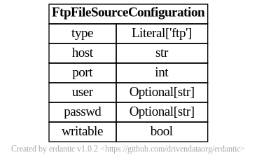

#### `azure`

The syntax for the `configuration` section of `azure` templates looks like this.

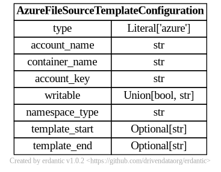

At runtime, after the `configuration` template is expanded, the resulting dictionary
passed to Galaxy's file source plugin infrastructure looks like this and should match a subset
of what you'd be able to add directly to `file_sources_conf.yml` (Galaxy's global file source
configuration).

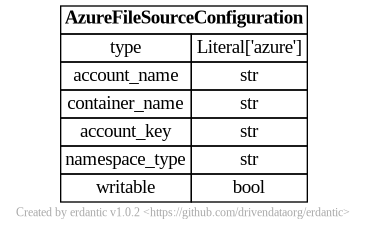

#### `webdav`

The syntax for the `configuration` section of `webdav` templates looks like this.

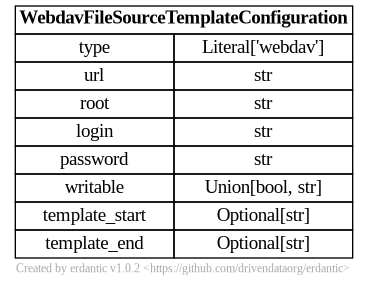

At runtime, after the `configuration` template is expanded, the resulting dictionary
passed to Galaxy's file source plugin infrastructure looks like this and should match a subset
of what you'd be able to add directly to `file_sources_conf.yml` (Galaxy's global file source
configuration).


#### `dropbox`

The syntax for the `configuration` section of `dropbox` templates looks like this.

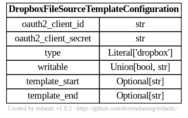

At runtime, after the `configuration` template is expanded, the resulting dictionary
passed to Galaxy's file source plugin infrastructure looks like this and should match a subset
of what you'd be able to add directly to `file_sources_conf.yml` (Galaxy's global file source
configuration).

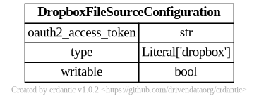

#### `elabftw`

The syntax for the `configuration` section of `elabftw` templates looks like this.

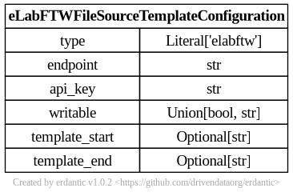

At runtime, after the `configuration` template is expanded, the resulting dictionary
passed to Galaxy's file source plugin infrastructure looks like this and should match a subset
of what you'd be able to add directly to `file_sources_conf.yml` (Galaxy's global file source
configuration).

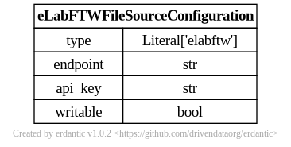

#### `inveniordm`

The syntax for the `configuration` section of `inveniordm` templates looks like this.


At runtime, after the `configuration` template is expanded, the resulting dictionary
passed to Galaxy's file source plugin infrastructure looks like this and should match a subset
of what you'd be able to add directly to `file_sources_conf.yml` (Galaxy's global file source
configuration).


### YAML Syntax


### Ready To Use Production File Source Templates

The templates are sufficiently generic that they may make sense for a variety of
Galaxy instances, address a variety of potential use cases, and do not need any
additional tailoring, parameterization, or other customization. These (mostly) assume
your Galaxy instance has [a Vault configured](https://docs.galaxyproject.org/en/master/admin/special_topics/vault.html)
and you are comfortable with it storing your user's secrets.

#### Allow Users to Define Generic FTP Servers as File Sources

```{literalinclude} ../../../lib/galaxy/files/templates/examples/production_ftp.yml
:language: yaml
```


#### Allow Users to Define Azure Blob Storage as File Sources

```{literalinclude} ../../../lib/galaxy/files/templates/examples/production_azure.yml
:language: yaml
```


#### Allow Users to Define Generic S3 Compatible Storage as File Sources

```{literalinclude} ../../../lib/galaxy/files/templates/examples/production_s3fs.yml
:language: yaml
```

#### Allow Users to Define Publicly Accessible AWS S3 Buckets as File Sources

```{literalinclude} ../../../lib/galaxy/files/templates/examples/production_aws_public_bucket.yml
:language: yaml
```


#### Allow Users to Define Private AWS S3 Buckets as File Sources

```{literalinclude} ../../../lib/galaxy/files/templates/examples/production_aws_private_bucket.yml
:language: yaml
```

#### Allow Users to Define WebDAV Servers as File Sources

```{literalinclude} ../../../lib/galaxy/files/templates/examples/production_webdav.yml
:language: yaml
```


#### Allow Users to Define eLabFTW Instances as File Sources

```{literalinclude} ../../../lib/galaxy/files/templates/examples/production_elabftw.yaml
:language: yaml
```

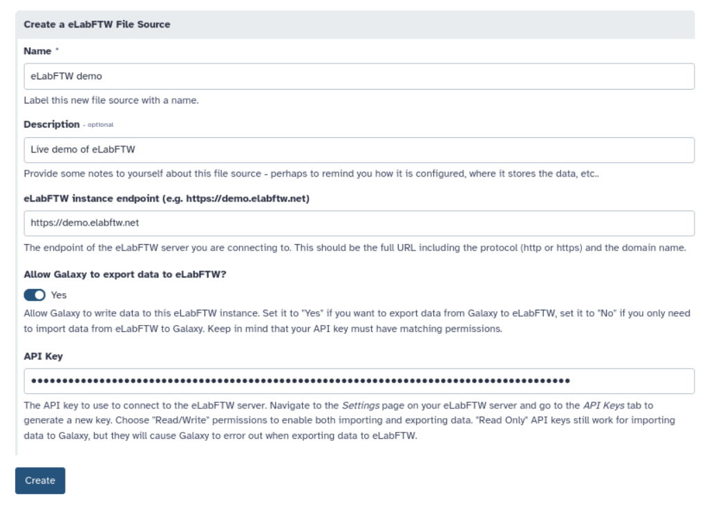

#### Allow Users to Define InvenioRDM Servers as File Sources

```{literalinclude} ../../../lib/galaxy/files/templates/examples/production_invenio.yaml
:language: yaml
```


### Production OAuth 2.0 File Source Templates

Unlike the examples in the previous section. These examples will require a bit of
configuration on the part of the admin. This is to obtain client credentials from the
external service and register an OAuth 2.0 redirection callback with the remote service.

#### Dropbox

Once you have OAuth 2.0 client credentials from Dropbox (called `oauth2_client_id` and
`oauth2_client_secret` here), the following configuration can be used configure your Galaxy
instance to enable Dropbox.

```{literalinclude} ../../../lib/galaxy/files/templates/examples/production_dropbox.yml
:language: yaml
```

To use this template - you'll need to make your credentials available to Galaxy's
web and job handler processes using the environment variables `GALAXY_DROPBOX_APP_CLIENT_ID`
and `GALAXY_DROPBOX_APP_CLIENT_SECRET`. Your jobs themselves do not require
these secrets to be set and will not be given the secrets.

If you'd like to configure these secrets explicit - you can configure them explicitly
in the configuration. If your configuration file is managed by Ansible, these secrets
could potentially be populated from your Ansible vault.

```{literalinclude} ../../../lib/galaxy/files/templates/examples/dropbox_client_secrets_explicit.yml
:language: yaml
```

To obtain the OAuth 2.0 credentials from Dropbox, you'll need to navigate to your
[Dropbox Apps](https://www.dropbox.com/developers/apps) and create a new app
for your Galaxy instance with the "Create app" button.


The only option available is "Scoped access" and this works fine for typical
Galaxy use cases. You will however want to click "Full Dropbox" to request
full access to your user's account. You will also need to give your "App" a name
here, this should likely be something related to your Galaxy instances name.


After your app is created, you'll be presented with a management screen for it.
The first thing you'll want to do is navigate to the permissions tab and enable
permissions to read and write to files and directories so the file source plugin
works properly:


Next, navigate back to the "Settings" tab. You'll need to register a callback
for your Galaxy instance (it will need HTTPS enabled). This should be the URL
to your Galaxy instance with `oauth2_callback` appended to it.


Finally you'll be able to find the `oauth2_client_id` and `oauth2_client_secret`
to configured your Galaxy with on this settings page.


Until you have 50 users, your App will be considered a "development" application.
The upshot of this is that your user's will get a scary message during authorization
but there seems to be no way around this. 50 users would definitely be considered
a production Galaxy instance but Dropbox operates on a different scale.

For more information on what Dropbox considers a "development" app versus a "production"
app - checkout the [Dropbox documentation](https://www.dropbox.com/developers/reference/developer-guide#production-approval).

## Playing Nicer with Ansible

Many large instances of Galaxy are configured with Ansible and much of the existing administrator
documentation leverages Ansible. The configuration template files using Jinja templating and so
does Ansible by default. This might result in a lack of clarity of when templates (strings
starting with `{{` and ending with `}}`) are being evaluated. Ansible templates are evaluated
at deploy time and the configuration objects describing plugins are evaluated at Galaxy runtime.

The easiest way to fix this is probably to store these templates files in your Ansible as plain files
and not templates. If you'd like to use Ansible templating to build up these files you'll very
likely need to tell either Galaxy or Ansible to use something other than `{{` and `}}` for
templating variables. This can be done by placing a directive at the top of your template that
is consumed by Ansible. For instance, to have `[%` and `%]` used instead of `{{` and `}}`
by Ansible at deploy time, the file could start with:

```
#jinja2:variable_start_string:'[%' , variable_end_string:'%]'
```

In this case, variables wrapped by `[%` and `%]` are expanded by Ansible and use the Ansible
environment and `{{` and `}}` are reserved for Galaxy templating.

Alternatively, Galaxy can be configured to use a custom template on a per-configuration
object basis by setting the `template_start` and/or `template_end` variables.

The following template chunk shows how to override the templating Galaxy does for a
particular object store configuration. Similar templating overrides work for file source
plugin templates.

```{literalinclude} ../../../lib/galaxy/files/templates/examples/templating_override.yml
:language: yaml
```

-   https://github.com/ansible/ansible/pull/75306
-   https://stackoverflow.com/questions/12083319/add-custom-tokens-in-jinja2-e-g-somevar

## Jinja Template Reference

Galaxy configuration file templating uses [Jinja](https://jinja.palletsprojects.com/en/3.0.x/templates/) to template values and connect inputs, configuration, and the runtime environment
into concrete configuration YAML blocks.

Jinja is fairly straight forward to learn but this document provides tons of examples and
one can probably adapt them to whatever you're interested in building without really needing
to dig deeply into Jinja. However, this section does outline what Galaxy does inject into the
Jinja environment to serve as a reference.

Even the most exotic configurations will likely only scratch the surface of what Jinja
allows and implements. The only relevant Jinja documentation you'll need in these cases
is probably just those documents on [variables](https://jinja.palletsprojects.com/en/3.0.x/templates/#variables), [filters](https://jinja.palletsprojects.com/en/3.0.x/templates/#filters),
and the [list of builtin filters](https://jinja.palletsprojects.com/en/3.0.x/templates/#list-of-builtin-filters).

### `variables`

This is a typed dictionary object is populated with user supplied values defined via the the `variables` section of the configuration template and filled in by the user when they
created a new object store or file source.

### `secrets`

This is a dictionary of strings populated with user supplied secrets defined via the the `secrets` section of the configuration template and filled in by the user when they
created a new object store or file source.

A deep dive into these can be found in the [User Secrets](#user-secrets) section of this document.

### `environment`

This dictionary object is populated with admin-supplied values defined via the the `environment`
section of the configuration template.

A deep dive into these can be found in the [Admin Secrets](#admin-secrets) section of this document.

```{literalinclude} ../../../lib/galaxy/files/templates/examples/admin_secrets_with_defaults.yml
:language: yaml
```

### `user`

This dictionary object exposes information about user configuring and using a target template
configuration. These values are populated from the `galaxy_user` table of the Galaxy database.
The current properties exposed include:

| Key        | Description                                               |
| ---------- | --------------------------------------------------------- |
| `username` | string corresponding the username of the Galaxy user      |
| `email`    | string corresponding the email of the Galaxy user         |
| `id`       | integer primary key of user object in the Galaxy database |

The simple example of project scratch storage used to describe these concepts made
use the Galaxy user's username to generate unique paths.

```{literalinclude} ../../../lib/galaxy/objectstore/templates/examples/simple_example.yml
:language: yaml
```

### `ensure_path_component`

This [Jinja filter](https://jinja.palletsprojects.com/en/3.0.x/templates/#filters)
will fail template evaluation if the value it is applied to is not
a simple directory name. If it contain `..` or `/` or in some other way might
be used to attempt path exploitation of cause odd path-related bugs. This is
useful when producing paths for `disk` object stores or `posix` file sources.

When taking inputs from users, setting the type of `path_component` instead of
`string` allows the client to validate potential issues way before this point,
but many path components might be built from environment variables or usernames
or sources like this that are not explicitly user inputs.

An example of an object store template that uses this is the simple scratch example
that was used to introduce concepts at the start of the object store template
documentation above.

```{literalinclude} ../../../lib/galaxy/objectstore/templates/examples/simple_example.yml
:language: yaml
```

### `asbool`

This [Jinja filter](https://jinja.palletsprojects.com/en/3.0.x/templates/#filters)
will use Galaxy configuration style logic to convert string values into boolean ones.

When taking inputs from users, setting the type of `boolean` is sufficient to ensure
a variable is boolean, but "secrets" and environment variables and many other things
are likely to be of type string but should be used in a template that expects boolean
values.

An example of an object store template that uses this is `secure` environment parameter
on the simple minio example.

```{literalinclude} ../../../lib/galaxy/objectstore/templates/examples/minio_example.yml
:language: yaml
```

## Connecting Configuration Templates to Secrets

(user-secrets)=

### User Secrets

Most of the examples in this document use secrets of one kind or another. For instance, in the FTP
example - the password field is a secret.

```{literalinclude} ../../../lib/galaxy/files/templates/examples/production_ftp.yml
:language: yaml
```

Instead of being saved in the database in plain text, Galaxy will use a configured Vault to store
this data. Check out Galaxy admin documentation on [Storing secrets in the vault](https://docs.galaxyproject.org/en/master/admin/special_topics/vault.html) for descriptions of how to configure
a vault. Most interesting user defined file sources and/or object stores will require a Galaxy Vault.

In this FTP example, a new Vault key will be created for each FTP instance the user creates.
The user file source APIs and management user interface will be responsible for orchestration of
storing and updating secrets. The Vault key for this password will be something like:

```
/galaxy/user/<user_id>/file_source_config/<file_source_instance_uuid>/password
```

Here `user_id` is the primary key of the User object in the database and
`file_source_instance_uuid` is the `uuid` value corresponding to the `user_file_source`
table in the database.

User defined object stores are stored in a similar fashion but at:

```
/galaxy/user/<user_id>/object_store_config/<object_store_instance_uuid>/<secret_name>
```

During the creation of an object store or file source, the secrets will be appended to the generated
form as password fields.


After an object store has been created, a user has the option to edit the settings in the UI.
Most of the settings appear in a simple form - but the secrets are managed and updated
individually in the "Secrets" tab.


(admin-secrets)=

### Admin Secrets

Administrators may define secrets that are available to all users and aren't parameterized
on a per-instance basis. These secrets can be injected into template instances through Vault
keys or through environment variables.

Each template may optionally define an `environment` key where these can be defined. The
following template entry describes a file source that injects the environment variable
`GALAXY_SECRET_HOME_VAR` into the template as `environment.var` and injects the Vault
key `secret_directory_file_source/my_secret` into the template as `environment.var`.
This template uses these variables to construct a root path for a `posix` file source
but the same secrets could just as easily store cloud keys and configure an S3 object store.

```{literalinclude} ../../../lib/galaxy/files/templates/examples/admin_secrets.yml
:language: yaml
```

If you'd like to make the target secrets optional, default values can also be setup.
The following block demonstrates the same configuration but with default values of
`default_var` for the default `var` value and `default_sec` for the default `sec`
value. These will be used in the target Vault keys are absent or the target environment
variable is not defined at runtime.

```{literalinclude} ../../../lib/galaxy/files/templates/examples/admin_secrets_with_defaults.yml
:language: yaml
```

## OAuth 2.0 Enabled Configurations

[OAuth 2.0](https://oauth.net/2/) has become an industry standard for allowing users
of various services (e.g. Dropbox or Google Drive) to authorize other services (e.g. Galaxy)
fine grained access to the services. There is a bit of a dance the services need to do
but the result can be a fairly nice end-user experience. The framework for configuring
user defined data access templates can support OAuth 2.0.

Galaxy keeps track of which plugin `type`s (currently only file source types) require
OAuth2 to work properly and will take care of authorization redirection, saving refresh tokens,
etc.. implicitly. One such `type` is `dropbox`. Here is the production Dropbox
template distributed with Galaxy.

```{literalinclude} ../../../lib/galaxy/files/templates/examples/production_dropbox.yml
:language: yaml
```

OAuth2 enabled plugin types include template definitions that include `oauth2_client_id`
and `oauth2_client_secret` in the configuration (as shown in the following specification
and in the above examples).


The above example defines these secrets using environment variables but they can stored in
Galaxy's Vault explicitly by the admin or written right to the configuration files as shown
in the next two examples:

```{literalinclude} ../../../lib/galaxy/files/templates/examples/dropbox_client_secrets_in_vault.yml
:language: yaml
```

```{literalinclude} ../../../lib/galaxy/files/templates/examples/dropbox_client_secrets_explicit.yml
:language: yaml
```

Looking at the configuration objects that get generated at runtime
from these templates though - `oauth2_client_id` and `oauth2_client_secret` no longer
appear and instead have been replaced with a `oauth2_access_token` parameter.
Galaxy will take care of stripping out the client (e.g. Galaxy server) information and
replacing it with short-term access tokens generated for the user's resources.


Normally, a UUID is created for each user configured instance object and this is used
to store the template's explicitly listed secrets in Galaxy's Vault. For OAuth 2.0
plugin types - before user's are even prompted for configuration metadata they are redirected
to the remote service and prompted to authorize Galaxy to act on their behalf when using
the remote service. If they authorize this, the remote service will send an [`authorization
code`](https://oauth.net/2/grant-types/authorization-code/) to `https://<galaxy_url>/oauth2_callback` along with state information
to recover which instance is being configured. At this point, Galaxy will fetch a [`refresh token`](https://oauth.net/2/refresh-tokens/) from the remote resource using the
supplied authorization code. The refresh token is stored in the Vault in key associated with
the UUID of the object that will be created when the user finishes the creation process.
Specifically it is stored at

```
/galaxy/user/<user_id>/file_source_config/<file_source_instance_uuid>/_oauth2_refresh_token
```

Here is the prefix at the end of `_` is indicating that Galaxy is managing this instead of
it being listed explicitly in a `secrets` section of the template configuration like the
explicit Vault secrets discussed in this document.

Galaxy knows how to fetch an [`access token`](https://oauth.net/2/access-tokens/) from this
refresh token that is actually used to interact with the remote resource. This is the property
`oauth2_access_token` that is injected into the configuration object shown above and passed
along to the actual object store or file source plugin implementation.
