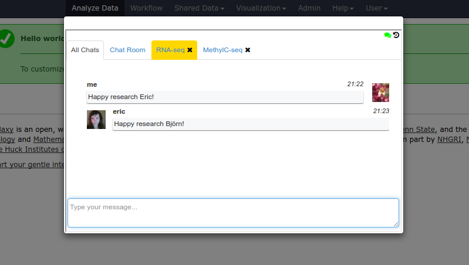
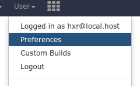
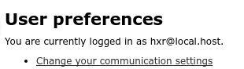
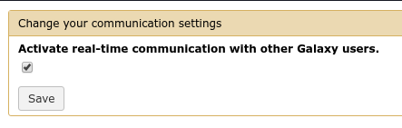
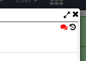
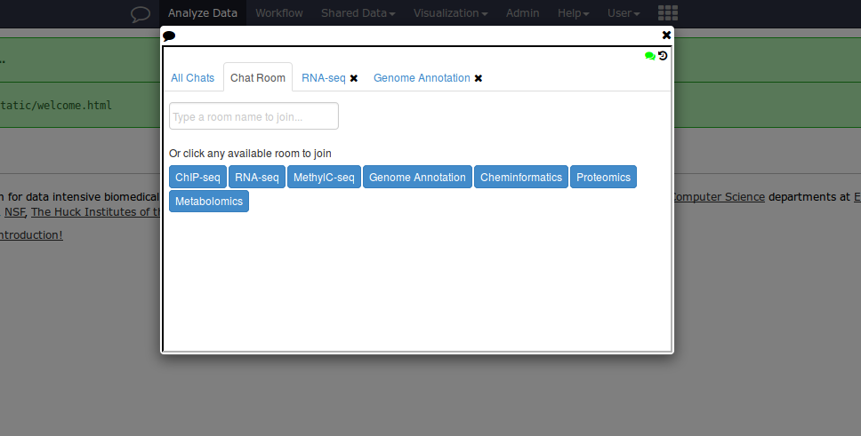

Galaxy Communication Server
===========================

A problem faced by administrators, especially those of smaller galaxy sites, is how to connect users with documentation on workflows and analysis procedures, and then helping them through running these steps. For sites where the admins and the tool developers are the same groups, finding time for developing the required training resources and providing the level of hands-on guidance required can be an impossible challenge in time management.

In order to solve this, a simple chat server has been added to Galaxy to provide realtime communication between users. The hope is that this will decrease the burden on administrators:

- *Troubleshooting*: When users have trouble with a tool, they can ask in chat if
  anyone can help, rather than coming to administrators and tool developers
  first.
- *Sharing*: Your galaxy users can easily talk to coworkers, maybe learn about
  new analyses they've each developed
- *Dedicated Discussion*: The chat implementation provides the ability to
  designate some fixed chat rooms which will always be visible to users, these
  can be used to help guide user discussion to topics like NGS.

Pre-requisites
--------------

This service will need to be deployed on a host that has:

- Access to the Galaxy database
- A port exposed
- A non-default ``id_secret`` set in your ``galaxy.yml``

We say "access to galaxy database", this service could run on an NFS mounted
copy of Galaxy, if the host it is deployed on can access the database of the
main galaxy instance. This is required, because the chat service validates
connecting users to prevent impersonation.

Deploying the Server
--------------------

The chat server is a very new feature in Galaxy and has been disabled by
default at a number of levels, as not all users may wish to use this feature.

Configuration is managed in ``galaxy.yml``:

.. code-block::  yaml

    # Galaxy real time communication server settings
    enable_communication_server: True
    communication_server_host: http://localhost
    communication_server_port: 7070
    # persistent_communication_rooms is a comma-separated list of rooms that should be always available.
    persistent_communication_rooms: NGS,RNA-Seq,Genome Annotation

As you can see in this configuration, it is pointing at a service running on
the same host as Galaxy, talking to port 7070.

Once you have configured this portion, you will want to install the required
dependencies, and launch the chat server. This is run as a separate flask based
service.

Installing the Dependencies
---------------------------

Most admins will find it convenient to activate the Galaxy virtualenv, and run
the following command:

.. code-block:: console

    (.venv)$ pip install flask flask-login flask-socketio eventlet

You can then launch the server:

.. code-block:: console

    (.venv)$ python ./scripts/communication/communication_server.py --port 7070 --host localhost

Next we'll configure user-level access.

Enabling the Chat Interace
--------------------------

Users who wish to enable the chat can do so in their user preferences.

There is a new element at the top of the list, which controls chat preferences

And a short dialog to enable it

After which, a new icon becomes visible next to "Analyse Data" on your Galaxy
header.

.. image:: chat-3.png

Opening the chat interface, lastly we notice that chat defaults to an offline
state. Clicking the red chat bubble icon will turn it green and allow the user
to engage with others.

Finally users can connect with one another within Galaxy.

Security Considerations
-----------------------

This service does:

- Ensure authenticated access by decoding their Galaxy ``galaxysession``
  cookie.
- Prevent user spoofing

This service does not:

- enforce rate-limiting of messages
- run any sort of text/obscenity filtering rules
- prevent user spoofing if the user is an administrator and impersonating
  another user

Keeping the Chat Server Running
-------------------------------

Here is an example supervisord configuration for keeping the chat server running:

.. code-block:: console

    [program:galaxy_chat_server]
    directory       = GALAXY_ROOT
    command         = python ./scripts/communication/communication_server.py --port 7070 --host localhost
    autostart       = true
    autorestart     = unexpected
    user            = GALAXY_USER
    startsecs       = 2
    redirect_stderr = true

Configuration with virtualenvs will be slightly different.
