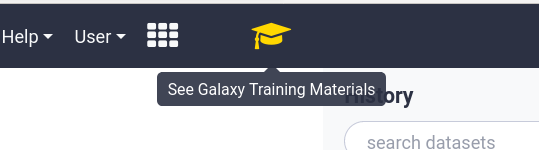

# Galaxy Training Materials Webhook

We have added an enabled-by-default webhook for accessing the GTN materials
within Galaxy. This provides users with easy access to a significant wealth of
free, open Galaxy training material across a wide array of topics.



For many users screen space is at a premium, this embeds the training directly
within Galaxy, allowing users to toggle back and forth quite easily.

By default the webhook will check if `/training-material/` is accessible, on
the same server as Galaxy. If it is, it will display that. Otherwise, it will
show the [public website](https://training.galaxyproject.org).

## Click to Run


If you choose to setup a proxy for the GTN (or deploy a local training site),
then an advanced feature will be activated: Tools will be highlighted in the
GTN, and your users can click on these to have that tool loaded in Galaxy.

## Proxy Setup


```nginx
location /training-material/ {
    proxy_pass https://training.galaxyproject.org/training-material/;
}
```
