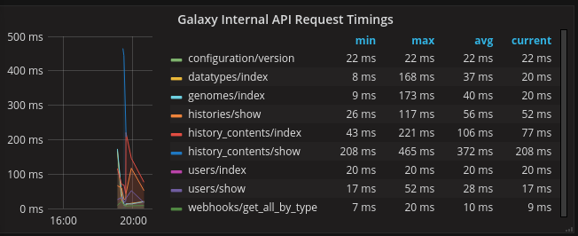

Galaxy Performance Tracking
===========================

Tracking performance over time and identifying slow queries in your Galaxy can be an extremely important thing to do, especially for larger Galaxies.
A more `in-depth tutorial <https://training.galaxyproject.org/training-material/topics/admin/tutorials/monitoring/tutorial.html>`__ is available at the Galaxy Training Network.

Most performance tracking requires sending metrics to a metrics collection server such as `StatsD <https://github.com/etsy/statsd/>`__. This document assumes you have already deployed StatsD.

Gunicorn
--------

There is some built-in `Gunicorn <https://docs.gunicorn.org/en/stable/instrumentation.html>`__ support for performance logging. You can send Gunicorn's internal metrics to a StatsD server by setting the `--statsd-host` and `--statsd-prefix` command line options for Gunicorn in the `gravity` section of `galaxy.yml`:

.. code-block:: yaml

   gravity:
      #...
      gunicorn:
        extra_args: '--statsd-host 127.0.0.1:8125 --statsd-prefix=gunicorn'

API / Route Timing Statistics
-----------------------------

Galaxy provides middleware to automatically log the amount of time controllers take to execute and to send that data to a stats server. Using the stats server of your choice, you can calculate the relevant statistics to ensure that your Galaxy server is performing as expected.

The statsD configuration requires setting the following options in the ``galaxy`` section of ``config/galaxy.yml``:

.. code-block:: yaml

    galaxy:
      #...
      statsd_host: 127.0.0.1
      statsd_port: 8125
      statsd_prefix: galaxy

Most people visualize the statistics using something like `Grafana <https://grafana.com/>`__:

