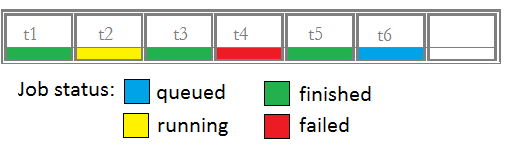

Build a job runner
==================

A walk through the steps of building a runner for Galaxy
~~~~~~~~~~~~~~~~~~~~~~~~~~~~~~~~~~~~~~~~~~~~~~~~~~~~~~~~

In this tutorial, we would build the runner in a block by block fashion
(like the building blocks), so we would divide the runner into
components based on their function.

We assume you are familiar with setting up and managing a local installation of Galaxy.

To learn more about the basics, please refer to:
https://galaxyproject.org/admin/get-galaxy/

To explore existing runners, please refer to:
https://github.com/galaxyproject/galaxy/blob/dev/lib/galaxy/jobs/runners

What is required to make a runner for Galaxy?
~~~~~~~~~~~~~~~~~~~~~~~~~~~~~~~~~~~~~~~~~~~~~

`galaxy.jobs.runners.\_\_init\_\_.py <https://github.com/galaxyproject/galaxy/blob/dev/lib/galaxy/jobs/runners/__init__.py>`__
has the base runner implementation. To create a new runner, that base
runner must be inherited and only certain methods need to be
overridden with your logic.

These are the following methods which need to be implemented: 

1. \_\_init\_\_(app, nworkers, \*\*kwargs)

2. queue\_job(job\_wrapper)

3. check\_watched\_item(job\_state)

4. stop\_job(job)

5. recover(job, job\_wrapper)

The big picture
---------------

The above methods are invoked at various state of a job execution in
Galaxy. These methods will act as a mediator between the Galaxy
framework and the external executor framework. To know, when and how
these methods are invoked, we will see about the implementation of
parent class and process lifecycle of the runner.

Implementation of parent class (galaxy.jobs.runners.\_\_init\_\_.py)
~~~~~~~~~~~~~~~~~~~~~~~~~~~~~~~~~~~~~~~~~~~~~~~~~~~~~~~~~~~~~~~~~~~~

-  .. rubric:: Class Inheritance structure
      :name: class-inheritance-structure

   .. image:: inherit.png

-  .. rubric:: The big picture!
      :name: the-big-picture-1

   .. image:: runner_diag.png

The whole process is divided into different stages for understanding
purpose.

Runner Methods in detail
~~~~~~~~~~~~~~~~~~~~~~~~

1. \_\_init\_\_ method - STAGE 1
~~~~~~~~~~~~~~~~~~~~~~~~~~~~~~~~

Input params:

1. app

2. nworkers (Number of threads specified in job\_conf)

3. \*\*kwargs (Variable length argument)

Output params: NA

The input params are read from job\_conf.xml and passed to the runner by
the Galaxy framework. Configuration of where to run jobs and external
runner configuration is performed in the job\_conf.xml file. More
information about job\_conf.xml is available
`here <https://galaxyproject.org/admin/config/jobs/>`__.

Have a look at the sample job\_conf.xml:

::

    <job_conf>
        <plugins>
            <plugin id="local" type="runner" load="galaxy.jobs.runners.local:LocalJobRunner" workers="4"/>
            <plugin id="godocker" type="runner" load="galaxy.jobs.runners.godocker:GodockerJobRunner">
                <param id="user">gosc</param>
                <param id="key">HELLOWORLD</param>
            </plugin>
        </plugins>
        <handlers>
            <handler id="main"/>
        </handlers>
        <destinations default="god">
            <destination id="local" runner="local"/>
            <destination id="god" runner="godocker">
                <param id="docker_cpu">1</param>
                <param id="docker_memory">2</param>
            </destination>
        </destinations>
    </job_conf>

The following steps are followed to manipulate the data in job\_conf.xml

A: Define structure of data under plugin tag (plugin tag in
job\_conf.xml) as a dictionary.

::

    runner_param_specs = dict(user=dict(map=str), key=dict(map=str))

B: Update the dictionary structure in kwargs.

::

    kwargs.update({'runner_param_specs': runner_param_specs})

C: Now call the parent constructor to assign the values.

::

    super(GodockerJobRunner, self).__init__(app, nworkers, **kwargs)

D: The assigned values can be accessed in runner in the following way.

::

    print self.runner_params["user"] 
    print self.runner_params["key"]

The output will be:

::

    gosc
    HELLOWORLD

E: Invoke the external API with the values obtained by the above method
for initialization.

Finally the worker threads and monitor threads are invoked for galaxy to
listen for incoming tool submissions.

::

    self._init_monitor_thread()
    self._init_worker_threads()

2. queue\_job method - STAGE 2
~~~~~~~~~~~~~~~~~~~~~~~~~~~~~~

Input params: job\_wrapper (Object of
`galaxy.jobs.JobWrapper <https://github.com/galaxyproject/galaxy/blob/dev/lib/galaxy/jobs/__init__.py#L743>`__)

Output params: None

galaxy.jobs.JobWrapper is a Wrapper around 'model.Job' with convenience
methods for running processes and state management.

-  Functioning of queue\_job method. 

   A. prepare\_job() method is invoked to do some sanity checks that all runners' queue\_job() methods are
   likely to want to do and also to build runner command line for that
   job. Initial state and configuration of the job are set and every
   data is associated with **job\_wrapper**.

B. Submit job to the external runner and return the jobid. Accessing
jobs data (tool submitted in Galaxy webframework) is purely from
job\_wrapper. eg: job\_wrapper.get\_state() -> gives state of a job
(queued/running/failed/success/...)

Let us look at a means of accessing external runner's configuration
present under destination tag of job\_conf.xml in the above example.

::

    job_destination = job_wrapper.job_destination
    docker_cpu = int(job_destination.params["docker_cpu"])
    docker_ram = int(job_destination.params["docker_memory"])

A special case: User Story: A docker based external runner is present. A
default docker image for execution is set in job\_conf.xml. A tool can
also specify the docker image for its execution. Specification in tool
is given more priority than the default specification. To achieve such a
functionality. We can use the following statement:

::

    docker_image = self._find_container(job_wrapper).container_id

Note: This pre-written method is only for getting the external
image/container/os..

C. After successful submission of job in the external runner, submit the
job to Galaxy framework. To do that,make an object of
AsynchronousJobState and put it in monitor\_queue.

::

    ajs = AsynchronousJobState(files_dir=job_wrapper.working_directory, job_wrapper=job_wrapper, job_id=job_id, job_destination=job_destination)
    self.monitor_queue.put(ajs)

3. check\_watched\_item method - STAGE 3
~~~~~~~~~~~~~~~~~~~~~~~~~~~~~~~~~~~~~~~~

Input params: job\_state (Object of
`galaxy.jobs.runners.AsynchronousJobState <https://github.com/galaxyproject/galaxy/blob/dev/lib/galaxy/jobs/runners/__init__.py#L400>`__)

Output params: AsynchronousJobState object

Without going into much detail, assume there is a queue to track the status of every job. eg:

The galaxy framework updates the status of a job by iterating through the
queue. During the iteration, it calls check\_watched\_item method with the job.
Your responsibility will be to get the status of execution of the job from the
external runner and return the updated status of the job, and also to
copy the output files for the completed jobs.

Updated result after an iteration (after invocation of check\_watched\_item 6 times):

Note: Iterating through the queue is already taken care by the framework.

To inform galaxy about the status of the job:

-  Get the job status from external runner using the job\_id.

-  Check if the job is queued/running/completed.. etc. A general structure is provided below.

-  Call self.mark\_as\_finished(job\_state), if the job has been successfully executed.

-  Call self.mark\_as\_failed(job\_state), if the job has failed during execution.

-  To change state of a job, change job\_state.running and job\_state.job\_wrapper.change\_state()

::

    def check_watched_item(self, job_state):
            !job_status = get_task_from_external_runner(job_state.job_id)
            if job_status == "over_with_success":
                job_state.running = False
                job_state.job_wrapper.change_state(model.Job.states.OK)
                !create_log_file()
                self.mark_as_finished(job_state)
                return None

            elif job_status == "running":
                job_state.running = True
                job_state.job_wrapper.change_state(model.Job.states.RUNNING)
                return job_state

            elif job_status == "pending":
                return job_state

            elif job_status == "over_with_error":
                job_state.running = False
                job_state.job_wrapper.change_state(model.Job.states.ERROR)
                !create_log_file()
                self.mark_as_failed(job_state)
                return None

Note:

-  Methods prefixed with ! are user-defined methods.

-  Return value is job\_state for running,pending jobs and None for rest of the states of jobs.

create\_log\_files() are nothing but copying the files (error\_file,
output\_file, exit\_code\_file) from external runner's directory to
working directory of Galaxy.

Source of the files are from the output directory of your external
runner. Destination of the files will be:

-  output file -> job\_state.output\_file.

-  error file -> job\_state.error\_file.

-  exit code file -> job\_state.exit\_code\_file.

4. stop\_job method - STAGE 4
~~~~~~~~~~~~~~~~~~~~~~~~~~~~~

Input params: job (Object of
`galaxy.model.Job <https://github.com/galaxyproject/galaxy/blob/dev/lib/galaxy/model/__init__.py#L344>`__)

Output params: None

Functionality: Attempts to delete a dispatched executing Job in external
runner.

When an user requests to stop the execution of job in Galaxy framework,
a call is made to the external runner to stop the job execution.

The job\_id of the job to be deleted is accessed by

::

    job.id

5. recover method - STAGE 5
~~~~~~~~~~~~~~~~~~~~~~~~~~~

Input params:

-  job (Object of `galaxy.model.Job <https://github.com/galaxyproject/galaxy/blob/dev/lib/galaxy/model/__init__.py#L344>`__).

-  job\_wrapper (Object of `galaxy.jobs.JobWrapper <https://github.com/galaxyproject/galaxy/blob/dev/lib/galaxy/jobs/__init__.py#L743>`__).

Output params: None

Functionality: Recovers jobs stuck in the queued/running state when
Galaxy started.

This method is invoked by Galaxy at the time of startup. Jobs in Running
& Queued status in Galaxy are put in the monitor\_queue by creating an
AsynchronousJobState object.

The following is a generic code snippet for recover method.

::

    ajs = AsynchronousJobState(files_dir=job_wrapper.working_directory, job_wrapper=job_wrapper)
    ajs.job_id = str(job_wrapper.job_id)
    ajs.job_destination = job_wrapper.job_destination
    job_wrapper.command_line = job.command_line
    ajs.job_wrapper = job_wrapper
    if job.state == model.Job.states.RUNNING:
        ajs.old_state = 'R'
        ajs.running = True
        self.monitor_queue.put(ajs)

    elif job.state == model.Job.states.QUEUED:
        ajs.old_state = 'Q'
        ajs.running = False
        self.monitor_queue.put(ajs)
