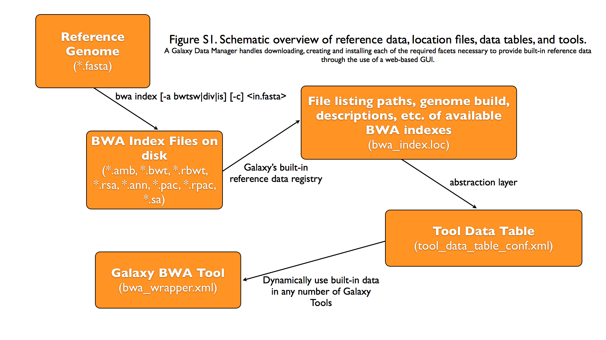

Data managers
=============

What are Data Managers?
~~~~~~~~~~~~~~~~~~~~~~~

Data Managers are a special class of Galaxy tool which allows for the
download and/or creation of data that is stored within
`Tool Data Tables <https://galaxyproject.org/admin/tools/data-tables/>`_
and their underlying flat (e.g. ``.loc``) files. These tools handle
e.g. the creation of indexes and the addition of entries/lines to the
data table / ``.loc`` file via the Galaxy admin interface.

Data Managers can be defined locally or installed through the Tool Shed.

A Video Introduction
~~~~~~~~~~~~~~~~~~~~

For a video overview on Data Managers, see this
`presentation from GCC2013 <http://vimeo.com/74265510>`_.

Tutorial
~~~~~~~~
The most up-to-date methods, including how to use Data Manager
repositories in the `Tool Shed <https://galaxyproject.org/toolshed/>`_:
`GCC2014 TrainingDay <https://galaxyproject.org/events/gcc2014/training-day/#tool-development-from-bright-idea-to-toolshed-data-managers>`_

What Kind of Data is Supported
~~~~~~~~~~~~~~~~~~~~~~~~~~~~~~
The Data Manager framework supports any kind of built-in ("pre-cached")
data that a tool developer would like to make available via a
`Tool Data Table <https://galaxyproject.org/admin/tools/data-tables/>`_.
This includes reference genomes, indexes on a reference genome,
BLAST databases, protein or pathway domain databases, and so-on.
This built-in data does not need to be associated with any type of
reference, build, or dbkey (genomic or otherwise), but, in many cases,
Tool Data Table entries and their Data Manager will be tied to a
specific genomic build.

Graphical Overview of Interplay between Built-in Data and Galaxy Tools
~~~~~~~~~~~~~~~~~~~~~~~~~~~~~~~~~~~~~~~~~~~~~~~~~~~~~~~~~~~~~~~~~~~~~~

Galaxy Data Manager XML File
----------------------------
The XML File for a Galaxy Data Manager, generally referred to as the
"data manager config file", serves a number of purposes. It defines
the availability of Data Managers to a Galaxy instance. It does this
by specifying the id of the Data Manager and the Data Manager tool
that is associated with it. It also contains a listing of the
Tool Data Tables that can be added to by the Data Manager. It also
specifies how to manipulate the raw column values provided by the
Data Manager Tool and under what directory structure to place the
finalized data values.

Pay attention to the following when creating a new Data Manager:

1. **Make sure your XML is valid** - Improper XML will most likely
   cause Galaxy to not load your Data Managers. The easiest way to
   validate your XML is just to open the XML file itself in e.g.
   `Firefox <http://www.mozilla.com/>`_, which will either parse
   the file and display it, or show the error and its location in
   large letters.
2. **Don't forget to restart Galaxy** - Galaxy loads and parses
   XML at run-time, which means you'll have to restart it after
   updating any XML files. The same does not apply if you only
   update an executable.
3. **Make sure you use an id that is unique within your Galaxy
   instance** - Galaxy can only load one Data Manager having an
   the same ID at a single time.
4. **When completed, make your Data Manager available in a
   ToolShed and install it from there** - This will avoid any
   possible collisions due to non-unique IDs, as specialized
   name-spacing is utilized when Data Managers are installed
   from a ToolShed.

A Galaxy Data Manager's config file consists of a subset of
the following XML tag sets - each of these is described in
detail in the following sections.

Details of XML tag sets
-----------------------

``<data_managers>`` tag set
~~~~~~~~~~~~~~~~~~~~~~~~~~~
The outer-most tag set. It contains no attributes. Any number
of ``<data_manager>`` tags can be included within it.

``<data_manager>`` tag set
~~~~~~~~~~~~~~~~~~~~~~~~~~
This tag defines a particular Data Manager. Any number of
``<data_table>`` tags can be included within it.

+---------------+------------+-----------+--------------------------------------------------+-----------------------------------------------------------------------------------------------------------------------------------------------------------------------------------------------------------------------------------------------------------------------+
| attribute     | values     | required  | example                                          | details                                                                                                                                                                                                                                                               |
+===============+============+===========+==================================================+=======================================================================================================================================================================================================================================================================+
| ``tool_file`` | A string*  | yes       | ``tool_file="data_manager/twobit_builder.xml"``  | This is the filename of the Data Manager Tool's XML file, relative to the Galaxy Root. Multiple Data Managers can use the same Tool, but doing so would require "id" to be declared.                                                                                  |
+---------------+------------+-----------+--------------------------------------------------+-----------------------------------------------------------------------------------------------------------------------------------------------------------------------------------------------------------------------------------------------------------------------+
| ``id``        | A string*  | no        | ``id="twobit_builder"``                          | Must be unique across all Data Managers; should be lowercase and contain only letters, numbers, and underscores. While technically optional, it is a best-practice to specify this value. When not specified, it will use the id of the underlying Data Manager Tool. |
+---------------+------------+-----------+--------------------------------------------------+-----------------------------------------------------------------------------------------------------------------------------------------------------------------------------------------------------------------------------------------------------------------------+
| ``version``   | A string*  | no        | ``version="0.0.1"``                              | Deprecated with release 21.09. The version of the data manager defaults to the version of the data manager tool                                                                                                                                                       |
+---------------+------------+-----------+--------------------------------------------------+-----------------------------------------------------------------------------------------------------------------------------------------------------------------------------------------------------------------------------------------------------------------------+

The following is an example that contains all of the attributes
described above.

.. code-block:: xml

    <data_manager tool_file="data_manager/twobit_builder.xml" id="twobit_builder">

``<data_table>`` tag set
~~~~~~~~~~~~~~~~~~~~~~~~~
This tag defines a Tool Data Table to add entries to. Any number
of ``<data_table>`` tags can be used. Each ``<data_table>`` tag
will contain an ``<output>`` tagset.

+---------------+------------+-----------+-------------------+------------------------------------------+
| attribute     | values     | required  | example           | details                                  |
+===============+============+===========+===================+==========================================+
| ``name``      | A string*  | yes       | ``name="twobit"`` | This is the name of the Tool Data Table. |
+---------------+------------+-----------+-------------------+------------------------------------------+

The following is an example that contains all of the attributes
described above.

.. code-block:: xml

    <data_table name="twobit">

``<output>`` tag set
~~~~~~~~~~~~~~~~~~~~

This tag defines how to handle the output of the Data Manager Tool.
It has no attributes, but contains one or more ``<column>`` tag sets.

The following is an example that contains all of the attributes
described above.

.. code-block:: xml

    <output>

``<column>`` tag set
~~~~~~~~~~~~~~~~~~~~

This tag defines a particular Tool Data Table column that will be
set. Any number of ``<column>`` tags can be used. Each
``<column>`` tag may contain ``<move>`` and / or
``<value_translation>`` tagsets, which are optional.

+----------------+------------+-----------+---------------------------+-------------------------------------------------------------------------------------------------+
| attribute      | values     | required  | example                   | details                                                                                         |
+================+============+===========+===========================+=================================================================================================+
| ``name``       | A string*  | yes       | ``name="value"``          | This is the name of Tool Data Table column.                                                     |
+----------------+------------+-----------+---------------------------+-------------------------------------------------------------------------------------------------+
| ``output_ref`` | A string*  | no        | ``output_ref="out_file"`` | Name of the Data Manager Tool's output file to use for additional processing within e.g. a tag. |
+----------------+------------+-----------+---------------------------+-------------------------------------------------------------------------------------------------+

The following is an example that contains all of the attributes
described above.

.. code-block:: xml

    <column name="path" output_ref="out_file" >

``<move>`` tag set
~~~~~~~~~~~~~~~~~~

This tag defines how to handle moving files from within the
Data Manager Tool output's ``extra_files_path`` into the final
storage location used for the Tool Data Table entry. Individual
files or the entire directory contents can be moved. Move tag
sets contain a ``<source>`` and a ``<target>`` tag set.

+-------------------------+----------------+-----------+--------------------------------+------------------------------------------------------------------------------------------------+
| attribute               | values         | required  | example                        | details                                                                                        |
+=========================+================+===========+================================+================================================================================================+
| ``type``                | A string*      | no        | ``<move type="file">``         | This can be either 'file' or 'directory'. Default is 'directory'.                              |
+-------------------------+----------------+-----------+--------------------------------+------------------------------------------------------------------------------------------------+
| ``relativize_symlinks`` | True or False  | no        | ``relativize_symlinks="True"`` | Whether or not to relativize created existing symlinks in moved target. Default is False.      |
+-------------------------+----------------+-----------+--------------------------------+------------------------------------------------------------------------------------------------+

The following is an example that contains all of the attributes
described above.

.. code-block:: xml

    <move type="file" relativize_symlinks="False">

``<source>`` tag set
~~~~~~~~~~~~~~~~~~~~

This tag defines the source location within a ``<move>`` tag set.
When not specified, it defaults to the entire ``extra_files_path``
of the output reference dataset. Both the base attribute and the
text of the ``<source>`` tag are treated as
`Cheetah <https://pythonhosted.org/Cheetah/>`_ templates, with
the columns names specified in the ``<column>`` tagsets available
as variables (with values taken from the corresponding data table
entries. The strings produced for the base attribute and the tag
text should resolve to a single line.

+------------+-------------------+-----------+------------------------------+-------------------------------------------------------------------------------------------------------------------------+
| attribute  | values            | required  | example                      | details                                                                                                                 |
+============+===================+===========+==============================+=========================================================================================================================+
| ``base``   | A string Template | no        | ``<source base="">``         | The base/root path to use for the source. When not provided, it defaults to the extra_files_path of the output dataset. |
+------------+-------------------+-----------+------------------------------+-------------------------------------------------------------------------------------------------------------------------+
| ``TEXT``   | A string Template | no        | ``<source>${path}</source>`` | This defines the value of the source, relative to the *base*                                                            |
+------------+-------------------+-----------+------------------------------+-------------------------------------------------------------------------------------------------------------------------+

The following is an example that contains the most common usage,
where the value provided by the Data Manager Tool, relative to
the ``extra_files_path``, is used as the source.

.. code-block:: xml

    <source>${path}</source>

``<target>`` tag set
~~~~~~~~~~~~~~~~~~~~

This tag defines the target location within a ``<move>`` tag set.
When not specified, it defaults to the *galaxy_data_manager_data_path*
configuration value. The values of the base and the tag text are
treated as templates as with the ``<source>`` tag. In addition
the variables from the ``<column>`` tagset the value of
``galaxy_data_manager_data_path`` configuration value is available
using the ``${GALAXY_DATA_MANAGER_DATA_PATH}`` variable.

+------------+-------------------+-----------+-----------------------------------------------------------------------------------+-----------------------------------------------------------------------------------------------------------------------------------------+
| attribute  | values            | required  | example                                                                           | details                                                                                                                                 |
+============+===================+===========+===================================================================================+=========================================================================================================================================+
| ``base``   | A string Template | no        | ``<source base="${GALAXY_DATA_MANAGER_DATA_PATH}">``                              | The base/root path to use for the target. When not specified, it defaults to the ``galaxy_data_manager_data_path`` configuration value. |
+------------+-------------------+-----------+-----------------------------------------------------------------------------------+-----------------------------------------------------------------------------------------------------------------------------------------+
| ``TEXT``   | A string Template | no        | ``<target base="${GALAXY_DATA_MANAGER_DATA_PATH}">${dbkey}/seq/${path}</target>`` | This defines the value of the target (destination), relative to the *base*                                                              |
+------------+-------------------+-----------+-----------------------------------------------------------------------------------+-----------------------------------------------------------------------------------------------------------------------------------------+

The following is an example that contains a common usage, where a
target value is constructed using several of the values provided
by the Data Manager Tool, relative to the
``galaxy_data_manager_data_path``, is used as the source.

.. code-block:: xml

    <target base="${GALAXY_DATA_MANAGER_DATA_PATH}">${dbkey}/seq/${path}</target>

``<value_translation>`` tag set
~~~~~~~~~~~~~~~~~~~~~~~~~~~~~~~

This tag allows using templating to modify the value provided by the Data Manager Tool into the actual value that should be stored within the Tool Data Table. There can be any number of value translations provided for an output. The value translations are performed in the order presented in the XML. It is important to note that a move will occur before the value translations are performed.

+---------------+----------+-----------+---------------------+----------------------------------------------------------------------------------------------+
| attribute     | values   | required  | example             | details                                                                                      |
+===============+==========+===========+=====================+==============================================================================================+
| ``type``      | A string | no        | ``type="template"`` | The type of value translation to perform. Currently "template" and "function" are supported. |
+---------------+----------+-----------+---------------------+----------------------------------------------------------------------------------------------+

The following is an example that contains a common usage, where a
value is constructed using several of the values provided by the
Data Manager Tool and that value is then turned into an absolute
path. If ``<value_translation>`` is a string (not a function) it
is treated as a template, much like ``<source>`` and ``<target>``,
and must return a single line string.

.. code-block:: xml

    <value_translation>${GALAXY_DATA_MANAGER_DATA_PATH}/${value}/seq/${path}</value_translation>
    <value_translation type="function">abspath</value_translation>

Bringing it all Together, an example
~~~~~~~~~~~~~~~~~~~~~~~~~~~~~~~~~~~~
Assume that we have a Data Manager Tool that provides the following
named values:

+------------+--------------+
| name       | value        |
+============+==============+
| ``value``  | sacCer2      |
+------------+--------------+
| ``path``   | sacCer2.2bit |
+------------+--------------+

and creates an output named "out_file", with an ``extra_files_path``
containing a file 'sacCer2.2bit'. (The primary dataset file contains
JSON that provides the above values)

and has a Data Manager configuration defined as:

.. code-block:: xml

    <data_managers>
        <data_manager tool_file="data_manager/twobit_builder.xml" id="twobit_builder">
            <data_table name="twobit">
                <output>
                    <column name="value" />
                    <column name="path" output_ref="out_file" >
                        <move type="file">
                            <source>${path}</source>
                            <target base="${GALAXY_DATA_MANAGER_DATA_PATH}">${value}/seq/${path}</target>
                        </move>
                        <value_translation>${GALAXY_DATA_MANAGER_DATA_PATH}/${value}/seq/${path}</value_translation>
                        <value_translation type="function">abspath</value_translation>
                    </column>
                </output>
            </data_table>
        </data_manager>
    <data_managers>

The result is:

+------------+-------------------------------------------------------------------------------------------+
| name       | value                                                                                     |
+============+===========================================================================================+
| ``value``  | sacCer2                                                                                   |
+------------+-------------------------------------------------------------------------------------------+
| ``path``   | ``${ABSOLUTE_PATH_OF_CONFIGURED_GALAXY_DATA_MANAGER_DATA_PATH}/sacCer2/seq/sacCer2.2bit`` |
+------------+-------------------------------------------------------------------------------------------+

and the "sacCer2.2bit" file has been moved into the location specified
by path.

Data Manager JSON Syntax
------------------------
Data Manager Tools are required to use JSON to communicate the new
Tool Data Table values back to the Data Manager. JSON can also
optionally be used to provide the input parameter values to the
Data Manager Tool, but this is not required.

Returning Values to the Data Manager
~~~~~~~~~~~~~~~~~~~~~~~~~~~~~~~~~~~~

A Data Manager Tool must provide the new values for the Tool Data
Table Entries via a JSON dictionary.

1. A single dictionary, with the key ``data_tables`` is required
   to be present within the root JSON dictionary.
2. The ``data_tables`` dictionary is keyed by the name of the
   Tool Data Table receiving new entries. Any number of named
   tables can be specified.
3. The value for the named Tool Data Table is a list of dictionaries
   or has ``add`` and ``remove`` as keys each with a list of
   dictionaries.
4. Each of these dictionaries contains the values that will
   be provided to the Data Manager and modified as per the
   configuration defined within the Data Manager XML Syntax.

Example 1 JSON Output from Data Manager Tool to Galaxy
~~~~~~~~~~~~~~~~~~~~~~~~~~~~~~~~~~~~~~~~~~~~~~~~~~~~~~

.. code-block:: json

    {
      "data_tables":{
        "all_fasta":[
          {
            "path":"sacCer2.fa",
            "dbkey":"sacCer2",
            "name":"S. cerevisiae June 2008 (SGD/sacCer2) (sacCer2)",
            "value":"sacCer2"
          }
        ]
      }
    }

This creates a new entry in the Tool Data Table::

    #<unique_build_id>    <dbkey>        <display_name>    <file_path>
    sacCer2    sacCer2    S. cerevisiae June 2008 (SGD/sacCer2) (sacCer2)    /Users/dan/galaxy-central/tool-data/sacCer2/seq/sacCer2.fa

Example 2 JSON Output from Data Manager Tool to Galaxy
~~~~~~~~~~~~~~~~~~~~~~~~~~~~~~~~~~~~~~~~~~~~~~~~~~~~~~

.. code-block:: json

    {
      "data_tables":{
        "all_fasta": {
          "add": [
            {
              "path":"sacCer2.fa",
              "dbkey":"sacCer2",
              "name":"S. cerevisiae June 2008 (SGD/sacCer2) (sacCer2)",
              "value":"sacCer2"
            }
          ],
          "remove": [
          ],
        }
      }
    }

Returning Values to the Data Manager
~~~~~~~~~~~~~~~~~~~~~~~~~~~~~~~~~~~~
Taking the input values of a Data Manager Tool and converting it
into a usable set of command-line arguments and options can be quite
complicated in many cases, especially when considering that the
underlying Data Manager Tool Executable will likely take those
options and convert them into a set of valued objects within the
executable/script itself before performing its operations.

To simplify this process, Data Manager Tools will automatically
have their parameter values JSONified and provided as the content
of the output dataset. This will allow the executable / script to
simply read and parse the JSON data and have a complete collection
of the Tool and Job parameters to use within the tool. Using this
methodology is not required, however, and a Data Manager Tool
developer is free to explicitly declare any number of the Tool
parameters explicitly to the command-line.

Example JSON input to tool
~~~~~~~~~~~~~~~~~~~~~~~~~~

.. code-block:: json

    {
      "param_dict":{
        "__datatypes_config__":"/Users/dan/galaxy-central/database/tmp/tmphyQRH3",
        "__get_data_table_entry__":"<function get_data_table_entry at 0x10d435b90>",
        "userId":"1",
        "userEmail":"dan@bx.psu.edu",
        "dbkey":"sacCer2",
        "sequence_desc":"",
        "GALAXY_DATA_INDEX_DIR":"/Users/dan/galaxy-central/tool-data",
        "__admin_users__":"dan@bx.psu.edu",
        "__app__":"galaxy.app:UniverseApplication",
        "__user_email__":"dan@bx.psu.edu",
        "sequence_name":"",
        "GALAXY_DATATYPES_CONF_FILE":"/Users/dan/galaxy-central/database/tmp/tmphyQRH3",
        "__user_name__":"danb",
        "sequence_id":"",
        "reference_source":{
          "reference_source_selector":"ncbi",
          "requested_identifier":"sacCer2",
          "__current_case__":"1"
        },
        "__new_file_path__":"/Users/dan/galaxy-central/database/tmp",
        "__user_id__":"1",
        "out_file":"/Users/dan/galaxy-central/database/files/000/dataset_200.dat",
        "GALAXY_ROOT_DIR":"/Users/dan/galaxy-central",
        "__tool_data_path__":"/Users/dan/galaxy-central/tool-data",
        "__root_dir__":"/Users/dan/galaxy-central",
        "chromInfo":"/Users/dan/galaxy-central/tool-data/shared/ucsc/chrom/sacCer2.len"
      },
      "output_data":[
        {
          "extra_files_path":"/Users/dan/galaxy-central/database/job_working_directory/000/202/dataset_200_files",
          "file_name":"/Users/dan/galaxy-central/database/files/000/dataset_200.dat",
          "ext":"data_manager_json",
          "out_data_name":"out_file",
          "hda_id":201,
          "dataset_id":200
        }
      ],
      "job_config":{
        "GALAXY_ROOT_DIR":"/Users/dan/galaxy-central",
        "GALAXY_DATATYPES_CONF_FILE":"/Users/dan/galaxy-central/database/tmp/tmphyQRH3",
        "TOOL_PROVIDED_JOB_METADATA_FILE":"galaxy.json"
      }
    }

Running Data Manager Tools using the API
----------------------------------------

See `scripts/api/data_manager_example_execute.py <https://github.com/galaxyproject/galaxy/blob/master/scripts/api/data_manager_example_execute.py>`_ for an example script.

Writing Data Manager Tests
--------------------------
Writing a Data Manager test is similar to writing a test for any other
`Galaxy Tool <https://galaxyproject.org/admin/tools/Writing%20Tests/>`_. For an example, please see at `http://testtoolshed.g2.bx.psu.edu/view/blankenberg/data_manager_example_blastdb_ncbi_update_blastdb <http://testtoolshed.g2.bx.psu.edu/view/blankenberg/data_manager_example_blastdb_ncbi_update_blastdb>`_.

Running Data Manager Tests
~~~~~~~~~~~~~~~~~~~~~~~~~~
Data Managers can be tested using the built-in ``run_tests.sh`` script.
All installed Data Managers can be tested, or individual Data Managers
can be tested.

To test all: ``sh run_tests.sh -data_managers``

To test a single Data Manager byid:
``sh run_tests.sh -data_managers -id data_manager_id``

Testing in the ToolShed
~~~~~~~~~~~~~~~~~~~~~~~
All Data Managers deposited within the ToolShed are tested using the
nightly testing framework.

Defining Data Managers
----------------------

Data Manager Components
~~~~~~~~~~~~~~~~~~~~~~~
Data Managers are composed of two components:

- Data Manager configuration (e.g. *data_manager_conf.xml*)
- Data Manager Tool
- Data table configuration

Data Manager Configuration
~~~~~~~~~~~~~~~~~~~~~~~~~~
The Data Manager Configuration (e.g. *data_manager_conf.xml*) defines
the set of available Data Managers using an XML description. Each
Data Manager can add entries to one or more Tool Data Tables. For
each Tool Data Table under consideration, the expected output entry
columns, and how to handle the Data Manager Tool results, are defined.

Upon installation, Galaxy will recursivly search for data_manager_conf.xml in the repository.
data_manager_conf.xml should be located in the root of the repository but can be located in a sub-directory.
The first instance of data_manager_conf.xml found will be used.
This file defines the paths to the data manager tools within the repository directory structure.

Data Manager Tool
~~~~~~~~~~~~~~~~~

A Data Manager Tool is a special class of Galaxy Tool. Data Manager
Tools do not appear in the standard Tool Panel and can only be
accessed by a Galaxy Administrator. Additionally, the initial
content of a Data Manager's output file contains a JSON dictionary
with a listing of the Tool parameters and Job settings
(i.e. they are a type of ``OutputParameterJSONTool``, this is also
available for ``DataSourceTools``). There is no requirement for
the underlying Data Manager tool to make use of these contents,
but they are provided as a handy way to transfer all of the tool
and job parameters without requiring a different command-line argument
for each necessary piece of information.

The primary difference between a standard Galaxy Tool and a
Data Manager Tool is that the primary output dataset of a
Data Manager Tool must be a file containing a JSON description of the
new entries to add to a Tool Data Table. The on-disk content to be
referenced by the Data Manager Tool, if any, is stored within the
``extra_files_path`` of the output dataset created by the tool.

A data manager tool can use a ``conda`` environment if the target
Galaxy is version 18.09 or above (specified in the tool's XML file).

Data manager tools are loaded by referring to them in the data_manager_conf.xml file for the repository.

Data table configuration
~~~~~~~~~~~~~~~~~~~~~~~~

Data tables that data managers operate on are specified in `tool_data_table_conf.xml.sample` located at the repository root.

Tables can be preloaded with content from files at `tool-data/*.loc.sample` relative to the repository root.
tool-data can contain subdirectories but files in those subdirectories must be referred to including the subdirectory path by
anything that resolves relative to the tool-data path within Galaxy (ie. path entries in the data table).

Data Manager Server Configuration Options
~~~~~~~~~~~~~~~~~~~~~~~~~~~~~~~~~~~~~~~~~

In your ``galaxy.yml`` ensure these settings are set:

.. code-block:: yaml

    # Data manager configuration options
    enable_data_manager_user_view: true
    data_manager_config_file: data_manager_conf.xml
    shed_data_manager_config_file: shed_data_manager_conf.xml
    galaxy_data_manager_data_path: tool-data

Where ``enable_data_manager_user_view`` allows non-admin users to
view the available data that has been managed.

Where ``data_manager_config_file`` defines the local XML file to
use for loading the configurations of locally defined data managers.

Where ``shed_data_manager_config_file`` defines the local XML file
to use for saving and loading the configurations of locally defined
data managers.

Where ``galaxy_data_manager_data_path`` defines the location to use
for storing the files created by Data Managers. When not configured
it defaults to the value of ``tool_data_path``.

An example single entry ``data_manager_config_file``
~~~~~~~~~~~~~~~~~~~~~~~~~~~~~~~~~~~~~~~~~~~~~~~~~~~~

.. code-block:: xml

    <?xml version="1.0"?>
    <data_managers> <!-- The root element -->
        <data_manager tool_file="data_manager/fetch_genome_all_fasta.xml" id="fetch_genome_all_fasta"> <!-- Defines a single Data Manager Tool that can update one or more Data Tables -->
            <data_table name="all_fasta"> <!-- Defines a Data Table to be modified. -->
                <output> <!-- Handle the output of the Data Manager Tool -->
                    <column name="value" /> <!-- columns that are going to be specified by the Data Manager Tool -->
                    <column name="dbkey" />
                    <column name="name" />
                    <column name="path" output_ref="out_file" >  <!-- The value of this column will be modified based upon data in "out_file". example value "phiX.fa" -->
                        <move type="file"> <!-- Moving a file from the extra files path of "out_file" -->
                            <source>${path}</source> <!-- File name within the extra files path -->
                            <target base="${GALAXY_DATA_MANAGER_DATA_PATH}">${dbkey}/seq/${path}</target> <!-- Target Location to store the file, directories are created as needed -->
                        </move>
                        <value_translation>${GALAXY_DATA_MANAGER_DATA_PATH}/${dbkey}/seq/${path}</value_translation> <!-- Store this value in the final Data Table -->
                    </column>
                </output>
            </data_table>
        <!-- additional data_tables can be configured from a single Data Manager -->
        </data_manager>
    </data_managers>

An example ``data_manager/fetch_genome_all_fasta.xml``
~~~~~~~~~~~~~~~~~~~~~~~~~~~~~~~~~~~~~~~~~~~~~~~~~~~~~~

This Tool Config calls a Python script
``data_manager_fetch_genome_all_fasta.py`` and provides a single file
``out_file`` and the description from the dbkey dropdown menu for input.

The starting contents of ``out_file`` contain information from Galaxy
about the tool, including input parameter values, in the JSON format.
Data Manager tools are expected to be able to parse this file.
The Data Manager tool will also put the return output values for its
results in this file; additional files to be moved can be placed in
the ``extra_files_path`` of ``out_file``.

.. code-block:: xml

    <tool id="data_manager_fetch_genome_all_fasta" name="Reference Genome" tool_type="manage_data">
        <description>fetching</description>
        <command interpreter="python">data_manager_fetch_genome_all_fasta.py "${out_file}" --dbkey_description ${ dbkey.get_display_text() }</command>
        <inputs>
            <param name="dbkey" type="genomebuild" label="DBKEY to assign to data" />
            <param type="text" name="sequence_name" value="" label="Name of sequence" />
            <param type="text" name="sequence_desc" value="" label="Description of sequence" />
            <param type="text" name="sequence_id" value="" label="ID for sequence" />
            <conditional name="reference_source">
                <param name="reference_source_selector" type="select" label="Choose the source for the reference genome">
                    <option value="ucsc">UCSC</option>
                    <option value="ncbi">NCBI</option>
                    <option value="url">URL</option>
                    <option value="history">History</option>
                    <option value="directory">Directory on Server</option>
                </param>
                <when value="ucsc">
                    <param type="text" name="requested_dbkey" value="" label="UCSC's DBKEY for source FASTA" optional="False" />
                </when>
                <when value="ncbi">
                    <param type="text" name="requested_identifier" value="" label="NCBI identifier" optional="False" />
                </when>
                <when value="url">
                    <param type="text" area="True" name="user_url" value="http://" label="URLs" optional="False" />
                </when>
                <when value="history">
                    <param name="input_fasta" type="data" format="fasta" label="FASTA File" multiple="False" optional="False" />
                </when>
                <when value="directory">
                    <param type="text" name="fasta_filename" value="" label="Full path to FASTA File on disk" optional="False" />
                    <param type="boolean" name="create_symlink" truevalue="create_symlink" falsevalue="copy_file" label="Create symlink to orignal data instead of copying" checked="False" />
                </when>
            </conditional>
        </inputs>
        <outputs>
            <data name="out_file" format="data_manager_json"/>
        </outputs>
        <!--
        <tests>
            <test>
                DON'T FORGET TO DEFINE SOME TOOL TESTS
            </test>
        </tests>
        -->
        <help>
    **What it does**

    Fetches a reference genome from various sources (UCSC, NCBI, URL, Galaxy History, or a server directory) and populates the "all_fasta" data table.

    ------

    .. class:: infomark

    **Notice:** If you leave name, description, or id blank, it will be generated automatically.

        </help>
    </tool>

An example ``data_manager_fetch_genome_all_fasta.py``
~~~~~~~~~~~~~~~~~~~~~~~~~~~~~~~~~~~~~~~~~~~~~~~~~~~~~

.. code-block:: python

    #!/usr/bin/env python
    #Dan Blankenberg

    import sys
    import os
    import tempfile
    import shutil
    import optparse
    import urllib2
    from ftplib import FTP
    import tarfile

    from galaxy.util.json import from_json_string, to_json_string

    CHUNK_SIZE = 2**20 #1mb

    def cleanup_before_exit( tmp_dir ):
        if tmp_dir and os.path.exists( tmp_dir ):
            shutil.rmtree( tmp_dir )

    def stop_err(msg):
        sys.stderr.write(msg)
        sys.exit(1)

    def get_dbkey_id_name( params, dbkey_description=None):
        dbkey = params['param_dict']['dbkey']
        #TODO: ensure sequence_id is unique and does not already appear in location file
        sequence_id = params['param_dict']['sequence_id']
        if not sequence_id:
            sequence_id = dbkey #uuid.uuid4() generate and use an uuid instead?

        sequence_name = params['param_dict']['sequence_name']
        if not sequence_name:
            sequence_name = dbkey_description
            if not sequence_name:
                sequence_name = dbkey
        return dbkey, sequence_id, sequence_name

    def download_from_ucsc( data_manager_dict, params, target_directory, dbkey, sequence_id, sequence_name ):
        UCSC_FTP_SERVER = 'hgdownload.cse.ucsc.edu'
        UCSC_CHROM_FA_FILENAME = 'chromFa.tar.gz' #FIXME: this file is actually variable...
        UCSC_DOWNLOAD_PATH = '/goldenPath/%s/bigZips/' + UCSC_CHROM_FA_FILENAME
        COMPRESSED_EXTENSIONS = [ '.tar.gz', '.tar.bz2', '.zip', '.fa.gz', '.fa.bz2' ]

        email = params['param_dict']['__user_email__']
        if not email:
            email = 'anonymous@example.com'

        ucsc_dbkey = params['param_dict']['reference_source']['requested_dbkey'] or dbkey
        ftp = FTP( UCSC_FTP_SERVER )
        ftp.login( 'anonymous', email )
        ucsc_file_name = UCSC_DOWNLOAD_PATH % ucsc_dbkey

        tmp_dir = tempfile.mkdtemp( prefix='tmp-data-manager-ucsc-' )
        ucsc_fasta_filename = os.path.join( tmp_dir, UCSC_CHROM_FA_FILENAME )

        fasta_base_filename = "%s.fa" % sequence_id
        fasta_filename = os.path.join( target_directory, fasta_base_filename )
        fasta_writer = open( fasta_filename, 'wb+' )

        tmp_extract_dir = os.path.join ( tmp_dir, 'extracted_fasta' )
        os.mkdir( tmp_extract_dir )

        tmp_fasta = open( ucsc_fasta_filename, 'wb+' )

        ftp.retrbinary( 'RETR %s' % ucsc_file_name, tmp_fasta.write )

        tmp_fasta.seek( 0 )
        fasta_tar = tarfile.open( fileobj=tmp_fasta, mode='r:*' )

        fasta_reader = [ fasta_tar.extractfile( member ) for member in fasta_tar.getmembers() ]

        data_table_entry = _stream_fasta_to_file( fasta_reader, target_directory, dbkey, sequence_id, sequence_name )
        _add_data_table_entry( data_manager_dict, data_table_entry )

        fasta_tar.close()
        tmp_fasta.close()
        cleanup_before_exit( tmp_dir )

    def download_from_ncbi( data_manager_dict, params, target_directory, dbkey, sequence_id, sequence_name ):
        NCBI_DOWNLOAD_URL = 'http://togows.dbcls.jp/entry/ncbi-nucleotide/%s.fasta' #FIXME: taken from dave's genome manager...why some japan site?

        requested_identifier = params['param_dict']['reference_source']['requested_identifier']
        url = NCBI_DOWNLOAD_URL % requested_identifier
        fasta_reader = urllib2.urlopen( url )

        data_table_entry = _stream_fasta_to_file( fasta_reader, target_directory, dbkey, sequence_id, sequence_name )
        _add_data_table_entry( data_manager_dict, data_table_entry )

    def download_from_url( data_manager_dict, params, target_directory, dbkey, sequence_id, sequence_name ):
        urls = filter( bool, map( lambda x: x.strip(), params['param_dict']['reference_source']['user_url'].split( '\n' ) ) )
        fasta_reader = [ urllib2.urlopen( url ) for url in urls ]

        data_table_entry = _stream_fasta_to_file( fasta_reader, target_directory, dbkey, sequence_id, sequence_name )
        _add_data_table_entry( data_manager_dict, data_table_entry )

    def download_from_history( data_manager_dict, params, target_directory, dbkey, sequence_id, sequence_name ):
        #TODO: allow multiple FASTA input files
        input_filename = params['param_dict']['reference_source']['input_fasta']
        if isinstance( input_filename, list ):
            fasta_reader = [ open( filename, 'rb' ) for filename in input_filename ]
        else:
            fasta_reader = open( input_filename )

        data_table_entry = _stream_fasta_to_file( fasta_reader, target_directory, dbkey, sequence_id, sequence_name )
        _add_data_table_entry( data_manager_dict, data_table_entry )

    def copy_from_directory( data_manager_dict, params, target_directory, dbkey, sequence_id, sequence_name ):
        input_filename = params['param_dict']['reference_source']['fasta_filename']
        create_symlink = params['param_dict']['reference_source']['create_symlink'] == 'create_symlink'
        if create_symlink:
            data_table_entry = _create_symlink( input_filename, target_directory, dbkey, sequence_id, sequence_name )
        else:
            if isinstance( input_filename, list ):
                fasta_reader = [ open( filename, 'rb' ) for filename in input_filename ]
            else:
                fasta_reader = open( input_filename )
            data_table_entry = _stream_fasta_to_file( fasta_reader, target_directory, dbkey, sequence_id, sequence_name )
        _add_data_table_entry( data_manager_dict, data_table_entry )

    def _add_data_table_entry( data_manager_dict, data_table_entry ):
        data_manager_dict['data_tables'] = data_manager_dict.get( 'data_tables', {} )
        data_manager_dict['data_tables']['all_fasta'] = data_manager_dict['data_tables'].get( 'all_fasta', [] )
        data_manager_dict['data_tables']['all_fasta'].append( data_table_entry )
        return data_manager_dict

    def _stream_fasta_to_file( fasta_stream, target_directory, dbkey, sequence_id, sequence_name, close_stream=True ):
        fasta_base_filename = "%s.fa" % sequence_id
        fasta_filename = os.path.join( target_directory, fasta_base_filename )
        fasta_writer = open( fasta_filename, 'wb+' )

        if isinstance( fasta_stream, list ) and len( fasta_stream ) == 1:
            fasta_stream = fasta_stream[0]

        if isinstance( fasta_stream, list ):
            last_char = None
            for fh in fasta_stream:
                if last_char not in [ None, '\n', '\r' ]:
                    fasta_writer.write( '\n' )
                while True:
                    data = fh.read( CHUNK_SIZE )
                    if data:
                        fasta_writer.write( data )
                        last_char = data[-1]
                    else:
                        break
                if close_stream:
                    fh.close()
        else:
            while True:
                data = fasta_stream.read( CHUNK_SIZE )
                if data:
                    fasta_writer.write( data )
                else:
                    break
            if close_stream:
                fasta_stream.close()

        fasta_writer.close()

        return dict( value=sequence_id, dbkey=dbkey, name=sequence_name, path=fasta_base_filename )

    def _create_symlink( input_filename, target_directory, dbkey, sequence_id, sequence_name ):
        fasta_base_filename = "%s.fa" % sequence_id
        fasta_filename = os.path.join( target_directory, fasta_base_filename )
        os.symlink( input_filename, fasta_filename )
        return dict( value=sequence_id, dbkey=dbkey, name=sequence_name, path=fasta_base_filename )

    REFERENCE_SOURCE_TO_DOWNLOAD = dict( ucsc=download_from_ucsc, ncbi=download_from_ncbi, url=download_from_url, history=download_from_history, directory=copy_from_directory )

    def main():
        #Parse Command Line
        parser = optparse.OptionParser()
        parser.add_option( '-d', '--dbkey_description', dest='dbkey_description', action='store', type="string", default=None, help='dbkey_description' )
        (options, args) = parser.parse_args()

        filename = args[0]

        params = from_json_string( open( filename ).read() )
        target_directory = params[ 'output_data' ][0]['extra_files_path']
        os.mkdir( target_directory )
        data_manager_dict = {}

        dbkey, sequence_id, sequence_name = get_dbkey_id_name( params, dbkey_description=options.dbkey_description )

        if dbkey in [ None, *, '?' ]:
            raise Exception( '"%s" is not a valid dbkey. You must specify a valid dbkey.' % ( dbkey ) )

        #Fetch the FASTA
        REFERENCE_SOURCE_TO_DOWNLOAD[ params['param_dict']['reference_source']['reference_source_selector'] ]( data_manager_dict, params, target_directory, dbkey, sequence_id, sequence_name )

        #save info to json file
        open( filename, 'wb' ).write( to_json_string( data_manager_dict ) )

    if __name__ == "__main__": main()

Example JSON Output from tool to galaxy, dbkey is sacCer2
~~~~~~~~~~~~~~~~~~~~~~~~~~~~~~~~~~~~~~~~~~~~~~~~~~~~~~~~~
.. code-block:: json

    {
      "data_tables":{
        "all_fasta":[
          {
            "path":"sacCer2.fa",
            "dbkey":"sacCer2",
            "name":"S. cerevisiae June 2008 (SGD/sacCer2) (sacCer2)",
            "value":"sacCer2"
          }
        ]
      }
    }

This creates a new entry in the Tool Data Table::

    #<unique_build_id>    <dbkey>        <display_name>    <file_path>
    sacCer2    sacCer2    S. cerevisiae June 2008 (SGD/sacCer2) (sacCer2)    /Users/dan/galaxy-central/tool-data/sacCer2/seq/sacCer2.fa
