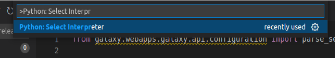
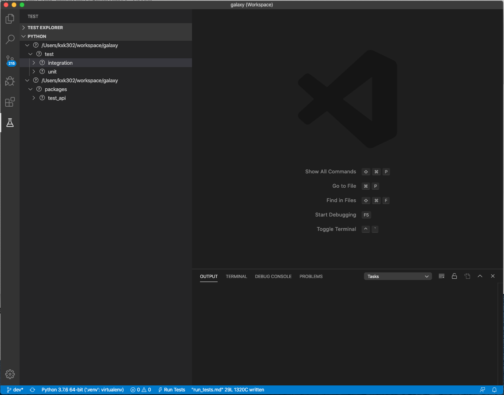

# Debugging Galaxy Tests

## Debugging Galaxy unit & integration tests in VS code

The following instructions assume that you have cloned your Galaxy fork into ~/galaxy directory.

1. Start VS Code
2. Install the Python extension for VS Code: select Extensions on Activity Bar, on the far left-hand side
3. Create a VS Code workspace by selecting 'File -> Add Folder to Workspace...' from menu and adding the `~/galaxy` directory
4. Optionally, save the workspace by selecting 'File -> Save Workspace As...' and save as 'galaxy.code-workspace' in the `~/galaxy` directory
5. Add the following snippet to `~/galaxy/.vscode/settings.json` (create the file if it does not already exist)

    ```json
    {
        "python.testing.unittestEnabled": false,
        "python.testing.nosetestsEnabled": false,
        "python.testing.pytestEnabled": true,
        "python.testing.pytestArgs": [
            "test/",
            "--ignore=test/shed_functional/",
            "--ignore=test/functional",
            "--ignore=test/unit/shed_unit/test_shed_index.py",
            "packages/test_api/"
        ],
        "python.pythonPath": ".venv/bin/python3",
        "pythonTestExplorer.testFramework": "pytest",
    }
    ```

6. Re-start VS Code
7. Choose the .venv Python as your Python Interpreter. First `Ctrl+Shift+P` then `>Python: Select Interpreter`.
+
8. Select Test on Activity Bar, on the far left hand side. You should see unit and integration tests under 'Python' (as shown in the image below). It may take a few seconds for the tests to load up. If they do not, click the 'Discover Tests' icon and wait for the tests to load.

9. Expand integration/unit tests, select a test to display its source code in editor, add a breakpoint, and start the debugger by clicking on the debug icon (next to test name)

## Debugging tests within GitHub actions

Sometimes it is necessary to debug tests that work locally. There are a few different strategies one could employ.
The first step is often to exclude the workflow runs that are passing, so that you don't waste time waiting for your test.
To do this you can delete all the workflow YAML files in `.github/workflows/` except for the one that sets up the failing test.

If the YAML file has a strategy section that sets up multiple tests keep just the one that contains the failing test.
If the test never finishes, add `-s` to the options that `run_tests.sh` pass to `pytest` (i.e. `-s` needs to be after a `--`), so you can see live output.
This diff here adds `-s` and disables strategies that are already passing:

```diff
diff --git a/.github/workflows/integration.yaml b/.github/workflows/integration.yaml
index 6647588dfb..c8d82957a1 100644
--- a/.github/workflows/integration.yaml
+++ b/.github/workflows/integration.yaml
@@ -14,7 +14,7 @@ jobs:
       fail-fast: false
       matrix:
         python-version: ['3.8']
-        subset: ['upload_datatype', 'extended_metadata', 'kubernetes', 'not (upload_datatype or extended_metadata or kubernetes)']
+        subset: ['not (upload_datatype or extended_metadata or kubernetes)']
     services:
       postgres:
         image: postgres:13
@@ -73,7 +73,7 @@ jobs:
         if: matrix.subset == 'upload_datatype'
       - name: Run tests
         if: matrix.subset != 'kubernetes'
-        run: './run_tests.sh -integration test/integration -- -k "${{ matrix.subset }}"'
+        run: './run_tests.sh -integration test/integration -- -s -k "${{ matrix.subset }}"'
         working-directory: 'galaxy root'
       - name: Run tests
         if: matrix.subset == 'kubernetes'
```

If that's not enough and you need to snoop around the process, halting it and inspecting what is going on it's helpful to log into the github runner
and run the test manually. You can do this by injecting a step that inserts an ssh session via [tmate](https://github.com/mxschmitt/action-tmate#use-registered-public-ssh-keys), then use your favorite tools like py-spy or similar to look at the test while it's failing or getting stuck.

Note that you probably don't want to do this on a PR branch, where all your tests are still going to run. Instead run this only against your fork.

# Debugging tests that run out of memory

You can profile the memory used in tests by installing
[pytest-memray](https://pytest-memray.readthedocs.io/) in your virtual
environment, activating it by setting `memray = true` in `pytest.ini`, then run
the problematic tests in the usual way. After the tests finish, a report is
produced by memray.

Note that `pytest-memray` cannot profile test classes that inherit from
`unittest.TestCase` .
