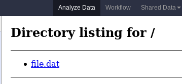

Build an Interactive Environment
================================

Unfortunately building a Galaxy Interactive Environment (GIE) isn't completely straightforward, and it's
certainly not as simple as picking out an existing container and plugging it
in. Here we'll go through build a "Hello, World" GIE which just displays a file
from a user's history.

Directory Layout
----------------

The GIE directory layout looks identical to that of normal visualization
plugins, for those familiar with developing those

.. code-block:: console

    $  tree config/plugins/interactive_environments/jupyter/
    config/plugins/interactive_environments/jupyter/
    ├── config
    │   ├── allowed_images.yml.sample
    │   ├── jupyter.ini.sample
    │   └── jupyter.xml
    ├── static
    │   └── js
    │       └── jupyter.js
    └── templates
        └── jupyter.mako

We'll use the variable ``{gie}`` to stand in for the name of your GIE. It
should match ``[a-z]+``, like ``jupyter`` or ``rstudio``. Here you can see the
``config/`` directory with a ``{gie}.ini.sample`` providing docker and image
configuration, ``allowed_images.yml.sample`` specifies acceptable images,
and then ``{gie}.xml`` which outlines that it is a GIE.

The static directory can hold resources such as javascript and css files. If
you are actively developing a GIE, you'll need to restart Galaxy after adding
any resources to that file, before they can be accessed in the browser.

Lastly, and most importantly, there's the templates folder. This normally just
contains ``{gie}.mako``, however the Jupyter file needs an extra template file.

First Steps, Configuration
--------------------------

We will name our GIE "helloworld", but you are free to name your's differently.
We'll first need to create the directory structure and set up our
configuration

.. code-block:: console

    $ mkdir -p $GALAXY_ROOT/config/plugins/interactive_environments/helloworld/{config,static,templates}
    $ cd $GALAXY_ROOT/config/plugins/interactive_environments/helloworld/

Next, you'll need to create the GIE plugin XML file ``config/helloworld.xml``

.. code-block:: xml

    <?xml version="1.0" encoding="UTF-8"?>
    <!DOCTYPE interactive_environment SYSTEM "../../interactive_environments.dtd">
    <!-- This is the name which will show up in the User's Browser -->
    <interactive_environment name="HelloWorld">
        <data_sources>
            <data_source>
                <model_class>HistoryDatasetAssociation</model_class>

                <!-- here you filter out which types of datasets are
                     appropriate for this GIE -->
                <test type="isinstance" test_attr="datatype" result_type="datatype">tabular.Tabular</test>
                <test type="isinstance" test_attr="datatype" result_type="datatype">data.Text</test>
                <to_param param_attr="id">dataset_id</to_param>
            </data_source>
        </data_sources>
        <params>
            <param type="dataset" var_name_in_template="hda" required="true">dataset_id</param>
        </params>
        <!-- Be sure that your entrypoint name is correct! -->
        <entry_point entry_point_type="mako">helloworld.mako</entry_point>
    </interactive_environment>

Once this is done, we can set up our INI file, ``config/helloworld.ini.sample`` which controls docker interaction

.. code-block:: ini

    [main]
    # Unused

    [docker]
    # Command to execute docker. For example `sudo docker` or `docker-lxc`.
    #command = docker {docker_args}

    # The image argument was moved to "allowed_images.yml.sample"

    # Additional arguments that are passed to the `docker run` command.
    #command_inject = --sig-proxy=true -e DEBUG=false

    # URL to access the Galaxy API with from the spawn Docker container, if empty
    # this falls back to galaxy.ini's galaxy_infrastructure_url and finally to the
    # Docker host of the spawned container if that is also not set.
    #galaxy_url =

    # The Docker hostname. It can be useful to run the Docker daemon on a different
    # host than Galaxy.
    #docker_hostname = localhost

    # Try to set the temp directory to world execute - this can fix the issue
    # where 'sudo docker' is not able to mount the folder otherwise.
    # "finalize namespace chdir to /import permission denied"
    #wx_tempdir = False

    # Overwrite the IE temp directory. This can be useful if you regular tempdir is
    # located on an NFS share, which does not work well as Docker volume. In this case
    # you can have a shared sshfs share which you can use as temporary directory to
    # share data between the IE and Galaxy.
    #docker_galaxy_temp_dir = None

    # If your Docker container exposes more then one port, Galaxy needs to know to
    # which ports it needs to connect. With this option you can specify the port number
    # inside your container to which Galaxy should connect the UI.
    #docker_connect_port = None

    # Set the following value to false if Docker volumes between Galaxy server and Docker
    # container cannot or should not be used.
    #use_volumes = True

    # To run containers in Docker Swarm mode on (an existing swarm), set the
    # following option to True *and*:
    # - set docker_connect_port above. For Nginx the # port should most likely be
    #   80.
    # - If command_inject is uncommented and includes `--sig-proxy`, that option should
    #   be removed.
    #swarm_mode = False

You'll then need to create the GIE plugin YML file ``allowed_images.yml.sample``
to specify allowed images
.. code-block::

    # This file lists acceptable images to allow running.
    #
    # This allows you, the admin, to create multiple flavours
    # for your users to run. E.g. maybe you need a geosciences flavour,
    # you can create the image based on our default image and add the
    # appropriate `apt-get/pip install` statements.
    ---
    -
        image: hello-ie
        description: |
            hello-ie is for getting you up to speed with
            IE development.

We've named our image ``hello-ie``, we'll get to creating that in a minute.

Mako Templates
--------------

Mako templates are very easy to use, and they allow significantly more
flexibility than many other templating languages. It's because of this
flexibility (and ability to write plain python code in them) that GIEs were
possible to develop easily.

In our ``templates/helloworld.mako``, we'll add the following

.. code-block:: html+mako

    <%namespace name="ie" file="ie.mako" />

This line says to inherit from the ``ie.mako`` file that's available in
``$GALAXY_ROOT/config/plugins/interactive_environments/common/templates/ie.mako``.
Next we'll add the following

.. code-block:: html+mako

    <%
    # Sets ID and sets up a lot of other variables
    ie_request.load_deploy_config()

    # Define a volume that will be mounted into the container.
    # This is a useful way to provide access to large files in the container,
    # if the user knows ahead of time that they will need it.
    user_file = ie_request.volume(
        hda.file_name, '/import/file.dat', mode='ro')

    # Launch the IE. This builds and runs the docker command in the background.
    ie_request.launch(
        volumes=[user_file],
        env_override={
            'custom': '42'
        }
    )

    # Only once the container is launched can we template our URLs. The ie_request
    # doesn't have all of the information needed until the container is running.
    url = ie_request.url_template('${PROXY_URL}/helloworld/')
    %>

That mako snippet loaded the configuration from the INI files, launched the
docker container, and then built a URL to the correct endpoint, through the
Galaxy NodeJS proxy. Additionally we've set an environment variable named ``CUSTOM``
with the value ``42`` to be passed to the container, and we've attached the dataset the
user selected (available in ``hda``) to the container as a read-only volume.

We'll continue appending to our ``helloworld.mako`` the HTML code that's actually displayed to the user, when this template is rendered

.. code-block:: html+mako

    <html>
    <head>
    <!-- Loads some necessary javascript libraries. Specifically jquery,
         toastr, and requirejs -->
    ${ ie.load_default_js() }
    </head>
    <body>

    
    

    

    </body>
    </html>

We've glossed over some of the features of this file, but most IEs do a significant amount
of "magic" in the top half of the mako template. For instance, the Jupyter notebook:

- If the user is trying to run the Jupyter GIE Visualization on an existing notebook in their history, then that gets loaded into the docker container via the temp directory and set as the default notebook
- Otherwise a default notebook is built for the user.

The RStudio notebook:

- generates a random password and configures the image to use this password
- Copies in an RData file if the user has loaded one
- sets some custom environment variables.

Connecting the User to the Container via Javascript
---------------------------------------------------

With the mako template above finished, if you were to load this in your
browser, not a lot would happen because we haven't built the hello-ie image,
and we haven't used Javascript to connect the user with the container. In the
tail end of the template, we set a variable ``notebook_access_url``. These are
partially a legacy of how things used to be done and you're welcome to clean up
your code according to your desires. Galaxy's NodeJS proxy handles the
authentication of users, so you don't have to worry about it, and can just
assume that only the correct user will have access to a given notebook.

In the ``static/`` directory, we generally create a ``js/`` directory below that,
and create a ``{gie}.js`` (so, ``static/js/helloworld.js``) file in there.
That file will have a function, ``load_notebook`` which will check if the GIE is available,
and when it is, display it to the user.

We start by writing the load notebook function, which is pretty generic

.. code-block:: javascript

    // Globals
    var IES = window.IES;
    // Load an interactive environment (IE) from a remote URL
    // @param {String} notebook_access_url: the URL embeded in the page and loaded
    function load_notebook(notebook_access_url){
        // When the page has completely loaded...
        // Test if we can access the GIE, and if so, execute the function
        // to load the GIE for the user.
        IES.test_ie_availability(notebook_access_url, function(){
            IES.append_notebook(notebook_access_url);
        });
    }

This function will display a spinner to the user to indicate process, make multiple requests
to ``notebook_access_url`` and display the GIE to the user in an iframe. That MUST return a 200 OK for the ``append_notebook`` function to ever be called. 302s do not count!

Historically, the GIE process involved a complex dance of:

- generating a random password in the mako template
- setting it as a javascript variable
- passing it to the docker container
- once the container was available, have the javascript automatically log a
  user in (something browsers try to prevent since that's otherwise an XSS
  vulnerability.)
- hope everything worked

You may wish to look at the Jupyter and RStudio GIEs for examples of the complex things that can be done at every step.

The GIE Container
-----------------

We'll build a simple container that just displays the dataset a user has
selected to them. Remember when we attached a volume to the container? We'll
make use of that now.

GIE Containers (often) consist of:

- Dockerfile
- NGINX Proxy configuration
- A custom startup script/entrypoint
- A script to monitor traffic and kill unused containers

We have to monitor the container's traffic and kill off unused containers,
because no one is watching them. The user launches the container in Galaxy, and
Galaxy immediately forgets the container exists. Thus, we say that if a
container has no connections to TCP connections to itself, then it should
commit suicide by killing the root process.

Here's an example ``Dockerfile`` for our helloworld container

.. code-block:: dockerfile

    FROM alpine
    # These environment variables are passed from Galaxy to the container
    # and help you enable connectivity to Galaxy from within the container.
    # This means your user can import/export data from/to Galaxy.
    ENV DEBIAN_FRONTEND=noninteractive \
        API_KEY=none \
        DEBUG=false \
        PROXY_PREFIX=none \
        GALAXY_URL=none \
        GALAXY_WEB_PORT=10000 \
        HISTORY_ID=none \
        REMOTE_HOST=none \
        DOCKER_PORT=none \
        CORS_ORIGIN-none

    RUN apk update && \
    apk add \
        wget procps nginx python py2-pip net-tools nginx git patch

    # Our very important scripts. Make sure you've run `chmod +x startup.sh
    # monitor_traffic.sh` outside of the container!
    ADD ./startup.sh /startup.sh
    ADD ./monitor_traffic.sh /monitor_traffic.sh

    # /import will be the universal mount-point
    # The Galaxy instance can copy in data that needs to be present to the
    # container
    RUN mkdir -p /import /web/helloworld /run/nginx

    # Nginx configuration
    COPY ./proxy.conf /proxy.conf
    COPY ./index.html /web/helloworld/
    RUN chmod ugo+r /web/helloworld/index.html

    VOLUME ["/import"]
    WORKDIR /import/

    # EXTREMELY IMPORTANT! You must expose a SINGLE port on your container.
    EXPOSE 80
    CMD /startup.sh

If you have questions on this, please feel free to contact us on IRC
(`irc.freenode.net#galaxyproject <https://webchat.freenode.net/?channels=galaxyproject>`__).

The proxy configuration is interesting, here we'll point NGINX to reverse proxy
a service running on ``:8000`` inside the container. That port will be hosting
a python process which serves up the directory contents of ``/import``, i.e.
the file the user selected which was mounted as a volume into
``/import/file.dat``

.. code-block:: nginx

    events {
        worker_connections  1024;
    }

    http {
        include       mime.types;
        default_type  application/octet-stream;

        sendfile        on;
        keepalive_timeout  65;

        server {
            listen 80;
            server_name localhost;
            access_log /var/log/nginx/localhost.access.log;

            root /web/;

            location PROXY_PREFIX/ {
                alias /web/;
            }

            rewrite ^(.*)/helloworld/(.*\.dat)$ PROXY_PREFIX/helloworld/dir/$2;

            location PROXY_PREFIX/helloworld/dir/ {
                proxy_buffering off;
                proxy_pass         http://127.0.0.1:8000/;
                proxy_redirect     http://127.0.0.1:8000/ PROXY_PREFIX/helloworld/dir/;
            }
        }
    }

Below is our ``index.html`` file

.. code-block:: html

    <html>
        <head>
        </head>
        <body>
            <h1>Welcome to Hello-World IE</h1>
            

                There is one service running, a <a href="dir/">directory
                listing</a>. (We originally had more but the github repository
            for the flask app we were using disappeared.)
            

        </body>
    </html>

And here we'll run that service in our ``startup.sh`` file

.. code-block:: bash

    #!/bin/bash
    # First, replace the PROXY_PREFIX value in /proxy.conf with the value from
    # the environment variable.
    sed -i "s|PROXY_PREFIX|${PROXY_PREFIX}|" /proxy.conf;
    # Then copy into the default location for ubuntu+nginx
    cp /proxy.conf /etc/nginx/sites-enabled/default;

    # Here you would normally start whatever service you want to start. In our
    # example we start a simple directory listing service on port 8000
    cd /import/ && python -mSimpleHTTPServer &

    # Launch traffic monitor which will automatically kill the container if
    # traffic stops
    /monitor_traffic.sh &
    # And finally launch nginx in foreground mode. This will make debugging
    # easier as logs will be available from `docker logs ...`
    nginx -g 'daemon off;'

Lastly, our ``monitor_traffic.sh`` file is often re-used between containers, the only adjustment being the port that is looked at

.. code-block:: bash

    #!/bin/bash
    while true; do
        sleep 60
        if [ `netstat -t | grep -v CLOSE_WAIT | grep ':80' | wc -l` -lt 3 ]
        then
            pkill nginx
        fi
    done

With those files, ``monitor_traffic.sh``, ``Dockerfile``, ``startup.sh``, and ``proxy.conf``, you should be able to build your ``hello-ie`` container

.. code-block:: bash

    $ cd hello-ie
    $ docker build -t hello-ie .

Now, if everything went smoothly, you should be able to restart Galaxy and try out your new GIE on a tabular or text file!

Debugging
---------

When you launch your new GIE in Galaxy, your Galaxy logs should show something like the following:

.. code-block:: console

    Starting docker container for IE helloworld with command [docker run --sig-proxy=true -e DEBUG=false -e "GALAXY_URL=http://localhost/galaxy/" -e "CORS_ORIGIN=http://localhost" -e "GALAXY_WEB_PORT=8000" -e "HISTORY_ID=f2db41e1fa331b3e" -e "CUSTOM=42" -e "GALAXY_PASTER_PORT=8000" -e "PROXY_PREFIX=/galaxy/gie_proxy" -e "API_KEY=1712364174a0ff79b34e9a78fee3ca1c" -e "REMOTE_HOST=127.0.0.1" -e "USER_EMAIL=hxr@local.host" -d -P -v "/home/hxr/work/galaxy/database/tmp/tmp5HaqZy:/import/" -v "/home/hxr/work/galaxy/database/files/000/dataset_68.dat:/import/file.dat:ro" hello-ie]

Here's the docker command written out in a more readable manner:

.. code-block:: console

    $ docker run --sig-proxy=true \
        -d -P \
        -e "API_KEY=1712364174a0ff79b34e9a78fee3ca1c" \
        -e "CORS_ORIGIN=http://localhost" \
        -e "CUSTOM=42" \
        -e "DEBUG=false" \
        -e "GALAXY_PASTER_PORT=8000" \
        -e "GALAXY_URL=http://localhost/galaxy/" \
        -e "GALAXY_WEB_PORT=8000" \
        -e "HISTORY_ID=f2db41e1fa331b3e" \
        -e "PROXY_PREFIX=/galaxy/gie_proxy" \
        -e "REMOTE_HOST=127.0.0.1" \
        -e "USER_EMAIL=hxr@local.host" \
        -v "/home/hxr/work/galaxy/database/tmp/tmp5HaqZy:/import/" \
        -v "/home/hxr/work/galaxy/database/files/000/dataset_68.dat:/import/file.dat:ro" \
      hello-ie

As you can see, a LOT is going on! We'll break it down further:

- ``-d`` runs the container in daemon mode, it launches and the client
  submitting the container finished
- ``-P`` randomly assigns an unused port to the container for each ``EXPOSE``d
  port from our ``Dockerfile``. This is why you must expose a port, and only
  one port.
- A large number of environment variables are set:

    - The user's API key is provided, allowing you to access datasets and
      submit jobs on their behalf. If you have an environment like
      Jupyter/RStudio, it is **highly recommended** that you provide some magic
      by which the user can use their API key without embedding it in the
      notebook. If you do embed it somehow in a document that gets saved to
      their history, anyone can impersonate that user if they get a hold of it.
      In the Jupyter GIE we have a variable that just runs
      ``os.environ.get('API_KEY')`` to avoid embedding it in their notebook.
    - A CORS Origin is provided for very strict servers, but it may be easier
      to simply void CORS requirements within the nginx proxy in your
      container.
    - Custom variables specified in your ``launch()`` command are available
    - A ``DEBUG`` environment variable should be used to help admins debug
      existing containers. You should use it to increase logging, not cleanup
      temporary files, and so on.
    - ``GALAXY_PASTER_PORT`` (deprecated) and ``GALAXY_WEB_PORT`` are the raw
      port that Galaxy is listening on. You can use this to help decide how to
      talk to Galaxy.
    - ``GALAXY_URL`` is the URL that Galaxy should be accessible at. For
      various reasons this may not be true. We recommend looking at our
      implementation of `galaxy.py
      <https://github.com/bgruening/docker-ipython-notebook/blob/15.07/galaxy.py>`__
      which is a small utility script to provide API access to Galaxy to get
      and fetch data, based on those environment variables.
    - The ``HISTORY_ID`` of the current history the user is on is provided. In
      the Jupyter/RStudio containers, we provide a dead simple method for users
      to download datasets from their current history which will be visible to
      them on the right hand side of their screen.
    - A ``PROXY_PREFIX`` is provided which should be used in the nginx conf.
    - ``REMOTE_HOST`` is another component used to test for a possible Galaxy
      access path
    - The user's email is made available, very convenient for webservices like
      Entrez which require the user's email address. You can pre-fill it out
      for them, making their life easier.
    - Two volumes are mounted, one a temporary directory from Galaxy (rw), and one
      the dataset the user selected (ro).

- and finally the image is specified.

Most of this information is usually required to build friendly, easy-to-use
GIEs. One of the strong points of GIEs is their magic interaction with Galaxy.
Here we've mounted a volume read-only, but in real life you may wish to provide
connectivity like Jupyter and RStudio provide, allowing the user to load
datasets on demand for interactive analysis, and then to store analysis
artifacts (and a log of what was done inside the container, à la Jupyter's
"notebooks") back to their current history.

If everything went well, at this point you should see a directory listing show up:

If you find yourself encountering difficulties, the "Hello, World" IE is
available in a `GitHub repo <https://github.com/erasche/hello-world-interactive-environment/releases/tag/v15.10>`__, and there are people on the IRC channel who can help debug.
