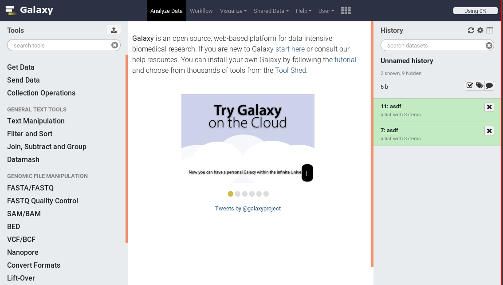
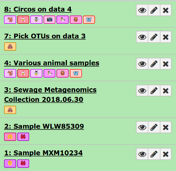
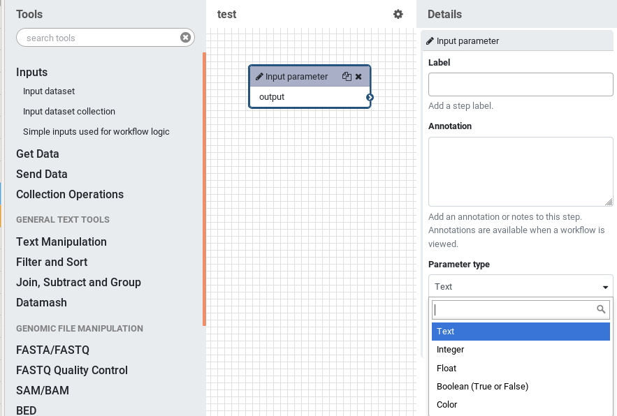
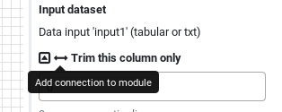
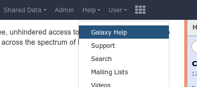

===========================================================
January 2019 Galaxy Release (v 19.01)
===========================================================

.. include:: _header.rst

Highlights
===========================================================

**Revised UI Style**

The Galaxy styling has been substantially reworked resulting in the largest visual refresh to Galaxy in years. It should provide a much cleaner and more consistent interface.

**More Colourful Tags**

Whenever you use dataset name tags (``#tag``), they will randomly be assigned a color. The colors are consistent; anywhere that tag with the same text appears in your history, it will have the same color. This should increase visual distinction between similarly shaped words, making it easier to track data flow in complex analyses.

**Extensive Workflow Enhancements**

The workflow editor now features new tool-like inputs which provide non-file data (such as numbers, text, true/false, colors) which can be connected to tool inputs. You are no longer restricted to only using files as inputs to tools!

The workflow editor allows you to specify that specific inputs should be exposed, and can thus be connected to the new workflow inputs.

**New Help Site**

There's a new discussion forum to replace Biostars. It is accessible under the 'Help' menu on some Galaxies, or at https://help.galaxyproject.org

New Visualizations
===========================================================

`Aequatus visualisation plugin <https://docs.google.com/presentation/d/1_KdwjbIyjUhdb_huAzOuI34693mciw_vXDCGLctKs9A/edit#slide=id.p2>`__ has been released which allows visualisation of gene alignments and gene family aggregations.

.. figure:: https://lh3.googleusercontent.com/wgNqZT2idSR4AkvUZ55ZQGXOfOPlAxFimO9795WvrQwP1ZMxxdYwNmRZErf-n5hZMGa1SulFry321vgHPoc11wsmJlmVPrmyxG8buV6P=s1600
   :alt: The Aequatus visualization allows analyzing gene family alignments

New Datatypes
===========================================================

- ISA-TAB (`Pull Request 5787`_)
- itp and mdp for gromacs (`Pull Request 6812`_)
- pqr (`Pull Request 6816`_)
- nmrML (`Pull Request 6903`_)
- RMA6, the MEGAN6 read-match archive format (`Pull Request 6962`_)
- fastg (`Pull Request 6987`_)
- Mash sketch files (`Pull Request 7087`_)

Builtin Tool Updates
===========================================================

- The grouping tool now allows you to replace non-numeric data (`Pull Request 6577`_)

Release Notes
===========================================================

Please see the :doc:`full release notes <19.01_announce>` for more details.

.. include:: 19.01_prs.rst

.. include:: _thanks.rst
