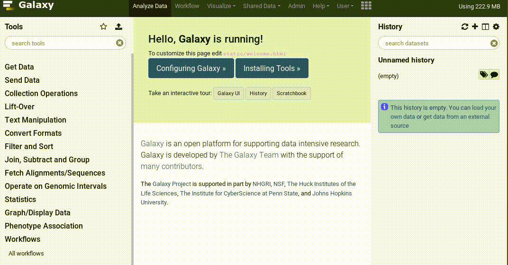
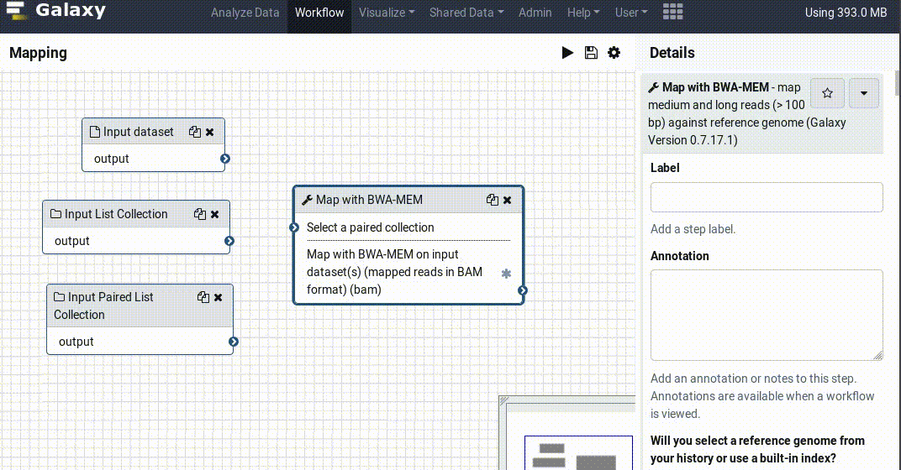
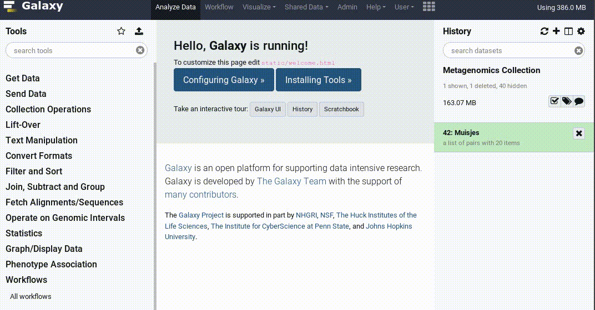

===========================================================
May 2019 Galaxy Release (v 19.05)
===========================================================

.. include:: _header.rst

Highlights
===========================================================

**Tool Favorites**

Tools can now be marked as favorites, and then they'll be easily accessible from the star button in your tool panel.

**Workflow Editor Connection Feedback**

The editor now provides feedback on why connections are invalid, so you aren't left wondering why two tools won't connect. For complex data pipelines this should greatly simplify your life!

**Data Dialog for Tool Form**

There is a new way to select datasets when running tools! It is a very simple method to select any number of files from both your History and Data Libraries.

.. figure:: images/19.05-inputs.gif
   :alt: Data dialog for selecting dataset in the tool form.

Additionally the selector implements a highly requested feature, the ability to run tools on arbitrary datasets from a collection

**History Export/Import Reworked**

These features used to be clumsy in the past but do not despair since in this release they got a revamp and their reliability skyrocketed! Moving historic object across Galaxies should now be easier than ever. Rocketfuel included.

New Visualizations
===========================================================

.. visualizations

`@jxtx <https://github.com/jxtx>`__ has implemented a Galaxy Interactive
Environment for `cellxgene <https://github.com/chanzuckerberg/cellxgene>`__, an
interactive explorer for single-cell transcriptomics data. `Pull Request 7268`_

.. figure:: https://user-images.githubusercontent.com/79973/51766184-f5faea80-20a7-11e9-86c8-a3127d501076.gif
   :alt: cellxgene demo

New Datatypes
===========================================================

* Add the single-cell datatype ``mtx``
  (thanks to `@bebatut <https://github.com/bebatut>`__ and
  `@nsoranzo <https://github.com/nsoranzo>`__).
  `Pull Request 7569`_, `Pull Request 7702`_, `Pull Request 7717`_
* Add ``geojson`` and shapefile (``shp``) datatypes for better GIS data support
  (thanks to `@bgruening <https://github.com/bgruening>`__).
  `Pull Request 7773`_, `Pull Request 7819`_
* Add ``imgt.json`` datatype for IMGT immune system libraries
  (thanks to `@jj-umn <https://github.com/jj-umn>`__).
  `Pull Request 7587`_
* Add microarrays data types ``gpr`` and ``gal``
  (thanks to `@bensellak <https://github.com/bensellak>`__).
  `Pull Request 7457`_
* Add ``spaln`` (space-efficient spliced alignment) database type
  (thanks to `@pvanheus <https://github.com/pvanheus>`__).
  `Pull Request 7718`_
* Redefine ``cel`` datatype
  (thanks to `@bensellak <https://github.com/bensellak>`__).
  `Pull Request 7514`_

Builtin Tool Updates
===========================================================

.. tools

* Update grouping tool to not remove empty cells at the begin/start of lines
  (thanks to `@bernt-matthias <https://github.com/bernt-matthias>`__).
  `Pull Request 7205`_
* Add general purpose expression tool
  (thanks to `@mvdbeek <https://github.com/mvdbeek>`__).
  `Pull Request 7796`_

Release Notes
===========================================================

Please see the :doc:`full release notes <19.05_announce>` for more details.

.. include:: 19.05_prs.rst

.. include:: _thanks.rst
