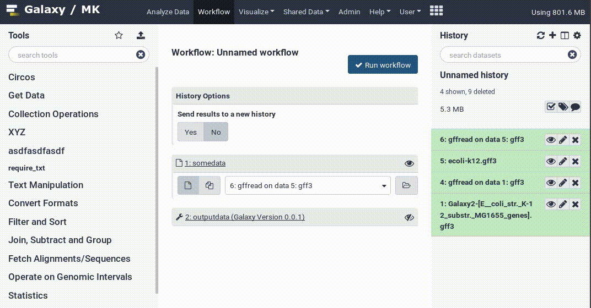

===========================================================
September 2019 Galaxy Release (v 19.09)
===========================================================

.. include:: _header.rst

Highlights
===========================================================

**Workflow Reporting**

John Chilton added embedded reports to workflows. These are reports which are automatically available upon workflow completion and can discuss the contents of a workflow, point out interesting aspects of individual outputs, and generally help you summarize the outputs for colleagues in a comprehensible way!

**Awesome Visualizations**

The Community (that is you!) added not one, not two, but **three** new awesome visualizations in this release allowing for free style image annotation, visualizing spatial data on OpenLayers maps, and exploring HIV NGS data with hyphy-vision. Details and screenshots below. Thanks go to `@anuprulez <https://github.com/anuprulez>`__ and `@veg <https://github.com/veg>`__

**Cleaner History Menu**

Check out the new, cleaner history menu! Many of the extraneous actions were moved out so you can more quickly do what you need to do:

.. figure:: images/19.09-history-menu.png
   :alt: New history menu

Also check out the `19.09 admin/dev release notes <https://docs.galaxyproject.org/en/release_19.09/releases/19.09_announce.html>`__.

New Visualizations
===========================================================

.. visualizations

`@anuprulez <https://github.com/anuprulez>`__ has implemented free style image annotation, allowing you to make notes on images in Galaxy and save these annotations. `Pull Request 6891`_

.. figure:: https://user-images.githubusercontent.com/3022518/47093799-3980c580-d22a-11e8-9f70-b58c624b7b4d.png
   :alt: image annotation screenshot

`@anuprulez <https://github.com/anuprulez>`__ has *also* implemented an OpenLayers based map visualization, allowing you to visualize your GIS data in Galaxy. `Pull Request 7888`_

.. figure:: https://user-images.githubusercontent.com/3022518/57146482-affba400-6dc5-11e9-9dcd-c0d03810ca0d.png
   :alt: map visualization screenshot

Other visualizations include:

* hyphy-vision
  (thanks to `@veg <https://github.com/veg>`__).
  `Pull Request 8227`_
* iCn3D
  `Pull Request 8347`_

New Datatypes
===========================================================

.. datatypes

* Shapefile GIS data is now supported (thanks to `@Alanamosse <https://github.com/Alanamosse>`__).
  `Pull Request 7615`_
* Add mcool datatype and extend h5 tool output testing
  (thanks to `@msauria <https://github.com/msauria>`__).
  `Pull Request 7993`_
* Add hyphy_results.json datatype
  (thanks to `@veg <https://github.com/veg>`__).
  `Pull Request 8186`_
* Add pgp and osw datatypes as used in OpenSWATH experiments
  (thanks to `@bgruening <https://github.com/bgruening>`__).
  `Pull Request 8458`_
* Add ckpt datatype
  (thanks to `@astrovsky01 <https://github.com/astrovsky01>`__).
  `Pull Request 8086`_
* Add dada2 datatypes
  (thanks to `@bernt-matthias <https://github.com/bernt-matthias>`__).
  `Pull Request 7895`_
* Add rDock active site datatype
  (thanks to `@bgruening <https://github.com/bgruening>`__).
  `Pull Request 8727`_
* Add Kallistobus datatypes
  (thanks to `@astrovsky01 <https://github.com/astrovsky01>`__).
  `Pull Request 8229`_

Builtin Tool Updates
===========================================================

.. tools

* Various collection operation tool improvements
  (thanks to `@mvdbeek <https://github.com/mvdbeek>`__).
  `Pull Request 8038`_
* Enhance unzip/zip collection collection operation to annotate output format properly
  (thanks to `@bernt-matthias <https://github.com/bernt-matthias>`__).
  `Pull Request 8239`_

Release Notes
===========================================================

Please see the :doc:`full release notes <19.09_announce>` for more details.

.. include:: 19.09_prs.rst

.. include:: _thanks.rst
