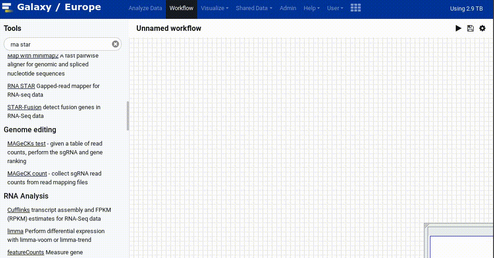
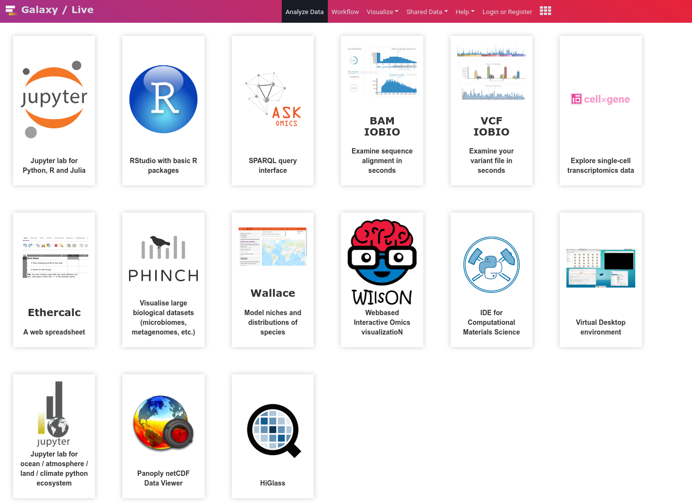
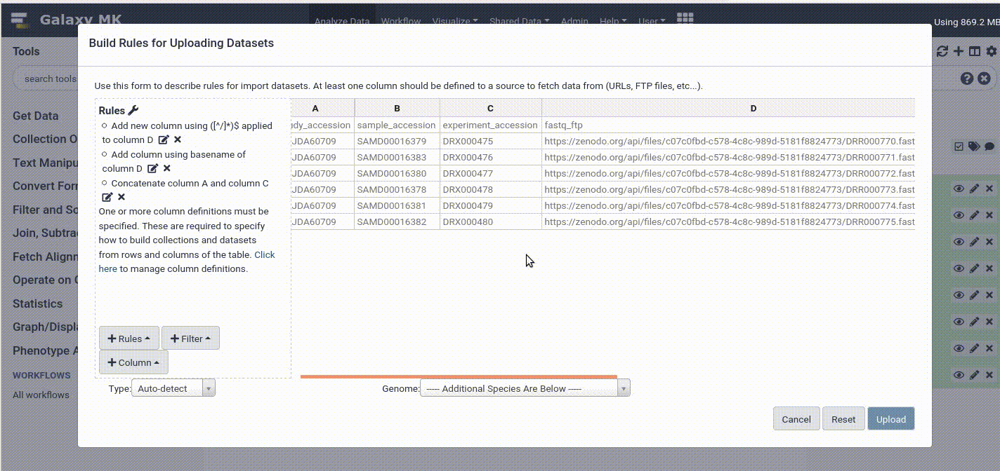

===========================================================
May 2020 Galaxy Release (v 20.05)
===========================================================

.. include:: _header.rst

Highlights
===========================================================

**Tool Recommendations**
  Anup Kumar has built a tool prediction feature based on machine learning conducted on Galaxy Europe data. Using the connections in workflows, he has built a button which can recommend what tool you should use after a current analysis step. You can read more on `UseGalaxy.eu's blogpost <https://galaxyproject.eu/posts/2019/06/27/tool-prediction/>`__. This feature is not currently available on `usegalaxy.org <https://usegalaxy.org>`__, but can be tried on `usegalaxy.eu <https://usegalaxy.eu>`__.

**New Interactive Tools**
  Through the combined efforts of many UseGalaxy.eu admins and developers, as well as the European Galaxy community we have converted a significant number of interactive environments into the new interactive tool specification. Thanks to `@bgruening <https://github.com/bgruening>`__, `@hexylena <https://github.com/hexylena>`__, `@jenzopr <https://github.com/jenzopr>`__, `@yvanlebras <https://github.com/yvanlebras>`__, `@annefou <https://github.com/annefou>`__, `@abretaud <https://github.com/abretaud>`__, `@joachimwolff <https://github.com/joachimwolff>`__, and `@astrovsky01 <https://github.com/astrovsky01>`__. You can try them all on `live.usegalaxy.eu <https://live.usegalaxy.eu/>`__

**Rule Based Uploader: Scrolling!**
  Many power users have fallen in love with Galaxy's Rule Builder, allowing you to upload tables of data, and easily tag datasets and build collections on upload. However with too many columns the table did not scroll well for users, but no longer! This has been fixed by one of the Galaxy team members, `@assuntad23 <https://github.com/assuntad23>`__. If you want to learn more about using the rule builder please see the `in-depth tutorial <https://training.galaxyproject.org/training-material/topics/galaxy-data-manipulation/tutorials/upload-rules/tutorial.html>`__ from the developer, `@jmchilton <https://github.com/jmchilton>`__.

**Social Login**
  The social login system has seen improvements over the past release, from adding support for Okta, adding and disconnecting OIDC accounts, to logging out. Through CILogon and Custos, users will be able to use existing institutional log in credentials to log into their Galaxy accounts. Different servers support different authentication providers, so ask your admin today if you want to login with CILogon, Custos, ELIXIR AAI, Google, or Globus.

New Visualizations
===========================================================

**Chira Visualisation**
  Chira provides a suite of tools and a new visualisation for chimeras, allowing you to analyze RNA-RNA interactome experimental data such as CLASH, CLEAR-CLIP, PARIS, LIGR-Seq, etc. `Read more in EU's blog. <https://galaxyproject.eu/posts/2020/03/24/rna-interactome/>`__ (thanks to `@OlegZharkov <https://github.com/OlegZharkov>`__, `Pull Request 9562`_)

.. figure:: https://user-images.githubusercontent.com/15801412/77534204-82fe2700-6e98-11ea-9974-d768fb407709.png
   :alt: Chimera visualisation

.. visualizations

* Editor as visualization
  (thanks to `@OlegZharkov <https://github.com/OlegZharkov>`__).
  `Pull Request 9531`_
* Skip visualization build, if no changes were registered
  (thanks to `@OlegZharkov <https://github.com/OlegZharkov>`__).
  `Pull Request 9634`_

New Datatypes
===========================================================

.. datatypes

* new data types for OpenMS
  (thanks to `@bernt-matthias <https://github.com/bernt-matthias>`__).
  `Pull Request 8109`_
* Add tpr datatype
  (thanks to `@simonbray <https://github.com/simonbray>`__).
  `Pull Request 9244`_
* Python3 compatible SnpEff and SnpSift metadata detection
  (thanks to `@wm75 <https://github.com/wm75>`__).
  `Pull Request 9282`_
* Add datatypes for xcms and camera
  (thanks to `@computational-metabolomics <https://github.com/computational-metabolomics>`__).
  `Pull Request 9470`_
* Create csi index for bam files where any region is larger than ``2**29 - 1``)
  (thanks to `@FredericBGA <https://github.com/FredericBGA>`__).
  `Pull Request 9570`_
* Add PAF, GFA1 and odgi datatypes
  (thanks to `@nsoranzo <https://github.com/nsoranzo>`__).
  `Pull Request 9592`_
* Add xg, vg and protobuf datatypes
  (thanks to `@bgruening <https://github.com/bgruening>`__).
  `Pull Request 9593`_
* Sniffer for multi-member zip archives
  (thanks to `@lecorguille <https://github.com/lecorguille>`__).
  `Pull Request 9595`_
* Fix gff3.gz and gff3.bz2 datatypes
  `Pull Request 9731`_
* Use right extension in bz2_to_uncompressed.xml
  `Pull Request 9734`_
* Fix disappearing datatypes after restart
  `Pull Request 9835`_

Builtin Tool Updates
===========================================================

.. tools

* Remove deprecated ``interpreter`` attribute from tools ``<command>``
  (thanks to `@nsoranzo <https://github.com/nsoranzo>`__).
  `Pull Request 9490`_
* Datasource tool for SRA manifest
  `Pull Request 9613`_
* Fix ITs to work in remote Kubernetes
  `Pull Request 9614`_
* fix error in bundled tool: shrimp_color_wrapper
  (thanks to `@bernt-matthias <https://github.com/bernt-matthias>`__).
  `Pull Request 9665`_
* extract_genomic_dna.py: import Comment, Header from bx.tabular.io instead of bx.intervals.io
  (thanks to `@cat-bro <https://github.com/cat-bro>`__).
  `Pull Request 9748`_

Release Notes
===========================================================

Please see the :doc:`full release notes <20.05_announce>` for more details.

.. include:: 20.05_prs.rst

.. include:: _thanks.rst
