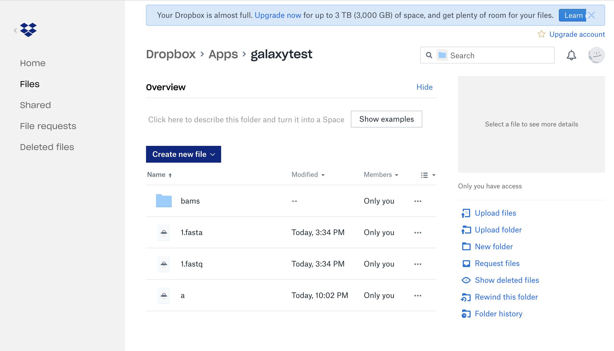
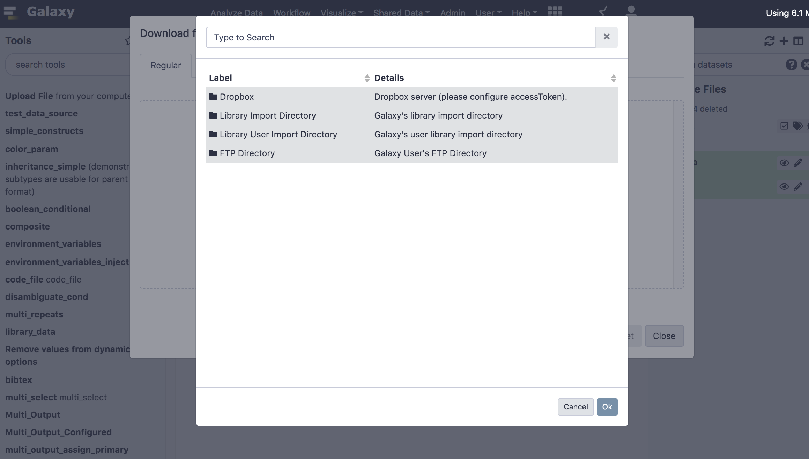
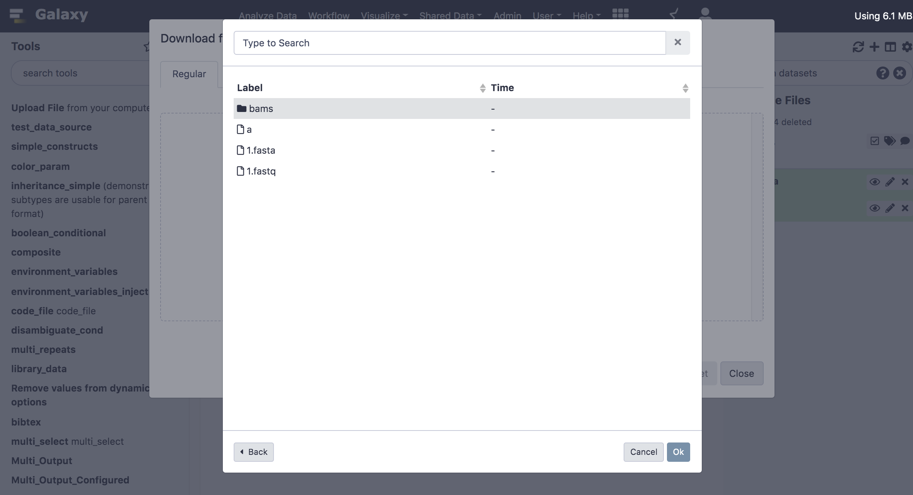
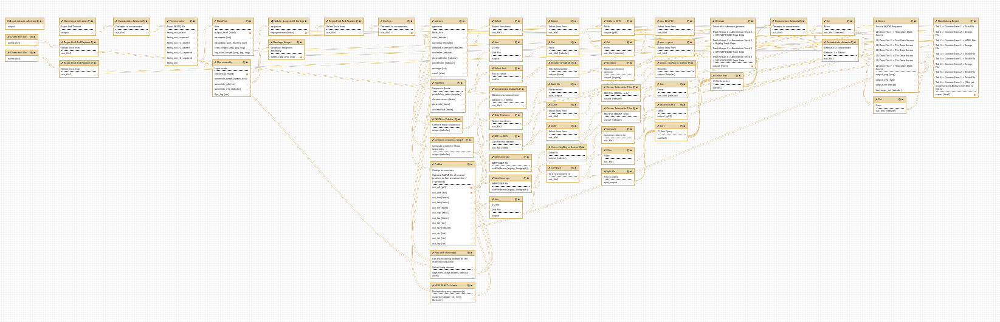
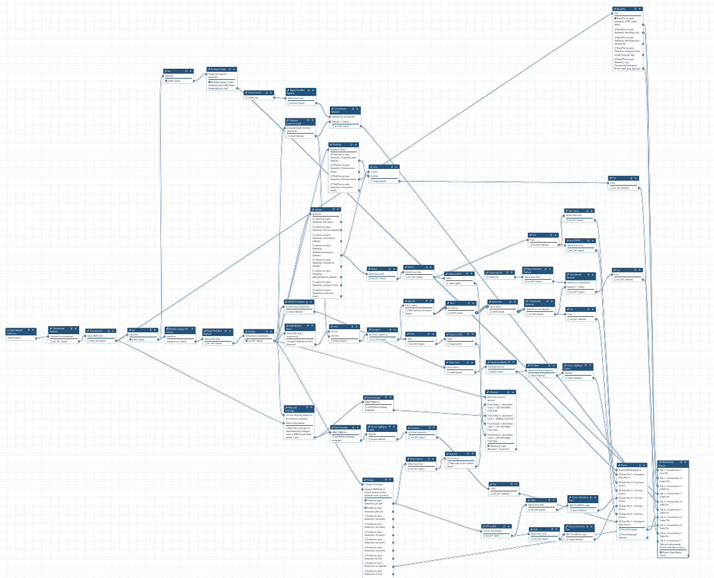
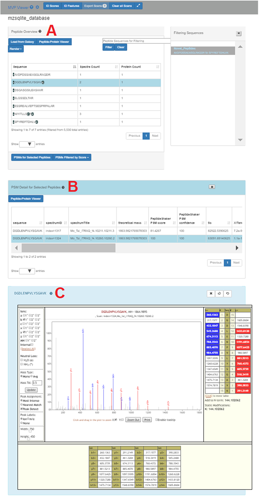
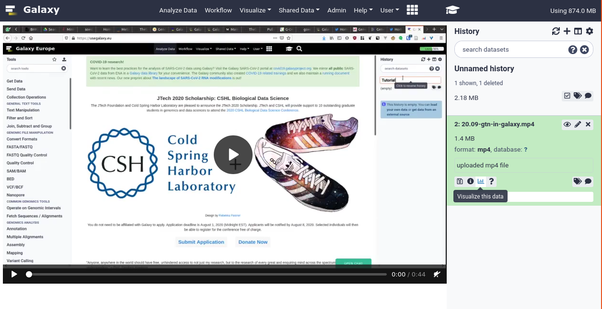

===========================================================
September 2020 Galaxy Release (v 20.09)
===========================================================

.. include:: _header.rst

Highlights
===========================================================

Pluggable Upload Components - Dropbox & WebDav
----------------------------------------------

`@jmchilton <https://github.com/jmchilton>`__ has written a new pluggable interface for upload sources. He has initially added two new backends, you can now import data from Dropbox and any WebDav servers you might have access to. This work also makes it easier for developers to add support for other, new personal data sources in the future.

An example of a Dropbox account:

There will be a new button for "Choose Remote files", when sources are configured, and then you will be able to see and search across all of the remote data locations to which you might have access.

You will be able to see and load your files easily in Galaxy!

The admin will need to configure this feature, and then you will need to provide your credentials for these services in Galaxy's user preferences, if you want to use them. Ask you admin!

GTN In Galaxy
-------------

During the BCC2020 CoFest, `@hexylena <https://github.com/hexylena>`__ and `@shiltemann <https://github.com/shiltemann>`__ worked together to add support for accessing `Galaxy Training Network <https://training.galaxyproject.org>`__ tutorials from within Galaxy. The graduation cap icon will activate the interface.

For updated tutorials, tools will be highlighted as blue buttons. When clicked, these buttons will hide the GTN and take you directly to the correct version of the correct tool within the Galaxy interface. No more time spent figuring out which "cut" tool the tutorial author meant! And when you're ready, you can easily jump back to the training materials.

.. raw:: html

   <video controls autoplay loop muted width="100%">
       <source src="../_static/20.09-gtn-in-galaxy.mp4" type="video/mp4">
   </video>

Thanks `@pvanheus <https://github.com/pvanheus>`__ for the video of it in action!

Upload Directly from the Tool Form
----------------------------------

Did you ever start configuring a tool but forgot to upload your datasets first? And had to start over? Now you can upload datasets directly in the tool form thanks to `@jmchilton <https://github.com/jmchilton>`__. `Pull Request 9809`_

.. raw:: html

   <video controls autoplay loop muted width="100%">
       <source src="../_static/20.09-upload-form.mp4" type="video/mp4">
   </video>

Improved Workflow Layout Algorithm
----------------------------------

The old automatic workflow layout algorithm liked to hide the flow of data within your workflow

So we have replaced the layout algorithm with a newer one which should make the flow of data within your workflows easier to understand. You will still probably want to make manual adjustments after the automatic layout, but hopefully this will save you some time.

Workflow Reporting Improvements
-------------------------------

When one or more workflows are submitted, the status page reporting on those workflow(s) and their reports has been improved!

.. figure:: images/20.09-wf-report-list.png
   :alt: Improved workflow report listing showing a workflow generating 4 histories, with individual reports. `Pull Request 9978`_

Several new functions have been added to the Workflow Report syntax, which you can use in your reports. Thanks `@OlegZharkov <https://github.com/OlegZharkov>`__! `Pull Request 9938`_

* ``invocation-time`` - The iso time of the workflow invocation time.
* ``generate-time`` - The iso time of the time of generation of the Markdown.
* ``generate-galaxy-version`` - The Galaxy MAJOR_VERSION at the time of generation of the Markdown.
* ``dataset-type`` - The ext/format/datatype of the target dataset.
* ``dataset-name`` - The name of the target dataset.

You can self-delete your account
--------------------------------

In (hopefully) rare cases, you might want to close your account and delete the associated data. `@astrovsky01 <https://github.com/astrovsky01>`__ has implemented user self-deletion, so you no longer need to request an admin to do this for you and wait for their response. `Pull Request 10107`_

New Visualizations
===========================================================

.. visualizations

GalaxyP MVP visualization plugin (thanks to `@tmcgowan <https://github.com/tmcgowan>`__). `Pull Request 10136`_

From their associated paper:

    [The MVP App] displays this example data where the list of variant peptides
    are shown in the Peptide Overview window (A). One of these peptides
    (sequence DGDLENPVLYSGAVK) has been selected in this list, and the button
    “PSMs for Selected Peptides” clicked to display the 2 PSMs that matched to
    this sequence, along with associated scoring metrics (B). Double-clicking
    on one of these PSMs opens the Lorikeet MS/MS viewer (C). Lorikeet [29]
    renders MS/MS spectra, providing a visualization of the annotated spectra
    that led to a PSM using the upstream sequence database searching software.
    C shows an example PSM, where the blue- and red-colored m/z peak
    values correspond to amino acid fragments that would be predicted to derive
    from the peptide sequence identified by this PSM

New Datatypes
===========================================================

Several community members and committers (`@stevecassidy <https://github.com/stevecassidy>`__, `@hexylena <https://github.com/hexylena>`__, `@anuprulez <https://github.com/anuprulez>`__, and `@bgruening <https://github.com/bgruening>`__, `@mvdbeek <https://github.com/mvdbeek>`__) worked together from 2017 on, to add datatypes for Audio & Video datatypes. This PR is now merged and available in Galaxies everywhere. This additionally includes a specific visualisation for these files allowing you to view the audio or video media directly in Galaxy. `Pull Request 4949`_

Support for ``mkv``, ``mp4``, ``flv``, ``mpg`` video containers, as well as ``mp3``, ``wav``, ``TextGrid``, and ``BPF`` audio formats is included.

.. datatypes

* Add VCF_BGZIP to VCF converter
  (thanks to `@almahmoud <https://github.com/almahmoud>`__).
  `Pull Request 7926`_
* Add NcbiTaxonomySQlite class to describe NCBI Taxonomy SQLite databases
  (thanks to `@pvanheus <https://github.com/pvanheus>`__).
  `Pull Request 9712`_
* Add lastdb datatype for last tool (PR `#2749 <https://github.com/galaxyproject/galaxy/issues/2749>`__)
  (thanks to `@RomainDallet <https://github.com/RomainDallet>`__).
  `Pull Request 9872`_
* Add BLASTDBv5 datatype (for blast >=2.8.1)
  (thanks to `@abretaud <https://github.com/abretaud>`__).
  `Pull Request 9939`_
* Use compression_utils to safely peek in compressed datasets
  (thanks to `@pvanheus <https://github.com/pvanheus>`__).
  `Pull Request 9990`_
* Add Anndata peek capability
  (thanks to `@mtekman <https://github.com/mtekman>`__).
  `Pull Request 10013`_, `Pull Request 10555`_
* Fix OSError in fastq_to_fqtoc converter
  (thanks to `@bgruening <https://github.com/bgruening>`__).
  `Pull Request 10042`_
* Don't display download link for optional, non-existant metadata files
  `Pull Request 10068`_
* Add "tgz" datatype to config sample file for toolfactory and any other tools generating gzipped tar files
  (thanks to `@fubar2 <https://github.com/fubar2>`__).
  `Pull Request 10080`_
* Fix determining 'int', 'float' column type in Tabular
  (thanks to `@selten <https://github.com/selten>`__).
  `Pull Request 10155`_
* Decrease pysam verbosity
  `Pull Request 10225`_
* Remove references to missing types from sample config file
  `Pull Request 10269`_
* Fix tuple assignment (fixes anndata, scanpy tool tests)
  `Pull Request 10293`_
* Fix ``Wav`` datatype to inherit from ``Audio``
  (thanks to `@nsoranzo <https://github.com/nsoranzo>`__).
  `Pull Request 10312`_
* Fix wiggle estimated_display_viewport
  `Pull Request 10333`_

Builtin Tool Updates
===========================================================

.. tools

* Fix and simplify built-in trim tool
  (thanks to `@wm75 <https://github.com/wm75>`__).
  `Pull Request 10145`_
* Allow unary plus and minus in filtering
  (thanks to `@wm75 <https://github.com/wm75>`__).
  `Pull Request 10154`_
* Fix filtering.py failing all expressions
  (thanks to `@almahmoud <https://github.com/almahmoud>`__).
  `Pull Request 10266`_

Release Notes
===========================================================

Please see the :doc:`full release notes <20.09_announce>` for more details.

.. include:: 20.09_prs.rst

.. include:: _thanks.rst
