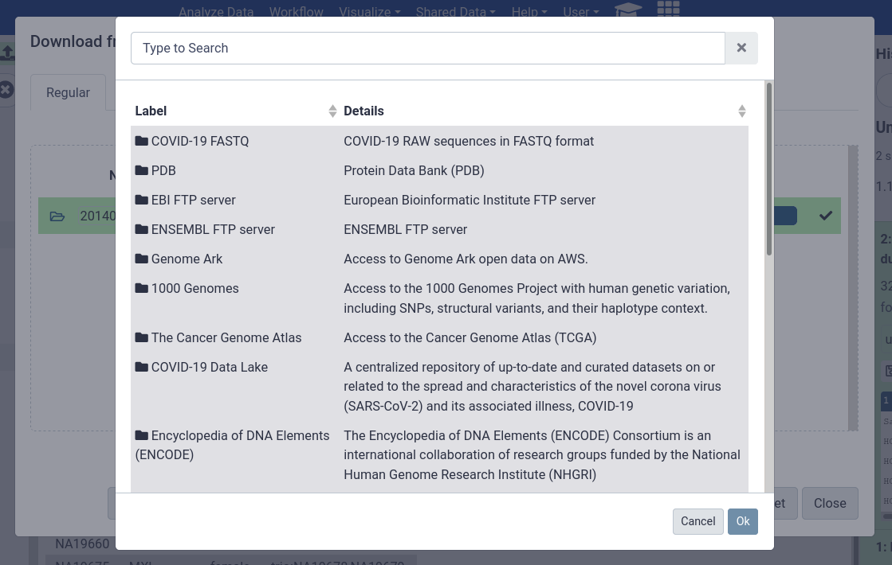
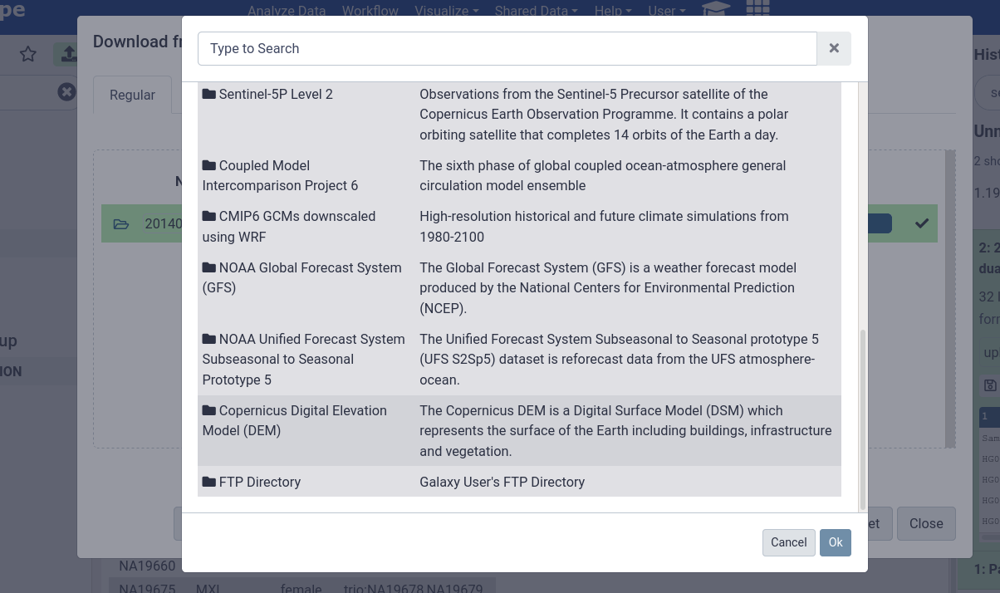
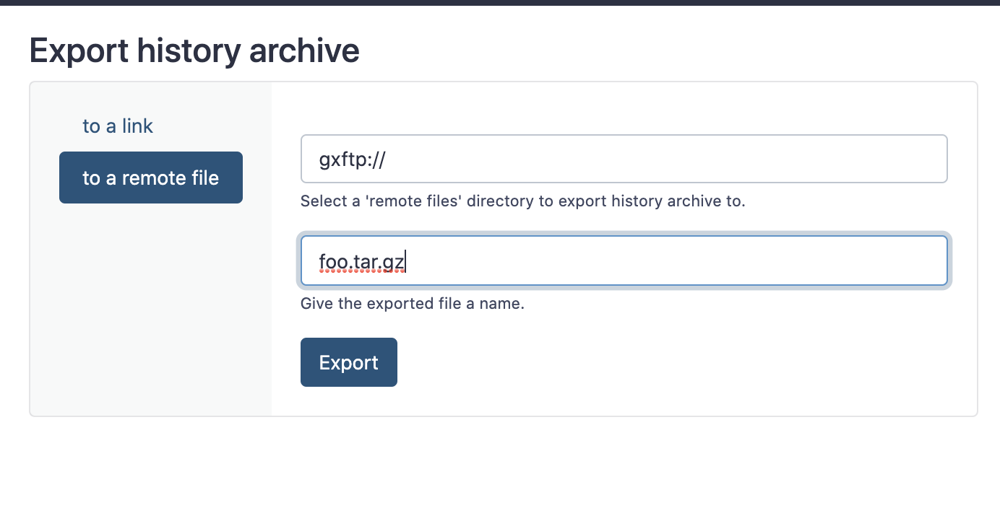
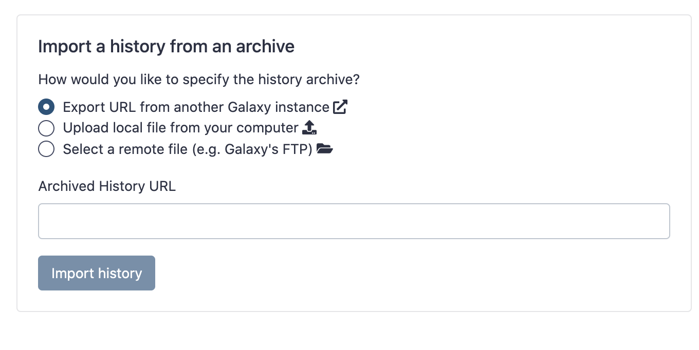
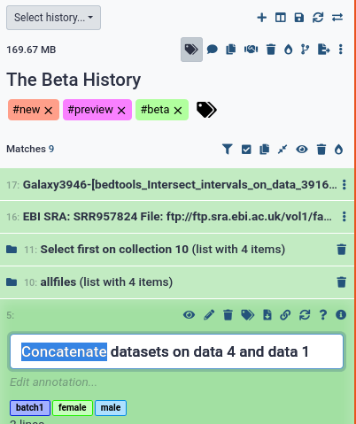
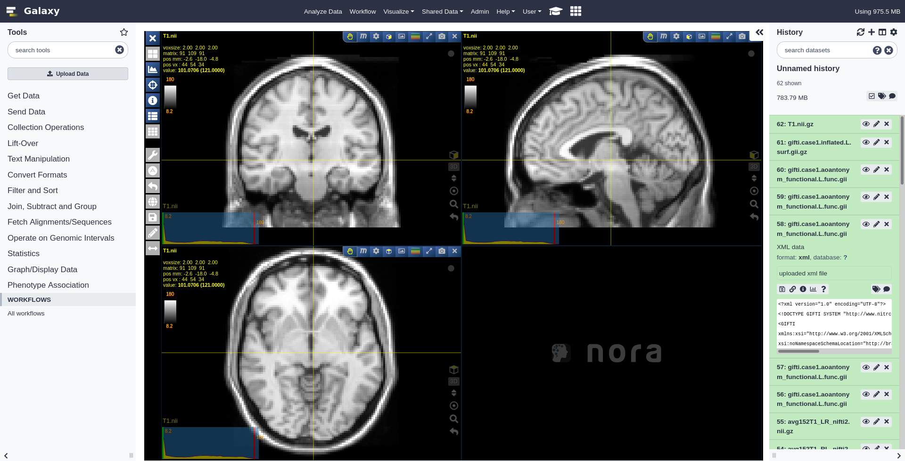

===========================================================
January 2021 Galaxy Release (v 21.01)
===========================================================

.. include:: _header.rst

Highlights
===========================================================

Workflows are the absolute ✨star✨ of Galaxy v21.01, they have seen huge improvements.

Workflows: Best Practices, Reports, Invocations
-----------------------------------------------

Workflows have seen huge improvements this release! The workflow report editor is easier than ever to use providing you with a list of common report components, interactive interfaces for embedding them in your reports, and a new workflow invocation tracker. You can now embed visualizations directly in your workflow reports making summarizing your analyses easier than ever.  And, once your reports are produced, you can export them directly to pages to share your reports with colleagues.

.. raw:: html

   <iframe width="560" height="315" src="https://www.youtube-nocookie.com/embed/TmZzfaKf1V0" frameborder="0" allow="accelerometer; autoplay; clipboard-write; encrypted-media; gyroscope; picture-in-picture" allowfullscreen></iframe>

If you're building advanced workflows utilizing Galaxy's powerful sub-workflows for reusable workflow components, then you'll be pleased to know you can now automatically update those to the latest version

.. raw:: html

   <iframe width="560" height="315" src="https://www.youtube-nocookie.com/embed/2gHvmy_tIVc" frameborder="0" allow="accelerometer; autoplay; clipboard-write; encrypted-media; gyroscope; picture-in-picture" allowfullscreen></iframe>

Furthermore when you're making workflows to share with others, a new "Best Practices" checker has been included which helps you discover easy things which make your workflows more shareable.

.. raw:: html

   <iframe width="560" height="315" src="https://www.youtube-nocookie.com/embed/pfNqAkzvKj8" frameborder="0" allow="accelerometer; autoplay; clipboard-write; encrypted-media; gyroscope; picture-in-picture" allowfullscreen></iframe>

Remote Files
------------

There was tough competition for top feature to highlight from 21.01 but the **Remote Files** interface is an absolutely fantastic new way to browse your data. Inside Galaxy there is a new, abstract way to reference files locally and on other servers. This let us provide a uniform interface to FTP servers, your Dropbox, public S3 buckets, and more! You'll find this under *Choose Remote Files* in the upload interface.

The Galaxy Climate community is providing an excellent test case; much of their data is publicly available on public S3 buckets which were not easy to access, now they're directly available from Galaxy. No more magic "import this url" steps in your documentation, now "just browse the repository for your data".

But the addition of the Remote Files browser didn't stop there! Several other interfaces received updates to use this new framework:

History Import & Export
^^^^^^^^^^^^^^^^^^^^^^^

Histories can now be exported directly to your FTP folders, Dropbox, or any other configured remote file storage.

And history importing saw the same treatment, permitting importing from any of these public data locations making it easier than ever to share histories between Galaxy, and make your analyses more reproducible!

See more screenshots and more features in `Pull Request 11054`_.

Rule Builder
^^^^^^^^^^^^

Likewise the Rule-Builder now has access to the remote files interface. Sample sheets with identifiers can easily be found in many FTP servers and other locations, and then loaded directly into the Rule Builder via this new interface. So easy!

Beta History Panel
------------------

The History panel is getting a refresh and a huge performance boost in the latest code. Does this sound exciting to you? Try it out now with the history menu option "Use Beta History Panel". This is not its final state but we'd love feedback from you, the users, on how you find it. It features both performance and usability improvements. E.g. now you can rename files without going into a separate menu, just double click the dataset title!

User-friendliness Improvements
------------------------------

This is a new section covering smaller improvements that just make your life easier and your interactions with Galaxy faster.

* Interactive tools can be stopped, without their outputs disappearing, better for reproducibility! `Pull Request 10497`_
* When uploading files, the 'name' field will be auto-focused, allowing you to get straight to renaming the files, saving you time. `Pull Request 10487`_
* Workflow versions now expose their update time. Reverting to an old version? Oh, yes, that one from Tuesday! `Pull Request 10492`_
* Sharing components now include a "copy to clipboard" feature for URLs. One click and you're ready to share with the world. `Pull Request 10754`_
* The GTN-in-Galaxy overlay now keeps track of the page you were looking at if the Galaxy page gets refreshed. Go forth and learn without distraction! `Pull Request 11290`_

New Visualizations
===========================================================

.. visualizations

NORA, a medical image viewer and annotation tool (thanks to `@bgruening <https://github.com/bgruening>`__, `Pull Request 11035`_)

OpenSeadragon viewer for deep zoom images (thanks to `@gregvonkuster <https://github.com/gregvonkuster>`__, `Pull Request 10756`_)

New Datatypes
===========================================================

.. datatypes

* initial commit for gfa2
  (thanks to `@bernt-matthias <https://github.com/bernt-matthias>`__).
  `Pull Request 10270`_
* add ome.tiff datatype
  (thanks to `@qiagu <https://github.com/qiagu>`__).
  `Pull Request 10349`_
* Add support for the dzi (Deep Zoom Image) data format
  (thanks to `@gregvonkuster <https://github.com/gregvonkuster>`__).
  `Pull Request 10546`_
* Add datatype converters for various MD filetypes
  (thanks to `@simonbray <https://github.com/simonbray>`__).
  `Pull Request 10757`_
* Add nifti1 and nifti2 datatype
  (thanks to `@bgruening <https://github.com/bgruening>`__).
  `Pull Request 11020`_
* add tck and trk datatype
  (thanks to `@bgruening <https://github.com/bgruening>`__).
  `Pull Request 11021`_
* add gifti fileformat
  (thanks to `@bgruening <https://github.com/bgruening>`__).
  `Pull Request 11028`_
* add basic Apache Parquet datatype
  `Pull Request 11047`_
* Add minimal `msf` datatype
  (thanks to `@nsoranzo <https://github.com/nsoranzo>`__).
  `Pull Request 11084`_
* Add ffindex and ffdata database file types
  `Pull Request 11218`_
* Fix sniffers of interval datatypes for files starting with many comments
  (thanks to `@nsoranzo <https://github.com/nsoranzo>`__).
  `Pull Request 11416`_
* Add cmap datatype
  (thanks to `@jaidevjoshi83 <https://github.com/jaidevjoshi83>`__).
  `Pull Request 11471`_
* Add compressed paf datatype
  (thanks to `@astrovsky01 <https://github.com/astrovsky01>`__).
  `Pull Request 11567`_

Builtin Tool Updates
===========================================================

.. tools

* Allow the Apply Rules tool to attach tags to output datasets.
  `Pull Request 10382`_
* Allow build_list inputs to be optional
  `Pull Request 10871`_
* Update askomics IT to 4.1.1
  (thanks to `@abretaud <https://github.com/abretaud>`__).
  `Pull Request 10878`_
* Allow empty file uploads
  (thanks to `@bernt-matthias <https://github.com/bernt-matthias>`__).
  `Pull Request 11079`_
* Make hash selection mandatory in hash tool.
  `Pull Request 11427`_
* Various pyiron interactive tool fixes.
  (thanks to `@bgruening <https://github.com/bgruening>`__).
  `Pull Request 11545`_
* Update the cellxgene IT container.
  (thanks to `@bgruening <https://github.com/bgruening>`__).
  `Pull Request 11546`_
* Allow using Openrefine without data inputs
  (thanks to `@bgruening <https://github.com/bgruening>`__).
  `Pull Request 11547`_
* Fix $HOME for some gxit requiring a specific one
  (thanks to `@abretaud <https://github.com/abretaud>`__).
  `Pull Request 11577`_

Release Notes
===========================================================

Please see the :doc:`full release notes <21.01_announce>` for more details.

.. include:: 21.01_prs.rst

.. include:: _thanks.rst
