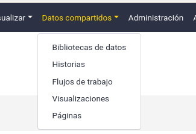

===========================================================
May 2021 Galaxy Release (v 21.05)
===========================================================

.. include:: _header.rst

Highlights
===========================================================

**¡Galaxy, ahora en español!**
Thanks to Wendi Bacon (`Pull Request 11891`_), the Spanish language translation of Galaxy has been finalised and merged, so if you prefer to use Galaxy in Spanish, now you can! This update will be part of an ongoing project from Spanish speakers within the Galaxy community to keep the Galaxy interface localisation up to date, and to produce some Spanish language training materials in the GTN.

**Bugfixes and Stability**
This release of Galaxy features fewer user-facing changes, as a huge amount of developer time went into making this a maintenance release with better testing, better stability, and more bugfixes. But watch out, this is all in preparation for the next release of Galaxy, 21.09, which will have some of the biggest UI changes in years!

**Remote Files: FTP Support**
In the last release, the Remote Files interface was added granting access to a huge number of remote data sources directly in Galaxy. Support was added for FTP servers in the latest release so now you can connect e.g. the NCBI FTP server for all of your genomic data needs.

**Download Collections from Reports**
Workflow reports are gaining popularity and features! You can not only insert previews of collections in your reports, but also download them directly from the report interface.

.. figure:: images/21.05-report.png
   :alt: Screenshot of a workflow report box showing a dataset collection. A new button, a download icon, appears at the top right.

New Visualizations
===========================================================

.. visualizations

Thanks to `@dlal-group <https://github.com/dlal-group>`__, the SimText suite of tools has been added as an interactive tool within Galaxy. You can read about how to use this new Interactive Tool in the associated `GTN tutorial <https://training.galaxyproject.org/training-material/topics/statistics/tutorials/text-mining_simtext/tutorial.html>`__.

New Datatypes
===========================================================

* Add FlowCytometry and MetaCyto datatypes
  (thanks to `@pcm32 <https://github.com/pcm32>`__).
  `Pull Request 9807`_
* Add support for `Mrc2014 format images <https://www.ccpem.ac.uk/mrc_format/mrc2014.php>`__, used in Microscopy
  (thanks to `@gregvonkuster <https://github.com/gregvonkuster>`__).
  `Pull Request 11220`_
* Add meryldb datatype, used by the meryl and mercury tools, both part of the `VGP workflows <https://github.com/VGP/vgp-assembly>`__.
  (thanks to `@bgruening <https://github.com/bgruening>`__).
  `Pull Request 11694`_
* Add datatype for PretextMap output
  `Pull Request 11747`_
* Add Avivator GEDA and sniffer for ome.tiff datatype. Aviator is a visualizer of high-resolution multiplexed bioimaging data on the web.
  (thanks to `@qiagu <https://github.com/qiagu>`__).
  `Pull Request 11801`_
* Add jellyfish db datatype, Jellyfish database files are k-mer counts in binary format.
  (thanks to `@astrovsky01 <https://github.com/astrovsky01>`__).
  `Pull Request 11802`_
* Add support for JPEG 2000 in Galaxy, widely used for storing satellite imagery, for instance from EU Copernicus Sentinel.
  (thanks to `@annefou <https://github.com/annefou>`__).
  `Pull Request 11812`_
* Add an H5 format for Machine Leaning models
  (thanks to `@qiagu <https://github.com/qiagu>`__).
  `Pull Request 11825`_
* Add support for the Relion STAR data format for Microscopy
  (thanks to `@gregvonkuster <https://github.com/gregvonkuster>`__).
  `Pull Request 11831`_
* Add toml datatype, a generic configuration file format that's used by a number of Proteomics applications
  (thanks to `@jj-umn <https://github.com/jj-umn>`__).
  `Pull Request 11909`_

Builtin Tool Updates
===========================================================

* The filter, grep, tail, and head tools all now support working with a file
  containing a header line (thanks to `@bernt-matthias <https://github.com/bernt-matthias>`__).
  `Pull Request 11365`_, `Pull Request 11859`_

Release Testing Team
===========================================================

A special thanks to the release testing team for testing many of the new features and reporting many bugs:

- `Keith Suderman <https://github.com/ksuderman>`_
- `David López <https://github.com/davelopez>`_
- `Dave Bouvier <https://github.com/davebx>`_
- `Qiang Gu <https://github.com/qiagu>`_

Release Notes
===========================================================

Please see the :doc:`full release notes <21.05_announce>` for more details.

.. include:: 21.05_prs.rst

.. include:: _thanks.rst
