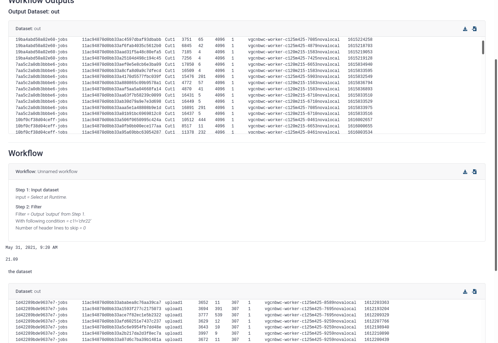

===========================================================
September 2021 Galaxy Release (v 21.09)
===========================================================

.. include:: _header.rst

Highlights
===========================================================

Tool Panel
----------

We now have "Tool Panel Views"! These are different views into the same toolbox and might help it make it easier to find the tools you want. In the future, there are plans to create user-customisable toolboxes, but until then go explore the new EDAM Ontology-based toolboxes which organise tools around scientific areas or processes, or based on the scientific process they do. For example, a category like "Filtering" might have tools like "select lines" or "filter bam by quality", both doing the same process of filtering, despite their different file types and formats.

.. raw:: html

   <iframe width="560" height="315" src="https://www.youtube-nocookie.com/embed/vCapB1xHjZg" frameborder="0" allow="accelerometer; autoplay; clipboard-write; encrypted-media; gyroscope; picture-in-picture" allowfullscreen></iframe>

Unfortunately not all tools are fully annotated yet, and while we also pull terms from `bio.tools <https://bio.tools/>`__, this still doesn't get us full coverage and many tools will still appear under a large section "Uncategorized". Hopefully this will improve as users and tool developers annotate these tools with the appropriate terms that help everyone find them.

More details can be found in `Pull Request 12327`_, `Pull Request 12365`_, and `Pull Request 12291`_

Collections (Beta History Updates)
----------------------------------

Did you ever create *a collection with the wrong dbkey or datatype*? Well, in the Beta History you can now **change collections' datatypes and dbkeys**! This should save a lot of time for everyone working with large datasets (`Pull Request 11799`).

.. raw:: html

   <iframe width="560" height="315" src="https://www.youtube-nocookie.com/embed/aPgMcTuzEJ4" frameborder="0" allow="accelerometer; autoplay; clipboard-write; encrypted-media; gyroscope; picture-in-picture" allowfullscreen></iframe>

Additionally, did a *collection ever fail* for you? And you wondered why? Now you can find out with the **view details button for collections** (`Pull Request 12261`_)!

Importing Data
--------------

Selecting datasets from the Remote Files view has gotten easier! Now you can select folders and files, and import at once all of the datasets recursively in those folders. Previously you could only select files within a folder, so this is a huge improvement in the usability of such a key new feature of Galaxy (`Pull Request 12310`_). But with great power comes great responsibility, be careful not to import the entirety of NCBI!

.. raw:: html

   <iframe width="560" height="315" src="https://www.youtube-nocookie.com/embed/XcZgQbGojh8" frameborder="0" allow="accelerometer; autoplay; clipboard-write; encrypted-media; gyroscope; picture-in-picture" allowfullscreen></iframe>

Reports
-------

Report components used to automatically arrange themselves in a smart way, but due to some issues with the floating of report components these will now be full width until we can figure out a good way to provide a similar feature allowing you to control the layout of the report (`Pull Request 12085`_).

News Webhook
------------

You might be reading this in the recently added "News" feature! This is the very first iteration of this component, hopefully in the future we will expand it to bring you all of your news and Galaxy notifications. The idea with the current iteration is that whenever your server admin updates Galaxy to a new version, everyone using the server will get a small, non-intrusive notification with these release notes! There you can find out all of the new features in Galaxy and quick videos on their use. (`Pull Request 12396`_)

New Datatypes
===========================================================

* Added documentation for FASTQ datatypes and implemented quality check
  (thanks to `@bernt-matthias <https://github.com/bernt-matthias>`__).
  `Pull Request 11931`_
* Make dataset preview for h5mlm datatype
  (thanks to `@qiagu <https://github.com/qiagu>`__).
  `Pull Request 11935`_
* Add datatypes for Structural Materials Hexrd application
  (thanks to `@jj-umn <https://github.com/jj-umn>`__).
  `Pull Request 11957`_
* Adding new subclass types
  (thanks to `@maikenp <https://github.com/maikenp>`__).
  `Pull Request 12097`_
* Converters: use target datatype
  (thanks to `@bernt-matthias <https://github.com/bernt-matthias>`__).
  `Pull Request 12185`_
* Add bref3 datatype
  (thanks to `@gallardoalba <https://github.com/gallardoalba>`__).
  `Pull Request 12199`_
* Converters: add missing tests and add linting to converter tests
  (thanks to `@bernt-matthias <https://github.com/bernt-matthias>`__).
  `Pull Request 12202`_
* Converters: Unify converters to tabix and bgzip
  (thanks to `@bernt-matthias <https://github.com/bernt-matthias>`__).
  `Pull Request 12213`_
* Converters: Unify molecules converters
  (thanks to `@bernt-matthias <https://github.com/bernt-matthias>`__).
  `Pull Request 12214`_
* Converters: Unify dcd, trr, xtc
  (thanks to `@bernt-matthias <https://github.com/bernt-matthias>`__).
  `Pull Request 12224`_
* converters: Unify bcf converters
  (thanks to `@bernt-matthias <https://github.com/bernt-matthias>`__).
  `Pull Request 12225`_
* Fix edta metadata setting
  (thanks to `@bernt-matthias <https://github.com/bernt-matthias>`__).
  `Pull Request 12273`_
* Increase specificity of mothur.pair.dist sniffer
  (thanks to `@bernt-matthias <https://github.com/bernt-matthias>`__).
  `Pull Request 12280`_
* Add "ExpressionSet RData object" Datatype
  (thanks to `@mtekman <https://github.com/mtekman>`__).
  `Pull Request 12336`_
* Small fix in binary.py
  (thanks to `@melibleq <https://github.com/melibleq>`__).
  `Pull Request 12384`_
* Parse sam metadata from sam files
  (thanks to `@bernt-matthias <https://github.com/bernt-matthias>`__).
  `Pull Request 12392`_
* Add ONNX datatype
  (thanks to `@anuprulez <https://github.com/anuprulez>`__).
  `Pull Request 12429`_
* Drop bcftools requirement from set_metadata tool
  `Pull Request 12472`_
* Fix cmap sniffer
  (thanks to `@astrovsky01 <https://github.com/astrovsky01>`__).
  `Pull Request 12509`_
* Add support for RDS files and improvements for RData
  (thanks to `@bernt-matthias <https://github.com/bernt-matthias>`__).
  `Pull Request 12712`_
* Add file_ext property to Pretext and others datatypes
  (thanks to `@bernt-matthias <https://github.com/bernt-matthias>`__).
  `Pull Request 12713`_
* Make vg a subclass of CompressedArchive
  (thanks to `@bernt-matthias <https://github.com/bernt-matthias>`__).
  `Pull Request 12718`_
* Yaml datatype backport
  `Pull Request 12745`_

Builtin Tool Updates
===========================================================

* Changes to Collection Operation Help sections and parameter names
  `Pull Request 11068`_
* GPU enabled jupyter notebook for machine learning powered by Jupyter lab and Tensorflow
  (thanks to `@anuprulez <https://github.com/anuprulez>`__).
  `Pull Request 11484`_
* Update bam.iobio interactive tool wrapper
  (thanks to `@luke-c-sargent <https://github.com/luke-c-sargent>`__).
  `Pull Request 11537`_
* Add tool for exporting individual files to galaxy file source plugins.
  `Pull Request 11613`_
* NCBI Datasets data source tool
  `Pull Request 11738`_
* Fix typo in `interactivetool_jupyter_notebook.xml` help section
  (thanks to `@maximskorik <https://github.com/maximskorik>`__).
  `Pull Request 12077`_
* Update interactivetool_pyiron.xml
  (thanks to `@gmauro <https://github.com/gmauro>`__).
  `Pull Request 12127`_
* Update AskOmics interactive tool to 4.3.1
  (thanks to `@abretaud <https://github.com/abretaud>`__).
  `Pull Request 12159`_
* Fix patterns in Grep1 tool
  `Pull Request 12166`_
* Remove unused legacy controller things
  `Pull Request 12172`_
* Add ``<creator>`` to the tool schema template, use live links in xsd
  `Pull Request 12242`_
* Systematic handling of remotely required tool files.
  `Pull Request 12250`_
* Restore Grep1 version 1.0.1
  `Pull Request 12252`_
* Vuefy and improve granularity for tool HTML sanitization
  `Pull Request 12283`_
* Allow bio.tools mappings for legacy tools.
  `Pull Request 12289`_
* Allow skipping sanitization of / char in export_remote tool
  `Pull Request 12372`_
* Lock location file before adding values
  `Pull Request 12446`_
* Modernize sorter (sort1) tool
  `Pull Request 12619`_
* Improve error handling in DirectoryUriToolParameter validation
  (thanks to `@davelopez <https://github.com/davelopez>`__).
  `Pull Request 12760`_

Release Testing Team
===========================================================

A special thanks to the release testing team for testing many of the new features and reporting many bugs:

- `Keith Suderman <https://github.com/ksuderman>`_
- `Wolfgang Maier <https://github.com/wm75>`_
- `Cristóbal Gallardo <https://github.com/gallardoalba>`_
- `Jennifer Hillman-Jackson <https://github.com/jennaj>`_
- `Alex Ostrovsky <https://github.com/astrovsky01>`_
- `Kaivan Kamali <https://github.com/kxk302>`_

Release Notes
===========================================================

Please see the :doc:`full release notes <21.09_announce>` for more details.

.. include:: 21.09_prs.rst

.. include:: _thanks.rst
