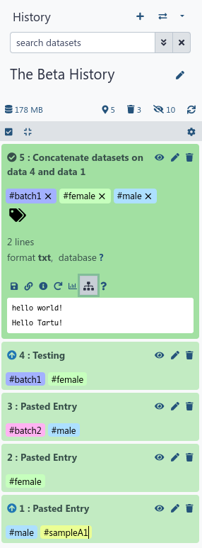
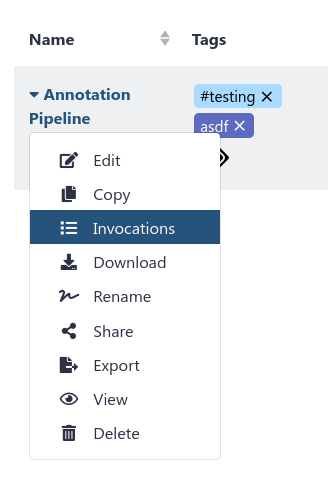
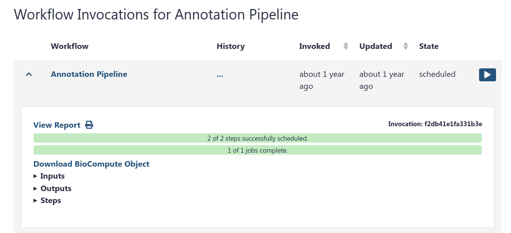
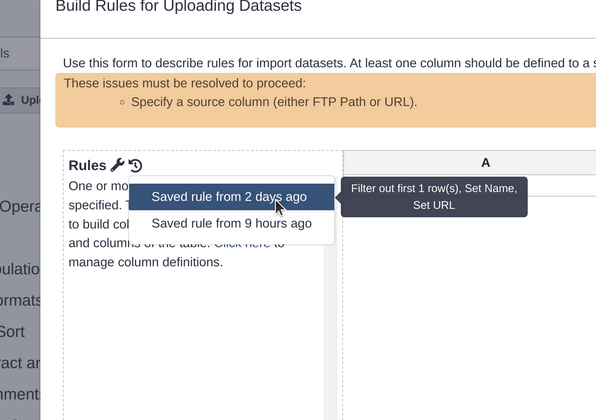
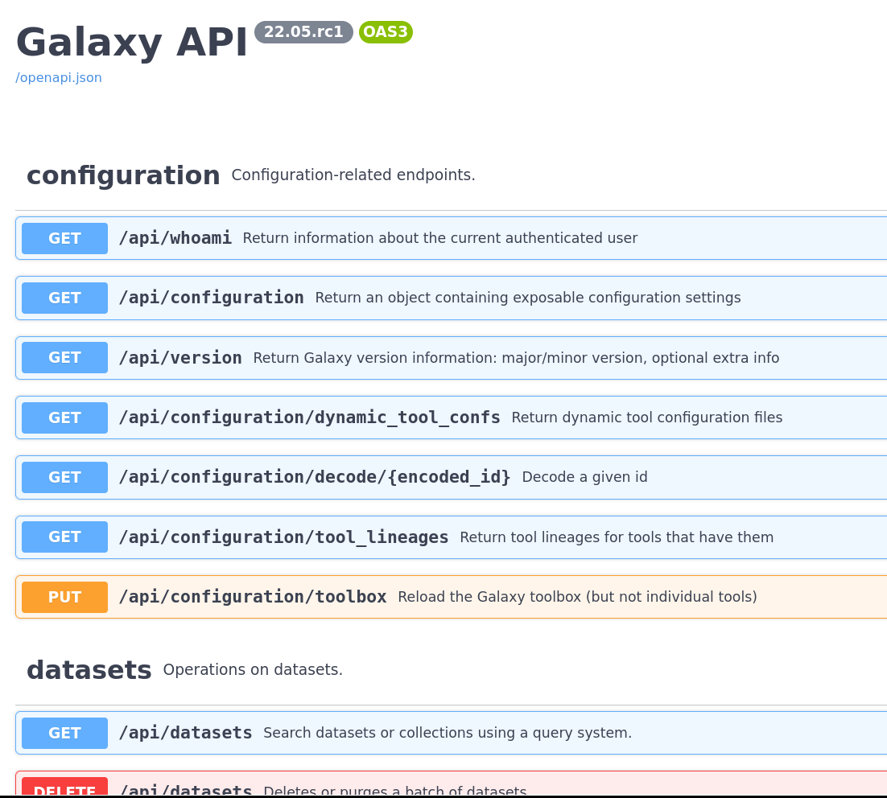
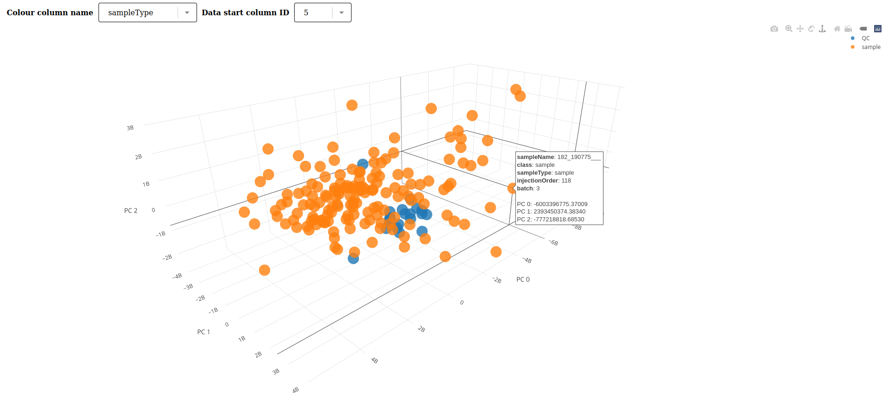

===========================================================
May 2022 Galaxy Release (v 22.05)
===========================================================

.. include:: _header.rst

Highlights
===========================================================

**The New History is Here**

After years of effort by the development team and community contributors, the new history is finally here. It's a big improvement over the old history interface, both technically and in terms of user experience, but it might take some getting used to. It has a lot of great new features like:

- A quick switcher, letting you switch between recent histories
- Easily find dataset inputs
- Improved history search interface

Check it out now!

 icon next to the dataset number. The history is titled the beta history and there are a lot of new buttons at the top.

**Storage Dashboard** (beta)

Have you ever been over your quotum? 250 GB sure goes fast! Now with the new Storage Dashboard you can get a quick overview of ways to help clean up deleted datasets and recover some of that quotum allocation. This is a beta version of this interface, let us know if you have any issues. In future versions, it will be expanded to help you understand how your allocation is being used, and which histories and datasets should be cleaned up first.

.. raw:: html

   <iframe width="560" height="315" src="https://www.youtube-nocookie.com/embed/Qbf3FcRPhhE" frameborder="0" allow="accelerometer; autoplay; clipboard-write; encrypted-media; gyroscope; picture-in-picture" allowfullscreen alt="Video of a user activating the storage dashboard interface, and then using the dataset deletion interface to delete multiple datasets, before seeing the decreased storage usage."></iframe>

**Bulk History Operations**

The new history allows for improved bulk operations, selecting dozens or hundreds of datasets to retag or change their dbkey automatically, a process that used to require using collections or doing them one by one.

.. raw:: html

   <iframe width="560" height="315" src="https://www.youtube-nocookie.com/embed/rSv4HgQaMkg" frameborder="0" allow="accelerometer; autoplay; clipboard-write; encrypted-media; gyroscope; picture-in-picture" allowfullscreen alt="Video of a user selecting multiple datasets and applying a tag to all of them, before selecting multiple datasets and applying a DB key to all of them as well."></iframe>

**Workflow Improvements**

You can now see all invocations of a specific workflow, across all of your histories.

This is especially useful if you run a single workflow across multiple datasets, and keep them nicely separated in multiple histories. You can see all of the results in a single centralised location.

Additional workflow improvements have been made, e.g. numbering of steps in a workflow. Improvements have been made to the internal representation of the workflow that should make the saved `.ga` and `.gxwf.yml` files easier to compare across changes.

Workflows can also now be zoomed via scrolling, this interface should be more familiar for anyone who has used Google Maps:

.. raw:: html

   <iframe width="560" height="315" src="https://www.youtube-nocookie.com/embed/B-Ku-zEiNOw" frameborder="0" allow="accelerometer; autoplay; clipboard-write; encrypted-media; gyroscope; picture-in-picture" allowfullscreen alt="Video of a user zooming in and out of a workflow by scrolling."></iframe>

**Saved Rules**

Do you use the Rule Based Uploader? (If not, `learn how today! <https://training.galaxyproject.org/training-material/topics/galaxy-interface/tutorials/upload-rules/tutorial.html>`__) The RBU now has a very convenient recently used rule listing, sorted by how recently they were used. You can hover over each entry to also list a preview of what steps were done in that RBU invocation:

**Scratchbook Upgraded**

The scratchbook has been updated to a newer implementation. Now your views of datasets can overlap, you have much more freedom in the size of each window, and you can minimize datasets like minimizing a window to the taskbar in Windows.

.. raw:: html

   <iframe width="560" height="315" src="https://www.youtube-nocookie.com/embed/1vd8o1m7cfc" frameborder="0" allow="accelerometer; autoplay; clipboard-write; encrypted-media; gyroscope; picture-in-picture" allowfullscreen alt="Video of the new scratchbook, where the user opens datasets and minimizes them. They now appear at the bottom of the window"></iframe>

**OpenAPI Docs**

The Galaxy API has been going through a long upgrade to FastAPI, which allows us to generate OpenAPI documentation. If you're an API consumer, either via BioBlend or via another system, you can use this to see all of the APIs available from Galaxy and try them out live.

New Visualizations
===========================================================

.. visualizations
* Add 3D PCA visualization
  (thanks to `@xtrojak <https://github.com/xtrojak>`__).
  `Pull Request 13771`_

New Datatypes
===========================================================

.. datatypes
* Add new molecule datatypes
  (thanks to `@muon-spectroscopy-computational-project <https://github.com/muon-spectroscopy-computational-project>`__).
  `Pull Request 12375`_
* Add mzqc datatype
  (thanks to `@bernt-matthias <https://github.com/bernt-matthias>`__).
  `Pull Request 13564`_
* Add bigWig to Wig converter
  (thanks to `@gallardoalba <https://github.com/gallardoalba>`__).
  `Pull Request 13708`_
* Add support for gz-compressed gfa1 and gfa2 files
  (thanks to `@gallardoalba <https://github.com/gallardoalba>`__).
  `Pull Request 13927`_
* Fix collection download for bam native files
  (thanks to `@mvdbeek <https://github.com/mvdbeek>`__).
  `Pull Request 14162`_

Builtin Tool Updates
===========================================================

.. tools
* Overhaul and improve the Jupyter Interactive Tool, providing many new interface options
  (thanks to `@blankenberg <https://github.com/blankenberg>`__).
  `Pull Request 13606`_
  * You can specify any number of user-defined inputs using the repeat input, providing name value, selecting the type of input, and then providing values.
  * You can make the JupyTool reusable in a workflow, by allowing the user to specify input values for the defined input blocks.
  * Inputs can be accessed by name from the automatically provided GALAXY_INPUTS dictionary.
  * Outputs can be written automatically to the user's history by writing to the outputs directory for one individual file or to the outputs/collection directory for multiple files.
  * Using collection tools, you can parse out the individual elements from the collection, as needed.
* Add built-in converters to tool panel
  (thanks to `@jdavcs <https://github.com/jdavcs>`__).
  `Pull Request 13447`_
* Add and update various interactive tools
  (thanks to `@gmauro <https://github.com/gmauro>`__).
  `Pull Request 13811`_
* Bump ncb-datasets-cli dependency to 13.14.0
  (thanks to `@mvdbeek <https://github.com/mvdbeek>`__).
  `Pull Request 13853`_

Release Testing Team
===========================================================

A special thanks to the release testing team for testing many of the new features and reporting many bugs:

- `Ahmed Awan <https://github.com/ahmedhamidawan>`
- `Catherine Bromhead <https://github.com/cat-bro>`
- `Fabio Cumbo <https://github.com/cumbof>`
- `Jennifer Hillman-Jackson <https://github.com/jennaj>`
- `John Davis <https://github.com/jdavcs>`
- `Simon Bray <https://github.com/simonbray>`
- `Tyler Collins <https://github.com/tcollins2011>`

Release Notes
===========================================================

User facing release notes compiled by `Helena Rasche <https://github.com/hexylena>`_.

Please see the `full release notes <22.05_announce.html>`_ for more details.

.. include:: 22.05_prs.rst

.. include:: _thanks.rst
