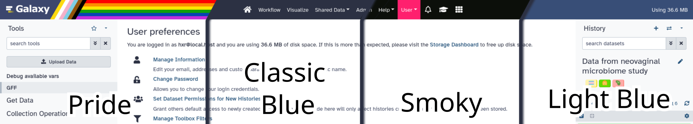

===========================================================
 2023 Galaxy Release (v 23.0)
===========================================================

.. include:: _header.rst

Highlights
===========================================================

Themes!
-------

Galaxy has themes! As as a user you will be able to select between a number of built-in themes. Server administrators may choose to provide additional themes for their users. If your admin has enabled this feature, you will find it under User → Preferences, just look for the bright red "New!"

e, a black theme with pink highlights, and then a lighter blue theme.

New Font
--------

You might have noticed Galaxy looking a wee bit different. The 0s and Os are now more distinctive, as well as a host of other characters, thanks to us switching to `Atkinson Hyperlegible <https://brailleinstitute.org/freefont>`__, a font that should be a _lot_ friendlier for folks with visual impairments. In general this font is a lot easier to read for everyone and we're excited for it!

New History Multi-view
----------------------

The old history multi-view which loaded every history and every dataset is now gone. In its place is a much faster and easier to navigate history multi-view which lets you select just the histories you want to look at, without the distraction of your other analyses! Now you can focus on the relevant data.

TODO: VIDEO

New Tool Search
---------------

Many of us over the years have struggled to find just the tool we were looking for. This latest release has a number of improvements specifically to make tool search better, and on top of that a whole new advanced tool search!

.. raw:: html

   <iframe width="560" height="315" src="https://www.youtube-nocookie.com/embed/04HHLVcjrO0" frameborder="0" allow="accelerometer; autoplay; clipboard-write; encrypted-media; gyroscope; picture-in-picture" allowfullscreen alt="Video of a user using the new search interface to find collection operations tools, and then a Filter tool."></iframe>

Power User Features
===========================================================

Are you a long time Galaxy user looking to up-skill into a real power user? Check out these new features to take your skills to the next level.

Faster Upload
-------------

Simply drag files from your desktop into Galaxy and they'll start uploading immediately! It's faster than ever to start analysing your data.

.. raw:: html

   <iframe width="560" height="315" src="https://www.youtube-nocookie.com/embed/KjVl4g0gyS8" frameborder="0" allow="accelerometer; autoplay; clipboard-write; encrypted-media; gyroscope; picture-in-picture" allowfullscreen alt="Video of a user using the new search interface to find collection operations tools, and then a Filter tool."></iframe>

Drag and Drop Between Histories
-------------------------------

With the new advent of the new Multi-History mentioned above, we now also can drag and drop between histories! And no longer are you restricted from dragging into the current history, instead you can drag files back and forth between all histories as well.

.. raw:: html

   <iframe width="560" height="315" src="https://www.youtube-nocookie.com/embed/8xzSzd2TOMY" frameborder="0" allow="accelerometer; autoplay; clipboard-write; encrypted-media; gyroscope; picture-in-picture" allowfullscreen alt="Video of a user using the new search interface to find collection operations tools, and then a Filter tool."></iframe>

Change the Datatype of a Collection
-----------------------------------

It's easier than ever to change the datatype of every dataset in a collection using the pencil icon. Previously this could be achieved through the Apply Rules tool, however now it can be done just like with individual datasets.

.. raw:: html

   <iframe width="560" height="315" src="https://www.youtube-nocookie.com/embed/SNvne6GdKzs" frameborder="0" allow="accelerometer; autoplay; clipboard-write; encrypted-media; gyroscope; picture-in-picture" allowfullscreen alt="Video of a user using the new search interface to find collection operations tools, and then a Filter tool."></iframe>

RO-Crate / Biocompute Export
----------------------------

Are you interested in publishing workflow artefacts? You can do that in one of two formats now, RO-Crate and BioCompute Object. These are both standards based efforts to package research data and metadata. Read more about [RO-Crate](https://www.researchobject.org/ro-crate/) and [BioCompute Objects](https://biocomputeobject.org/). You'll need to have a remote file source configured (e.g. FTP or Dropbox) to use it.

Workflow Report - Collapsible Boxes
-----------------------------------

Based on user feedback of what features were missing from workflow reports, support for collapsing large boxes has been added to the Workflow Reports editor. Simply add ``collapse="Your Box Title"`` and large elements will be hidden with just a clickable box titled "Your Box Title". Great for including large graphs or tables that may be important, but not relevant to show initially.

New Datatypes
===========================================================

.. datatypes
* Add "Datatypes" Page
  (thanks to `@ElectronicBlueberry <https://github.com/ElectronicBlueberry>`__).
  `Pull Request 14464`_
* Add datatypes for Sybila tools
  (thanks to `@xtrojak <https://github.com/xtrojak>`__).
  `Pull Request 14362`_
* Add CASTEP datatypes
  (thanks to `@mvdbeek <https://github.com/mvdbeek>`__).
  `Pull Request 14504`_
* Add support for the PSL data format
  (thanks to `@gregvonkuster <https://github.com/gregvonkuster>`__).
  `Pull Request 14813`_
* Add ludwig report datatype
  (thanks to `@qiagu <https://github.com/qiagu>`__).
  `Pull Request 14903`_
* Display model diagram for h5mlm datatype
  (thanks to `@qiagu <https://github.com/qiagu>`__).
  `Pull Request 14992`_
* Enable Tabix download + New datatype JuicerMediumTabix in 22.05
  (thanks to `@lldelisle <https://github.com/lldelisle>`__).
  `Pull Request 15024`_
* Add wiff2 composite/tar datatypes
  (thanks to `@neoformit <https://github.com/neoformit>`__).
  `Pull Request 15249`_
* Add ecology type section + hdr and bil datatypes
  (thanks to `@yvanlebras <https://github.com/yvanlebras>`__).
  `Pull Request 15337`_
* add xsd datatype
  (thanks to `@bernt-matthias <https://github.com/bernt-matthias>`__).
  `Pull Request 15344`_

Builtin Tool Updates
===========================================================

.. tools
* Simplify head wrapper - same functionality, no pipe
  (thanks to `@wm75 <https://github.com/wm75>`__).
  `Pull Request 14895`_
* Update interactivetool_ml_jupyter_notebook.xml
  (thanks to `@anuprulez <https://github.com/anuprulez>`__).
  `Pull Request 14910`_
* Add interactive tool for Mgnify Jupyter lab
  (thanks to `@bebatut <https://github.com/bebatut>`__).
  `Pull Request 14950`_
* Add interactive tool for Pavian
  (thanks to `@bebatut <https://github.com/bebatut>`__).
  `Pull Request 15068`_

Release Testing Team
===========================================================

A special thanks to the release testing team for testing many of the new features and reporting many bugs:

Alireza Heidari <https://github.com/itisAliRH>
Bryan Raubenolt <https://github.com/thepineapplepirate>
Cameron Hyde <https://github.com/neoformit>
Jennifer Hillman-Jackson <https://github.com/jennaj>
John Chilton <https://github.com/jmchilton>
John Davis <https://github.com/jdavcs>
Laila Los <https://github.com/ElectronicBlueberry>

Release Notes
===========================================================

User facing release notes compiled and written by `Helena Rasche <https://github.com/hexylena>`_.

Please see the :doc:`full release notes <23.0_announce>` for more details.

.. include:: 23.0_prs.rst

.. include:: _thanks.rst
