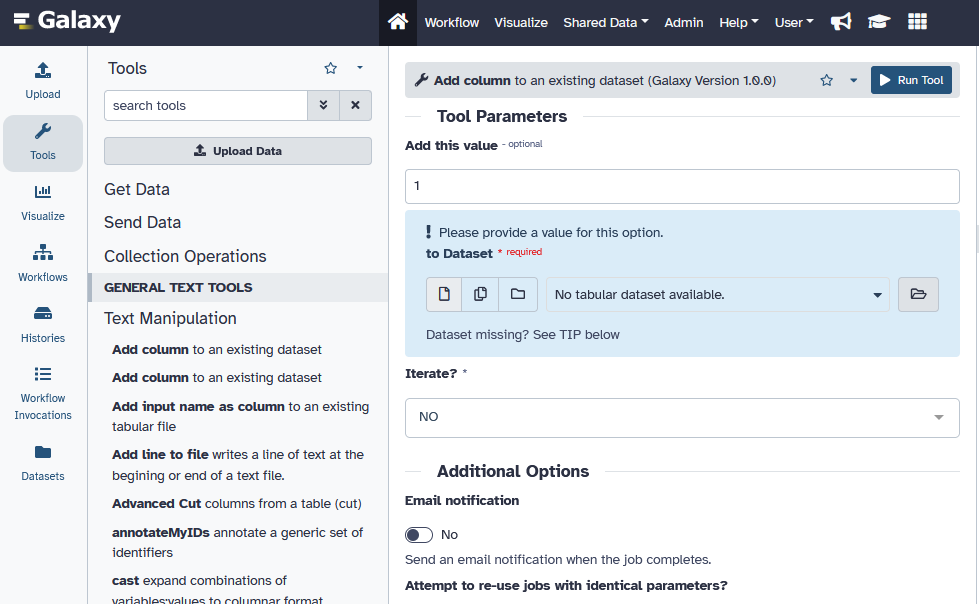
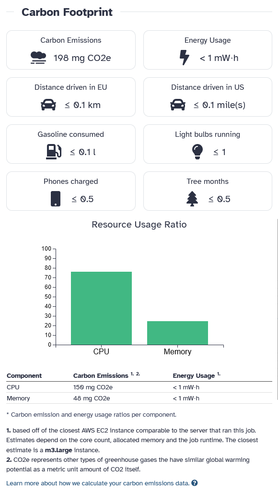
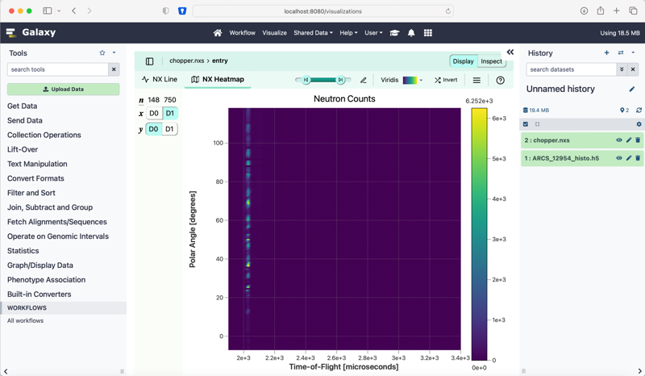

===========================================================
23.1 Galaxy Release (June 2023)
===========================================================

.. include:: _header.rst

Highlights
===========================================================

Activity Bar Interface
--------------------------

23.1 introduces the Activity Bar, a new customizable interface element designed
for swift navigation through various sections of the application. The feature is
currently opt-in, and you can try it today by enabling it in User Preferences.
Upcoming releases will enable this by default for all users, and will extend
functionality with new activities and by allowing users to drag items such as
datasets and workflows directly from the UI into the activity bar component.

Carbon Emissions Reporting
---------------------------

Monitor your environmental impact with our new Carbon Emissions Reporting
feature. This feature is available on the job information page, allowing users
to track their carbon footprint in real-time. The calculations assume global
average values for carbon intensity and power usage effectiveness.  Monitor your
carbon footprint and become inspired to better your relationship with the
environment!

History Archival Feature
-------------------------
The history menu has a new option to move a history out of your active histories
and into an archive.  When archiving a history, you will be presented with two
options: either to “Keep the Storage Space” or to “Free the Storage Space” taken
up by the history. Keeping the storage space will keep the contents of the
history where they are, allowing them to be restored at any moment, but will
prevent the UI from allowing certain operations on the history. Freeing the
storage space will prompt you to package and export the history to a permanent
remote source as a backup snapshot, and then will purge the history and its
contents to free up storage space. There will be a simple list, titled Archived
Histories, for you to explore your archived histories and restore and reimport
them, as needed!

Visualize HDF5 Datasets
------------------------

Users can now visualize their HDF5 datasets directly in Galaxy, thanks to the
integration of the h5web visualizer (https://h5web.panosc.eu/)!

Galaxy Notification Framework
-----------------------------
Galaxy now contains a universal notification framework.  This will facilitate
sending notifications about a wide variety of scenarios like job completion,
artifact sharing, server updates, and more.  Users have control over their
notifications, including the option to subscribe/unsubscribe from certain types
of notifications.  The new notification system also supports broadcast
notifications, allowing administrators to send server-wide announcements, such
as server maintenance or downtime notifications.

New Visualizations
===========================================================

.. visualizations
* H5web updates
  (thanks to `@dannon <https://github.com/dannon>`__).
  `Pull Request 16509`_
* Update galaxyproject/charts utilizing visualizations
  (thanks to `@dannon <https://github.com/dannon>`__).
  `Pull Request 16674`_
* Add support for visualizing HDF5 datasets
  (thanks to `@jarrah42 <https://github.com/jarrah42>`__).
  `Pull Request 15394`_
* Phylocanvas rebuild
  (thanks to `@dannon <https://github.com/dannon>`__).
  `Pull Request 15521`_
* Gitignore update
  (thanks to `@ElectronicBlueberry <https://github.com/ElectronicBlueberry>`__).
  `Pull Request 16046`_
* Fixes the parcel2 build for hdf5 viz when using node18.
  (thanks to `@dannon <https://github.com/dannon>`__).
  `Pull Request 16047`_
* FITS file visualization plugin
  (thanks to `@francoismg <https://github.com/francoismg>`__).
  `Pull Request 16187`_
* Small test decorator improvements
  (thanks to `@jmchilton <https://github.com/jmchilton>`__).
  `Pull Request 16220`_

New Datatypes
===========================================================

.. datatypes
* Fix bad auto-merge of dev
  (thanks to `@jmchilton <https://github.com/jmchilton>`__).
  `Pull Request 15386`_
* Follow up to `#15186 <https://github.com/galaxyproject/galaxy/issues/15186>`__
  (thanks to `@jdavcs <https://github.com/jdavcs>`__).
  `Pull Request 15388`_
* Add support for visualizing HDF5 datasets
  (thanks to `@jarrah42 <https://github.com/jarrah42>`__).
  `Pull Request 15394`_
* Merge 23.0 into dev
  (thanks to `@mvdbeek <https://github.com/mvdbeek>`__).
  `Pull Request 15594`_
* Enable ``strict_equality`` mypy option
  (thanks to `@nsoranzo <https://github.com/nsoranzo>`__).
  `Pull Request 15808`_
* FITS data format
  (thanks to `@volodymyrss <https://github.com/volodymyrss>`__).
  `Pull Request 15905`_
* Improve display chunk generation for BAMs
  (thanks to `@wm75 <https://github.com/wm75>`__).
  `Pull Request 15972`_
* Code cleanups from ruff and pyupgrade
  (thanks to `@nsoranzo <https://github.com/nsoranzo>`__).
  `Pull Request 16035`_
* Dataset chunking tests (and small fixes)
  (thanks to `@jmchilton <https://github.com/jmchilton>`__).
  `Pull Request 16069`_
* Merge release_23.0 into dev
  (thanks to `@nsoranzo <https://github.com/nsoranzo>`__).
  `Pull Request 16088`_
* Improve robustness of collection edit E2E test
  (thanks to `@jmchilton <https://github.com/jmchilton>`__).
  `Pull Request 16092`_
* Add hdf4 datatype
  (thanks to `@TheoMathurin <https://github.com/TheoMathurin>`__).
  `Pull Request 16105`_
* Fix linting of FITS datatype code
  (thanks to `@mvdbeek <https://github.com/mvdbeek>`__).
  `Pull Request 16169`_
* Add zipped mongodb and genenotebook datatypes
  (thanks to `@abretaud <https://github.com/abretaud>`__).
  `Pull Request 16173`_
* Add Visium datatype for squidpy and spatialomics tools
  (thanks to `@astrovsky01 <https://github.com/astrovsky01>`__).
  `Pull Request 16255`_

Builtin Tool Updates
===========================================================

.. tools
* Remove render.py script from iSEE
  (thanks to `@neoformit <https://github.com/neoformit>`__).
  `Pull Request 16616`_
* FileInput no longer accept 'U' in the file mode
  (thanks to `@bgruening <https://github.com/bgruening>`__).
  `Pull Request 16704`_
* Deprecate tools/evolution
  (thanks to `@bernt-matthias <https://github.com/bernt-matthias>`__).
  `Pull Request 15656`_
* Allow pending inputs in some collection operation tools
  (thanks to `@mvdbeek <https://github.com/mvdbeek>`__).
  `Pull Request 15892`_
* Updates MGnify interactive tool to v1.1.0
  (thanks to `@SandyRogers <https://github.com/SandyRogers>`__).
  `Pull Request 16179`_
* Remove various fallback behaviors
  (thanks to `@mvdbeek <https://github.com/mvdbeek>`__).
  `Pull Request 16199`_

Release Testing Team
===========================================================

A special thanks to the release testing team for testing many of the new features:

* `Jennifer Hillman-Jackson <https://github.com/jennaj>`__
* `John Davis <https://github.com/jdavcs>`__
* `Luke Sargent <https://github.com/luke-c-sargent>`__
* `Martin Cech <https://github.com/martenson>`__
* `Michelle Savage <https://github.com/hujambo-dunia>`__
* `Stephen Mosher <https://github.com/slmosher>`__

Release Notes
===========================================================

Please see the :doc:`full release notes <23.1_announce>` for more details.

.. include:: 23.1_prs.rst

.. include:: _thanks.rst
