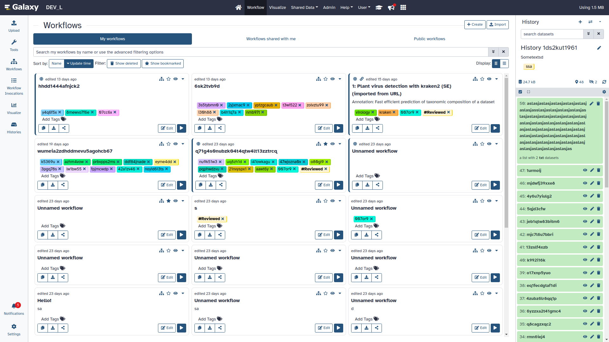
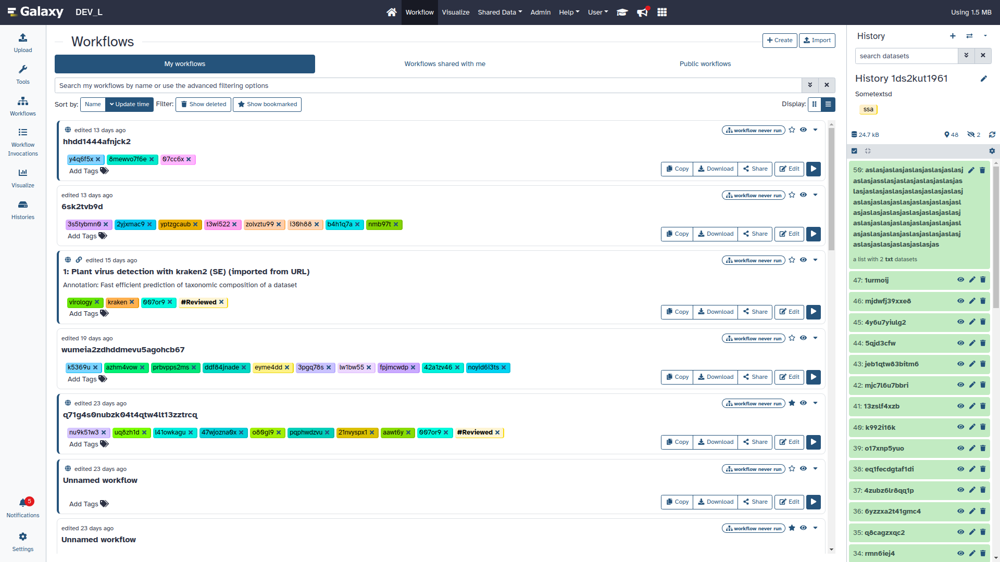
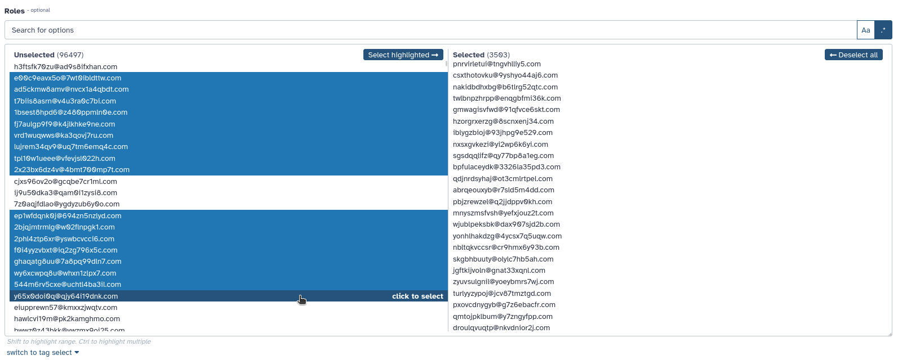
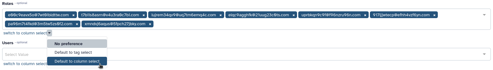

===========================================================
24.0 Galaxy Release (March 2024)
===========================================================

.. include:: _header.rst

Highlights
===========================================================

New Workflow List and Card View
-----------------------------------------------------------

As part of our ongoing efforts to enhance user experience, we are proud to announce several new improvements to the workflows user interface, including workflow list view, workflow card view and workflow quick view. These improvements also include new tabs for "My workflows" (owned by the user), "Shared with me" (shared by other users) and "Published workflows" (publicly accessible workflows).

.. raw:: html

   <iframe width="560" height="315" src="https://www.youtube.com/embed/YKTiTIBCi1E" title="Galaxy 24.0 - Workflow cards" frameborder="0" allow="accelerometer; autoplay; clipboard-write; encrypted-media; gyroscope; picture-in-picture; web-share" allowfullscreen></iframe>

My workflows: card view

My workflows: list view

New select component for selecting a large amount of options
-----------------------------------------------------------

This new component addresses the need of selecting a very large number of options at once. The component features a list based layout which can be filtered using plain-text or a regular expression. Options can be added individually, in bulk via the filter value, or by first highlighting a range.

The component is fully keyboard accessible. All methods of selection and highlighting work via keyboard. The options are not selectable individually with tab, but can be scrolled through using the arrow-keys. The hover hint adapts when a keyboard is used.

The size of the table can be increased to allow for seeing more options at once.The options in the list are limited to 1000 for performance reasons, but this can be temporarily increased in steps of 500, when reaching the end of a list.

The component can be chosen when multiple options are available; a local preference for which component to choose can be set. If no preference is set, the component will be used if there are more than 15 options selected, or more than 500 options are available.

Multiple item drag and drop and keyboard navigation
-----------------------------------------------------------

This new feature allows users to select multiple history items and drag and drop them into other histories or even tool forms! Users can also navigate their history using the arrow keys; multiple history items can be selected with the <kbd>Shift + ArrowUp/ArrowDown</kbd> key combination.

Drag and drop:

.. raw:: html

   <iframe width="560" height="315" src="https://www.youtube.com/embed/CL6AJkSmkf4" title="Galaxy 24.0 - Multiselect / drag and drop enhancements" frameborder="0" allow="accelerometer; autoplay; clipboard-write; encrypted-media; gyroscope; picture-in-picture; web-share" allowfullscreen></iframe>

Keyboard navigation and selection:

.. raw:: html

   <iframe width="560" height="315" src="https://www.youtube.com/embed/tzTxmPzl6qU" title="Galaxy 24.0 - Multiselect / keyboard navigation" frameborder="0" allow="accelerometer; autoplay; clipboard-write; encrypted-media; gyroscope; picture-in-picture; web-share" allowfullscreen></iframe>

Resource grids have been consolidated into tab views
-----------------------------------------------------------

Your histories, visualisations, and pages are now consolidated into an easier to use interface. Switch between your results and published results easily.

.. raw:: html

   <iframe width="560" height="315" src="https://www.youtube.com/embed/mkwLAYdncRs" title="Galaxy 24.0 - Resource grids" frameborder="0" allow="accelerometer; autoplay; clipboard-write; encrypted-media; gyroscope; picture-in-picture; web-share" allowfullscreen></iframe>

Move datasets between storage locations
-----------------------------------------------------------

Relocate a dataset to a different storage location with ease using this new UI feature! The example below uses an instance with four storage locations defined, but only three of them declaring the same "device" ID (set by the administrator). Clicking on the dataset information and scrolling to storage details has a "Relocate" option if the dataset is "safe" to relocate and there are valid targets to relocate it to. The UI utilizes the same visual language used for describing attributes of the storage and exposing admin provided details. This example also shows what the buttons look like for storage locations with and without quota enabled.

.. raw:: html

   <iframe width="560" height="315" src="https://www.youtube.com/embed/uas3zdg-Ea0" title="Galaxy 24.0 - Moving datasets between storage locations" frameborder="0" allow="accelerometer; autoplay; clipboard-write; encrypted-media; gyroscope; picture-in-picture; web-share" allowfullscreen></iframe>
Visualizations
===========================================================

.. visualizations
* Fix for fits_image_viewer visualization plugin
  (thanks to `@francoismg <https://github.com/francoismg>`__).
  `Pull Request 17002`_
* Replaces Trackster Grids with Data Dialog, Removes Phyloviz, Circster and Sweepster
  (thanks to `@guerler <https://github.com/guerler>`__).
  `Pull Request 17415`_
* Add basic TIFF Image visualization
  (thanks to `@davelopez <https://github.com/davelopez>`__).
  `Pull Request 17553`_
* Enhance Avivator display app to support regular Tiffs
  (thanks to `@davelopez <https://github.com/davelopez>`__).
  `Pull Request 17554`_
* Remove legacy phyloviz, circster and sweepster artifacts
  (thanks to `@guerler <https://github.com/guerler>`__).
  `Pull Request 17573`_

Datatypes
===========================================================

.. datatypes
* Make columns types an empty list for empty tabular data
  (thanks to `@bernt-matthias <https://github.com/bernt-matthias>`__).
  `Pull Request 13918`_
* Python 3.8 as minimum
  (thanks to `@mr-c <https://github.com/mr-c>`__).
  `Pull Request 16954`_
* Add support for (fast5.tar).xz binary compressed files
  (thanks to `@tuncK <https://github.com/tuncK>`__).
  `Pull Request 17106`_
* Fix for converter tests
  (thanks to `@bernt-matthias <https://github.com/bernt-matthias>`__).
  `Pull Request 17188`_
* correct dbkey for minerva display app
  (thanks to `@hexylena <https://github.com/hexylena>`__).
  `Pull Request 17196`_
* Add a3m datatype
  (thanks to `@astrovsky01 <https://github.com/astrovsky01>`__).
  `Pull Request 17217`_
* Add binary datatypes for intermediate output of fastk tools
  (thanks to `@astrovsky01 <https://github.com/astrovsky01>`__).
  `Pull Request 17265`_
* Enable ``warn_unreachable`` mypy option
  (thanks to `@mvdbeek <https://github.com/mvdbeek>`__).
  `Pull Request 17365`_
* Fix type annotation of code using XML etree
  (thanks to `@nsoranzo <https://github.com/nsoranzo>`__).
  `Pull Request 17367`_
* Update to black 2024 stable style
  (thanks to `@nsoranzo <https://github.com/nsoranzo>`__).
  `Pull Request 17391`_
* Allow using tool data bundles as inputs to reference data select parameters
  (thanks to `@mvdbeek <https://github.com/mvdbeek>`__).
  `Pull Request 17435`_
* Faster FASTA and FASTQ metadata setting
  (thanks to `@bernt-matthias <https://github.com/bernt-matthias>`__).
  `Pull Request 17462`_
* Feature SBOL datatypes
  (thanks to `@guillaume-gricourt <https://github.com/guillaume-gricourt>`__).
  `Pull Request 17482`_
* Better display of estimated line numbers and add number of columns for tabular
  (thanks to `@bernt-matthias <https://github.com/bernt-matthias>`__).
  `Pull Request 17492`_
* Add magres datatype
  (thanks to `@martenson <https://github.com/martenson>`__).
  `Pull Request 17499`_
* Add npy datatype
  (thanks to `@astrovsky01 <https://github.com/astrovsky01>`__).
  `Pull Request 17517`_

Builtin Tool Updates
===========================================================

.. tools
* Qiskit in galaxy
  (thanks to `@thepineapplepirate <https://github.com/thepineapplepirate>`__).
  `Pull Request 17170`_
* Hide wig_to_bigWig tool
  (thanks to `@bernt-matthias <https://github.com/bernt-matthias>`__).
  `Pull Request 17328`_
* Update to black 2024 stable style
  (thanks to `@nsoranzo <https://github.com/nsoranzo>`__).
  `Pull Request 17391`_
* Update RStudio GxIT to use the reworked 23.1 image
  (thanks to `@natefoo <https://github.com/natefoo>`__).
  `Pull Request 17533`_

Release Testing Team
===========================================================

A special thanks to the release testing team:

* `Ahmed Awan <https://github.com/ahmedhamidawan>`__
* `Amirhossein Naghsh Nilchi <https://github.com/nilchia>`__
* `David López <https://github.com/davelopez>`__
* `Jennifer Hillman-Jackson <https://github.com/jennaj>`__
* `John Davis <https://github.com/jdavcs>`__
* `Tyler Collins <https://github.com/tcollins2011>`__

Release Notes
===========================================================

Please see the :doc:`full release notes <24.0_announce>` for more details.

.. include:: 24.0_prs.rst

.. include:: _thanks.rst
