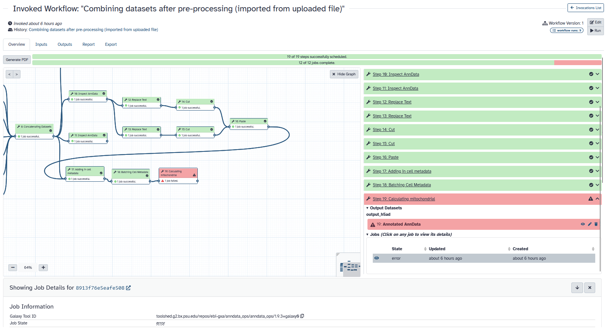
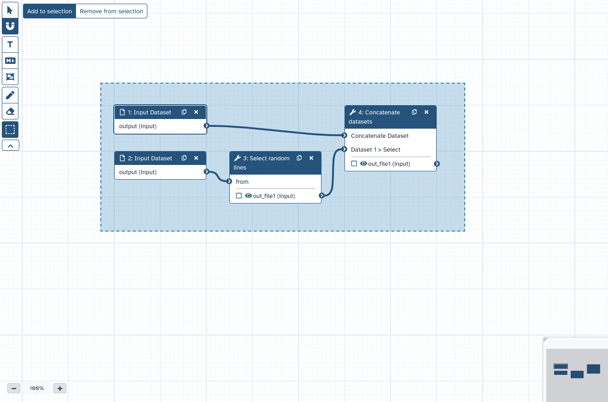
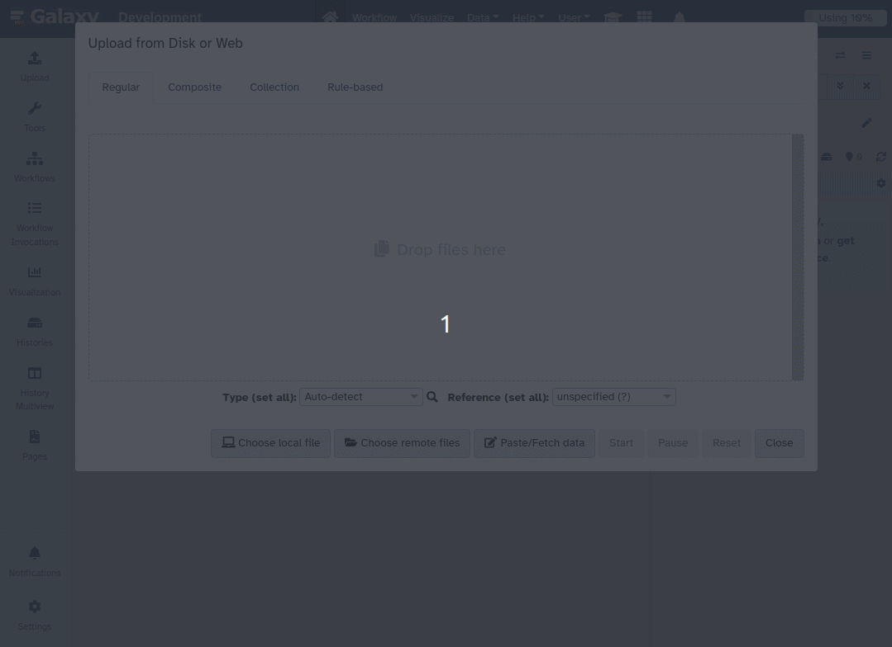
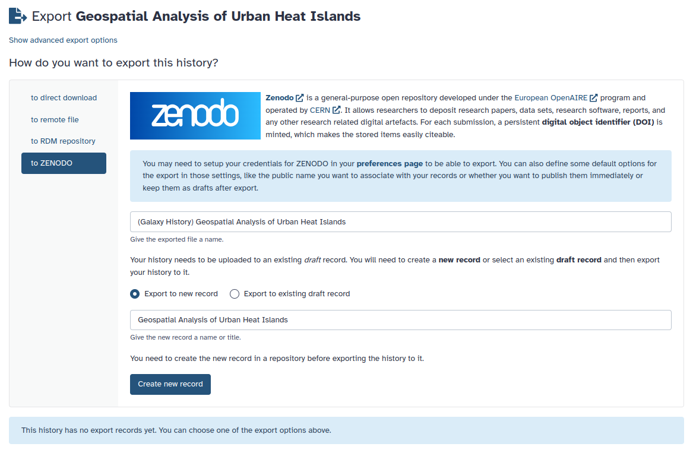
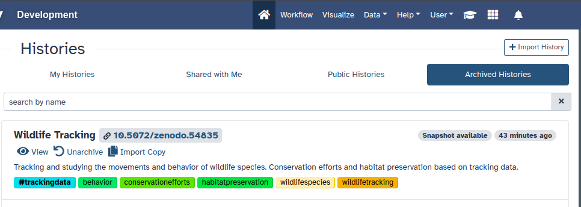

===========================================================
24.1 Galaxy Release (June 2024)
===========================================================

.. include:: _header.rst

Highlights
===========================================================

Visualizing workflow runs with an invocation graph view
-----------------------------------------------------------

A graph view has been added to the workflow invocation summary. This feature uses the original workflow structure to display job states for each step on the workflow editor canvas. You can click on a step to expand and see detailed information about that invocation step.
[`#17413 <https://github.com/galaxyproject/galaxy/pull/17413>`__]

.. raw:: html

   <iframe width="560" height="315" src="https://www.youtube.com/embed/TlDnoZxWh5E" title="Galaxy 24.1 - Workflow invocation graph view" frameborder="0" allow="accelerometer; autoplay; clipboard-write; encrypted-media; gyroscope; picture-in-picture; web-share" allowfullscreen></iframe>

Workflow editor undo/redo
-----------------------------------------------------------

Undo/redo functionality has been added to the workflow editor, enhancing the user experience and workflow management. Here's how it works:

- Action Class Instances: The system uses a store to manage undo and redo stacks of action class instances. These instances encapsulate bi-directional state changes.
- Granular Undo-Redo: All user actions in the workflow editor are now managed by these action classes, allowing for granular undo and redo of workflow modifications.
- Continuous State-Changes: For continuous state changes (like moving a node or typing text), changes are stored every second or when another change occurs.

This system provides users with more control over their workflow editing process, allowing them to undo and redo changes in a detailed and efficient manner.
[`#17774 <https://github.com/galaxyproject/galaxy/pull/17774>`__]

.. raw:: html

   <iframe width="560" height="315" src="https://www.youtube.com/embed/G_X7nJ73Fos" title="Galaxy 24.1 - Worfklow editor undo/redo" frameborder="0" allow="accelerometer; autoplay; clipboard-write; encrypted-media; gyroscope; picture-in-picture; web-share" allowfullscreen></iframe>

Select multiple items in workflow editor
-----------------------------------------------------------

New selection features in the Workflow Editor have been introduced to improve workflow management:

- Shift-Select: You can now shift-select multiple steps or comments, allowing for easier grouping and manipulation of workflow elements.
- Box Selection Editor Tool: This tool enables you to add or remove items from the selection by dragging a box around them. This feature is useful for quickly selecting multiple items.
- Group Actions: Selected items can be moved together, deleted, and duplicated, streamlining workflow editing tasks.
- Default Selection for Imported and Duplicated Items: Items imported from other workflows and newly duplicated items are now selected by default. This makes it easier to reposition them within the workflow.

These enhancements simplify the process of selecting and managing multiple elements in the Workflow Editor, improving the overall editing experience.
[`#17615 <https://github.com/galaxyproject/galaxy/pull/17615>`__]

All-vs-all collection analysis patterns
-----------------------------------------------------------

Galaxy now matches corresponding datasets when multiple collections are used to map over a tool, akin to a dot product pattern. This feature can be adapted for all-vs-all mapping by first creating two new input collections containing the Cartesian product (in math terms) or Cross Join (in SQL terms) of the inputs. These collections align every combination of elements between the first and second lists, enhancing flexibility in dataset mapping.
[`#17366 <https://github.com/galaxyproject/galaxy/pull/17366>`__]

Pagination support added to files source plugins
-----------------------------------------------------------

To improve navigation of remote file sources potentially containing vast numbers of files, server-side pagination support has been added to file source plugins. Plugins can now support server-side pagination, searching and sorting, which is indicated by corresponding serializable properties and is implemented on a per-plugin basis. See PyFilesystem2-based and Invenio-based plugins for implementation details.
[`#18059 <https://github.com/galaxyproject/galaxy/pull/18059>`__]

Zenodo integration
-----------------------------------------------------------

A new Zenodo file source plugin based on Invenio has been added, making integration more straightforward. This update also introduces new schemes (invenio:// and zenodo://) for Invenio and Zenodo file sources, respectively, aligning them with their intended conventions. Existing exports using the gxfiles:// scheme will continue to work as expected.
[`#18022 <https://github.com/galaxyproject/galaxy/pull/18022>`__]

Document Object Identifiers displayed in archived histories
-----------------------------------------------------------

Histories that have been archived and preserved in an external repository like Zenodo will now display their Document Object Identifier (DOI). This change enhances the clarity and accessibility of archived histories.
[`#18134 <https://github.com/galaxyproject/galaxy/pull/18134>`__]

Activity bar is now enabled by default
-----------------------------------------------------------

Activity bar is now enabled by default, which enhances the user experience by providing quick access to essential features and improving workflow navigation.
[`#17531 <https://github.com/galaxyproject/galaxy/pull/17531>`__]

Visualizations
===========================================================

.. visualizations
* Check various preconditions in FeatureLocationIndexDataProvider
  (thanks to `@davelopez <https://github.com/davelopez>`__).
  `Pull Request 18283`_
* Add pinia to manually mounted vue components
  (thanks to `@guerler <https://github.com/guerler>`__).
  `Pull Request 18299`_
* Update parcel-built visualizations to use parcel v2
  (thanks to `@dannon <https://github.com/dannon>`__).
  `Pull Request 18311`_
* Fix visualizations compatible dataset filtering
  (thanks to `@davelopez <https://github.com/davelopez>`__).
  `Pull Request 18343`_
* Fix pca 3d rendering of tabular files and visualization error handling in general
  (thanks to `@mvdbeek <https://github.com/mvdbeek>`__).
  `Pull Request 18211`_

Datatypes
===========================================================

.. datatypes
* Tighten axt sniffer
  (thanks to `@martenson <https://github.com/martenson>`__).
  `Pull Request 18204`_
* Don't set dataset peek for errored jobs
  (thanks to `@mvdbeek <https://github.com/mvdbeek>`__).
  `Pull Request 18231`_
* Better display of estimated line numbers and add number of columns for tabular
  (thanks to `@bernt-matthias <https://github.com/bernt-matthias>`__).
  `Pull Request 17492`_
* Add colabfold tar file datatype
  (thanks to `@astrovsky01 <https://github.com/astrovsky01>`__).
  `Pull Request 17567`_
* Set minimal metadata also for empty bed datasets
  (thanks to `@wm75 <https://github.com/wm75>`__).
  `Pull Request 17586`_
* Code cleanups from ruff and pyupgrade
  (thanks to `@nsoranzo <https://github.com/nsoranzo>`__).
  `Pull Request 17654`_
* Npz sniffing: do not read the whole file
  (thanks to `@bernt-matthias <https://github.com/bernt-matthias>`__).
  `Pull Request 17672`_
* Never fail dataset serialization if display_peek fails
  (thanks to `@mvdbeek <https://github.com/mvdbeek>`__).
  `Pull Request 17937`_
* Enable ``warn_unused_ignores`` mypy option
  (thanks to `@nsoranzo <https://github.com/nsoranzo>`__).
  `Pull Request 17991`_
* Add support for additional media types
  (thanks to `@arash77 <https://github.com/arash77>`__).
  `Pull Request 18054`_
* Enable flake8-implicit-str-concat ruff rules
  (thanks to `@nsoranzo <https://github.com/nsoranzo>`__).
  `Pull Request 18067`_
* Chore: remove repetitive words
  (thanks to `@tianzedavid <https://github.com/tianzedavid>`__).
  `Pull Request 18076`_
* Add Net datatype
  (thanks to `@martenson <https://github.com/martenson>`__).
  `Pull Request 18080`_

Builtin Tool Updates
===========================================================

.. tools
* Raise exception when extracting dataset from collection without datasets
  (thanks to `@mvdbeek <https://github.com/mvdbeek>`__).
  `Pull Request 18249`_
* Backport Qiskit Jupyter Notebook update to 24.1
  (thanks to `@natefoo <https://github.com/natefoo>`__).
  `Pull Request 18310`_
* Fix null inputs in database operation tools
  (thanks to `@mvdbeek <https://github.com/mvdbeek>`__).
  `Pull Request 18385`_
* Code cleanups from ruff and pyupgrade
  (thanks to `@nsoranzo <https://github.com/nsoranzo>`__).
  `Pull Request 17654`_
* Rename JupyTool to something more searchable (i.e. JupyterLab which includes the substring Jupyter)
  (thanks to `@hexylena <https://github.com/hexylena>`__).
  `Pull Request 17849`_
* Enable ``warn_unused_ignores`` mypy option
  (thanks to `@nsoranzo <https://github.com/nsoranzo>`__).
  `Pull Request 17991`_
* Enable flake8-implicit-str-concat ruff rules
  (thanks to `@nsoranzo <https://github.com/nsoranzo>`__).
  `Pull Request 18067`_

Release Notes
===========================================================

Please see the :doc:`full release notes <24.1_announce>` for more details.

.. include:: 24.1_prs.rst

.. include:: _thanks.rst
