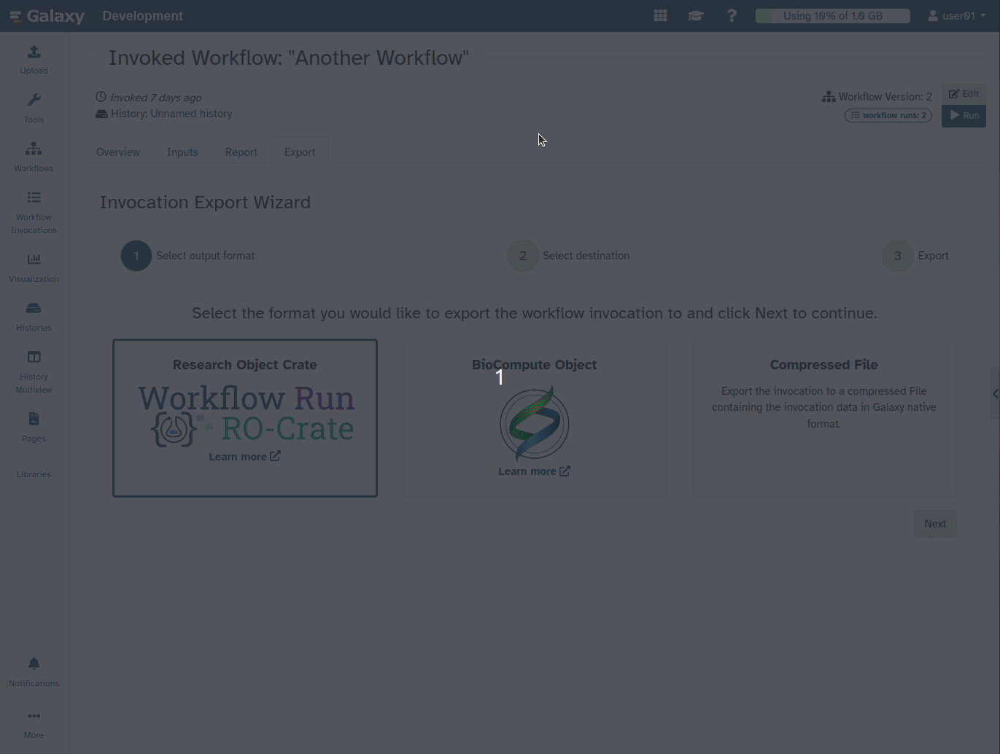
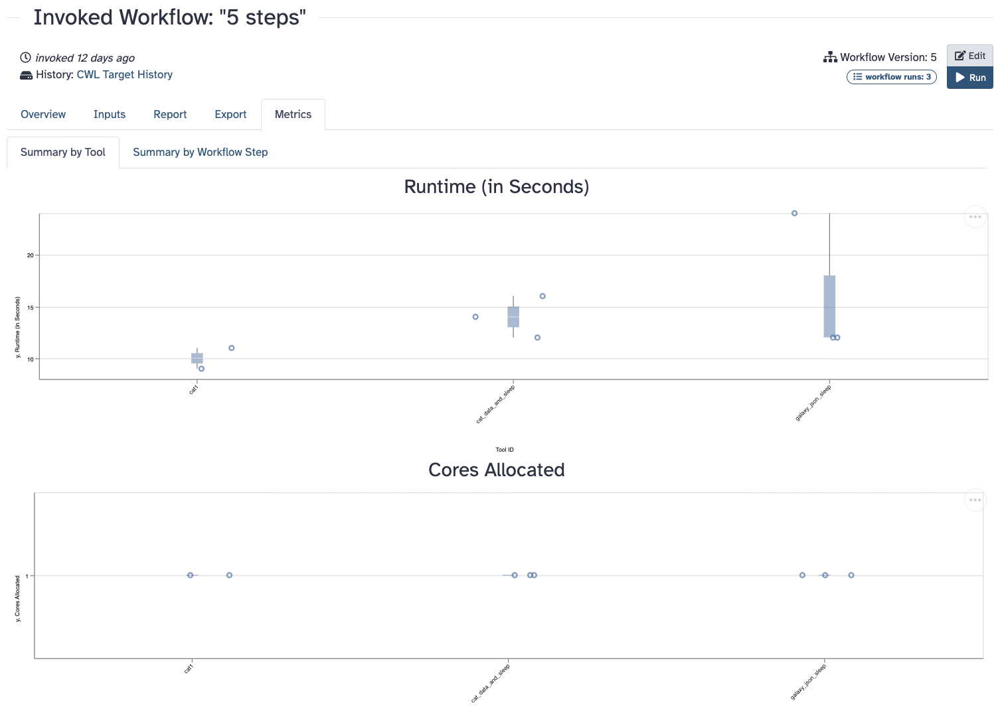

===========================================================
24.2 Galaxy Release (January 2025)
===========================================================

.. include:: _header.rst

Please see the full :doc:`24.2 release notes <24.2_announce>` for more details.

Highlights
===========================================================

A Wizard-like Export View for Workflow Invocations
-----------------------------------------------------------

The workflow invocation export process has been enhanced with a new wizard-like interface,
making it more guided and user-friendly. This interface simplifies complex processes with many
options, providing a step-by-step approach to exporting workflow invocations.

- **Select export format**. Choose from various formats such as RO Crate, BioCompute Object,
  or Compressed File.
- **Choose export destination**. Options include temporary direct download, remote file source,
  or RDM repository.
- **Export**! Finalize and complete the export process with ease.

This new interface aims to improve the user experience and may be extended to other complex
processes in Galaxy in the future.
[`#18796 <https://github.com/galaxyproject/galaxy/pull/18796>`__]

Workflow Editor Enhancements: Activity Bar and Undo Stack UI
-----------------------------------------------------------

The Activity Bar is now present in the Workflow Editor along side multiple interface
improvements.
[`#18729 <https://github.com/galaxyproject/galaxy/pull/18729>`__]
[`#18548 <https://github.com/galaxyproject/galaxy/pull/18548>`__]

- **No more double side bars**. Inspecting a step now has it's own floating window,
  which can be easily expanded and remembers it's size. All other features were moved to the
  left side-bar.
- **Undo redo UI**. A new interactive way of viewing recent changes. Click a change to scroll
  backwards and forwards in time.
- **Layout anything with ease**. The auto-layout feature was moved to the Editor Tool Bar. It
  now aligns to the grid, untangles connections, and sorts Workflow Comments along with steps.
- **Find your workflows**. Workflows now have their own dedicated interface, from which you can
  find, copy into, and inserts Sub-Workflows into your Workflow.
- **Inputs** are not tools, and are now no longer treated as such. Find inputs in their own
  interface, and easily add input sub-types directly.

.. raw:: html

   <iframe width="560" height="315" src="https://www.youtube.com/embed/42HZQkC7PHY" title="Galaxy 24.2 - Workflow Editor Enhancements: Activity Bar and Undo Stack UI" frameborder="0" allow="accelerometer; autoplay; clipboard-write; encrypted-media; gyroscope; picture-in-picture; web-share" allowfullscreen></iframe>

Masthead Revision and Activity Bar Improvements
-----------------------------------------------------------

The Galaxy masthead has been revised to achieve consistency and reduce redundancy, aligning its
functionality with the Activity Bar.

- **New "More" activity**. Hidden and less frequently used activities are now accessible through
  a new "More" activity, allowing users to add or remove items from the activity bar and navigate
  directly to any activity.
- **Username visible in masthead**. The username is now visible in the masthead, with user
  preferences and logout options accessible through the user dropdown.
- **A compact masthead**. The masthead has been streamlined, removing redundant links and only
  displaying essential items such as storage and the username on the right end.

These changes enhance the user experience by making the interface more intuitive and reducing
clutter.
[`#17927 <https://github.com/galaxyproject/galaxy/pull/17927>`__]

.. raw:: html

   <iframe width="560" height="315" src="https://www.youtube.com/embed/5NMkcpj-1w8" title="Galaxy 24.2 - Masthead Revision and Activity Bar Improvements" frameborder="0" allow="accelerometer; autoplay; clipboard-write; encrypted-media; gyroscope; picture-in-picture; web-share" allowfullscreen></iframe>

Improved Navigation and Usability of Collection Builders
-----------------------------------------------------------

To guide users towards creating collections of the correct type, Galaxy now provides
better navigation via buttons directly on data collection parameters. Users can create a
collection with the required structure for the input, with pre-filtered items from their
current history, also ensuring compatibility with required file extensions. Additionally, users
can upload datasets directly to the collection builder. These updates will improve the user
experience of opening a workflow run form, creating appropriate collection(s) for its inputs
and running the workflow in one seamless iteration.
[`#18857 <https://github.com/galaxyproject/galaxy/pull/18857>`__]

.. raw:: html

   <iframe width="560" height="315" src="https://www.youtube.com/embed/y4gNThU_BZE" title="Galaxy 24.2 - Improved Navigation and Usability of Collection Builders" frameborder="0" allow="accelerometer; autoplay; clipboard-write; encrypted-media; gyroscope; picture-in-picture; web-share" allowfullscreen></iframe>

Enhanced Workflow Invocation View
-----------------------------------------------------------

The Workflow Invocation View, introduced in the `previous release <24.1_announce_user.html>`__
has been significantly refined to improve the usability and visualization of workflow runs.
[`#18615 <https://github.com/galaxyproject/galaxy/pull/18615>`__]

Updates include:

- **Workflow steps moved to a separate tab**, allocating maximum space for the graph.
- **Progress bars relocated to the header** for a cleaner layout.
- **Workflow inputs displayed directly on the graph**, eliminating the need for clicking
  and investigating each input.
- **The Invocations panel also toggles out on mouse leave**, providing an uncluttered view when
  exploring runs.

.. list-table::
   :header-rows: 1

   * - Before
     - After
   * - .. image:: images/24.2-invocation-view-improvements-before.png
          :alt: Invocation view improvements before
          :width: 100%
     - .. image:: images/24.2-invocation-view-improvements-after.png
          :alt: Invocation view improvements after
          :width: 100%
   * - Steps show on the right, the progress bars are within the `Overview` tab
     - Only the currently active step shows below, leaving full width for graph, progress
       bars in the Header

Display Metrics for Workflow Invocations
-----------------------------------------------------------

Galaxy now provides a Metrics tab in the Workflow Invocation View, allowing users to quickly
summarize runtime, memory usage, and core allocation per invocation. This enhancement helps users
better understand the resource usage of their workflows. The Metrics tab displays runtime in
seconds and core allocation for each step and tool in the workflow.
[`#19048 <https://github.com/galaxyproject/galaxy/pull/19048>`__]

Libraries Modernization: Directory Dataset Picker
-----------------------------------------------------------

The dataset picker for user and import directories has been modernized, providing a more
intuitive and user-friendly interface. Users can now easily import files or folders from their
user directory or import directory into a library. Admins can also import datasets from a
specified path. Additionally, the new History Dataset Picker allows users to explore their
histories and select datasets to add to the library, streamlining the dataset management process.
[`#18638 <https://github.com/galaxyproject/galaxy/pull/18638>`__]

.. raw:: html

   <iframe width="560" height="315" src="https://www.youtube.com/embed/i8AHdv5sU5A" title="Galaxy 24.2 - Libraries Modernization: Directory Dataset Picker" frameborder="0" allow="accelerometer; autoplay; clipboard-write; encrypted-media; gyroscope; picture-in-picture; web-share" allowfullscreen></iframe>

Live Reporting of Job Console Outputs
-----------------------------------------------------------

If enabled by the Galaxy administrators, it will now be possible to view live console output
for running jobs. The job output will be available on the Job Information page where these
logs have always been available for completed jobs. The job information view has also been
updated with scrollable code blocks, a more intuitive expand/collapse feature,
and an auto-scroll function for seamless log viewing. This should allow you to debug issues with
running jobs faster and track the progress of running jobs in realtime in a way that has never
been an option in Galaxy. A huge thanks to Gregory Cage at Oak Ridge National Laboratory for
this valuable contribution!
[`#16975 <https://github.com/galaxyproject/galaxy/pull/16975>`__]

ChatGXY - Job Error Wizard
-----------------------------------------------------------

With this release, we're excited to introduce ChatGXY — AI assistance built
directly into the Galaxy interface. The first functionality being rolled out is
an AI-driven job error diagnoser that automatically inspects errored jobs and
provides actionable insights. Users on supported servers can access this
feature through the Dataset Error interface, where ChatGXY offers targeted
suggestions to help diagnose and resolve job errors quickly and efficiently.
[`#15860 <https://github.com/galaxyproject/galaxy/pull/15860>`__]

Visualizations
===========================================================

.. visualizations
* Prevent cycling through failing conversion jobs in trackster
  (thanks to `@mvdbeek <https://github.com/mvdbeek>`__).
  `Pull Request 19494`_
* Update visualizations package versions
  (thanks to `@guerler <https://github.com/guerler>`__).
  `Pull Request 19232`_
* Fix MSA viz, new dependency specification options
  (thanks to `@dannon <https://github.com/dannon>`__).
  `Pull Request 18760`_
* Parse stored config details to script-based visualizations
  (thanks to `@guerler <https://github.com/guerler>`__).
  `Pull Request 18651`_
* Install npm-package viz to the package prefix explicitly
  (thanks to `@dannon <https://github.com/dannon>`__).
  `Pull Request 18950`_
* Migrate NGL viewer to npm package
  (thanks to `@guerler <https://github.com/guerler>`__).
  `Pull Request 18946`_
* Support deferred datasets in visualizations
  (thanks to `@davelopez <https://github.com/davelopez>`__).
  `Pull Request 19097`_
* Openlayer update to npm package
  (thanks to `@hujambo-dunia <https://github.com/hujambo-dunia>`__).
  `Pull Request 19134`_
* Replace static Cytoscape plugin with npm package
  (thanks to `@itisAliRH <https://github.com/itisAliRH>`__).
  `Pull Request 19127`_
* Update tiff viewer to use script entry_point
  (thanks to `@guerler <https://github.com/guerler>`__).
  `Pull Request 19151`_
* Migrate Venn Diagram to Script-Tag
  (thanks to `@guerler <https://github.com/guerler>`__).
  `Pull Request 19153`_
* FITS file table graph visualization plugin
  (thanks to `@francoismg <https://github.com/francoismg>`__).
  `Pull Request 19003`_
* Restore access to saved visualizations
  (thanks to `@guerler <https://github.com/guerler>`__).
  `Pull Request 19136`_
* Remove OpenLayers legacy files and add SVG logo
  (thanks to `@guerler <https://github.com/guerler>`__).
  `Pull Request 19135`_

Datatypes
===========================================================

.. datatypes
* Add pod5 datatype
  (thanks to `@TomHarrop <https://github.com/TomHarrop>`__).
  `Pull Request 18419`_
* Handle compressed content in dataset preview for all sequence classes
  (thanks to `@PlushZ <https://github.com/PlushZ>`__).
  `Pull Request 18776`_
* Type annotations and fixes
  (thanks to `@nsoranzo <https://github.com/nsoranzo>`__).
  `Pull Request 18911`_
* Improve usability of Directory datatype
  (thanks to `@wm75 <https://github.com/wm75>`__).
  `Pull Request 17614`_
* Add some Zarr-based datatypes
  (thanks to `@davelopez <https://github.com/davelopez>`__).
  `Pull Request 19040`_
* Add XML based `vtk` datatype
  (thanks to `@tStehling <https://github.com/tStehling>`__).
  `Pull Request 19104`_
* Add gtf to auto_compressed_types
  (thanks to `@mvdbeek <https://github.com/mvdbeek>`__).
  `Pull Request 19175`_

Builtin Tool Updates
===========================================================

.. tools
* Drop "Send to cloud" tool and associated cloudauthz code
  (thanks to `@jdavcs <https://github.com/jdavcs>`__).
  `Pull Request 18196`_
* Update GPU JupyterLab tool
  (thanks to `@anuprulez <https://github.com/anuprulez>`__).
  `Pull Request 18220`_
* Improvements to Tool Test Parsing
  (thanks to `@jmchilton <https://github.com/jmchilton>`__).
  `Pull Request 18560`_
* Add Tool-Centric APIs to the Tool Shed 2.0
  (thanks to `@jmchilton <https://github.com/jmchilton>`__).
  `Pull Request 18524`_
* Add BlobToolkit to the list of interactive tools
  (thanks to `@Delphine-L <https://github.com/Delphine-L>`__).
  `Pull Request 18630`_
* Enable ``ignore-without-code`` mypy error code
  (thanks to `@nsoranzo <https://github.com/nsoranzo>`__).
  `Pull Request 18898`_
* Remove some unused dynamic drill down options
  (thanks to `@jmchilton <https://github.com/jmchilton>`__).
  `Pull Request 18892`_
* Fix commas that shouldn't be in biotools_mappings.tsv
  (thanks to `@jmchilton <https://github.com/jmchilton>`__).
  `Pull Request 18919`_
* Add filter null collection operation tool
  (thanks to `@mvdbeek <https://github.com/mvdbeek>`__).
  `Pull Request 18928`_
* Remove outdated fimo wrapper and galaxy-sequence-utils dependency
  (thanks to `@nsoranzo <https://github.com/nsoranzo>`__).
  `Pull Request 18937`_
* Jupyter Interactive Tool 1.0.1/24.07
  (thanks to `@natefoo <https://github.com/natefoo>`__).
  `Pull Request 18861`_
* Add Interactive Tool Ilastik
  (thanks to `@lldelisle <https://github.com/lldelisle>`__).
  `Pull Request 16837`_

Please see the full :doc:`24.2 release notes <24.2_announce>` for more details.

.. include:: 24.2_prs.rst

----

.. include:: _thanks.rst
