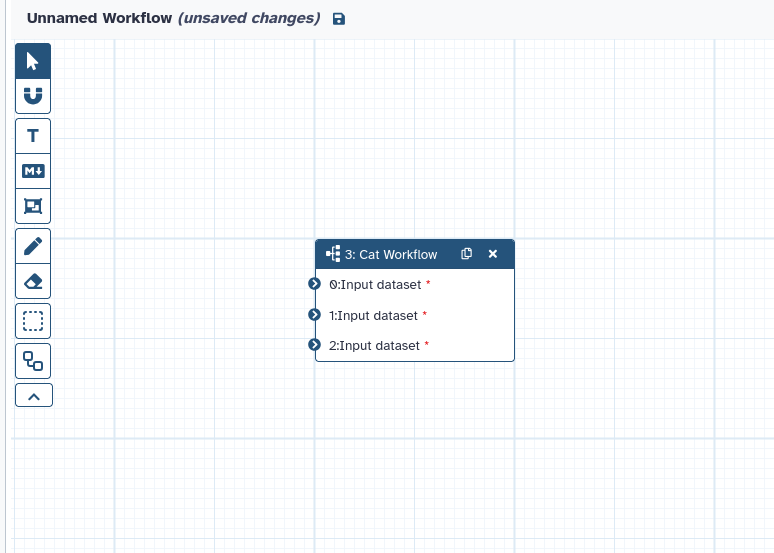
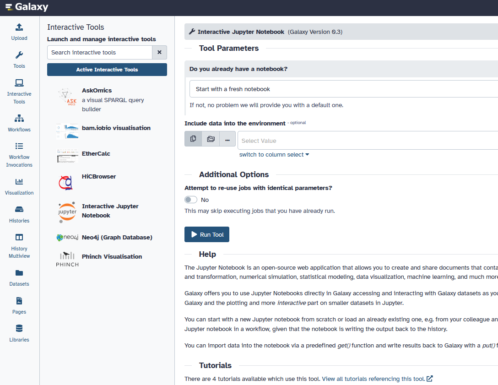
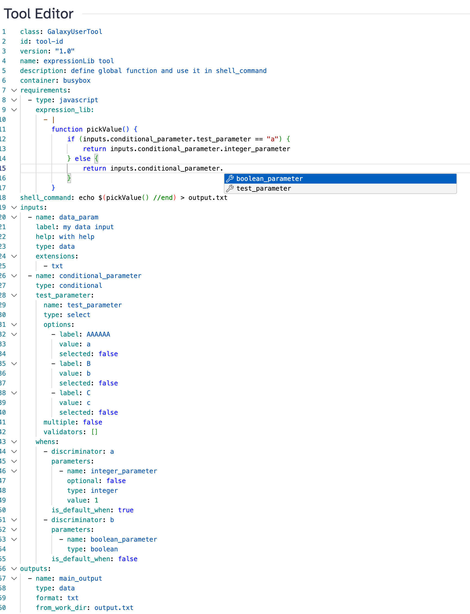
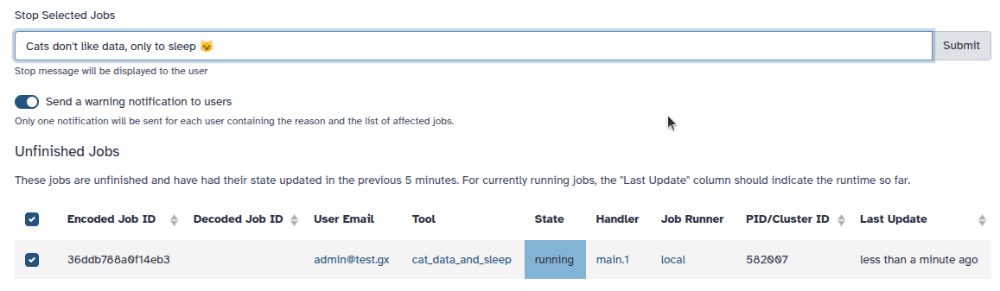
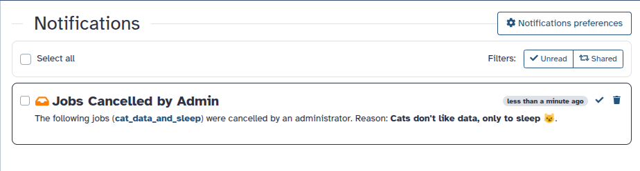

===========================================================
25.0 Galaxy Release (June 2025)
===========================================================

.. include:: _header.rst

Please see the full :doc:`25.0 release notes <25.0_announce>` for more details.

Highlights
===========================================================

Empower Users to Build More Kinds of Collections, More Intelligently
--------

Galaxy’s collection system has been vastly expanded, simplifying creation while supporting new,
advanced use cases for both users and developers.

- **Support for mixed paired and unpaired collections**. Tools and workflows can now work with
  lists that contain both paired and unpaired data (`list:paired_or_unpaired`), supporting more
  flexible scientific analyses and tool development. A new collection operation tool lets you
  split such collections into homogeneous lists if needed.
- **Generalized collection creation**. Easily build these new generalized collection types—including
  nested lists (`list:list`), nested lists of pairs (`list:list:paired`), and more—directly from
  selected datasets, without requiring rules.
- **Wizard-style collection builders**. A new wizard component guides users step-by-step,
  auto-detecting data structures and suggesting the most appropriate collection format. Choose
  between "Auto Build List" for instant setup or "Advanced Build List" for full manual control,
  with tailored help and warnings.
- **New Rule Based Import Activity**. An activity-based wizard for rule-based uploads gives more
  space, clarity, and flexibility. Notably, you can now drop files directly onto the “Paste Table”
  form, and work with rules in a more consistent, central location.
- **Better error handling and feedback**. The new interfaces provide clear feedback and tailored
  warnings for duplicate identifiers and unpaired datasets, streamlining the user experience.
- **Refinements and bug fixes**. Includes fixes for extension handling, improved abstractions for
  collection input adaptation, and refactoring for easier future maintenance.

These changes make collection creation more powerful and accessible, supporting both simple and
sophisticated data organization scenarios, and laying the groundwork for future enhancements.
[`#19377 <https://github.com/galaxyproject/galaxy/pull/19377>`__]

Here's an example of one of the new collection builders in action:

.. raw:: html

   <iframe width="100%" height="360" style="margin-bottom: 1em;" src="https://www.youtube.com/embed/EFJY-m-ieWQ?si=9PBRgvSiGtP5Fy3F" title="Galaxy 25.0 - New Rule Based Import Activity" frameborder="0" allow="accelerometer; autoplay; clipboard-write; encrypted-media; gyroscope; picture-in-picture; web-share" referrerpolicy="strict-origin-when-cross-origin" allowfullscreen></iframe>

Add ZIP explorer to import individual files from local or remote ZIP archives
--------

Galaxy now features a ZIP explorer, streamlining the process of importing individual files from both
local and remote ZIP archives.

- **ZIP explorer integration**. Browse the contents of ZIP files directly in Galaxy and select only the
  files you need, minimizing unnecessary uploads.
- **Support for local and remote archives**. Import from ZIP files on your computer or by providing a
  remote URL.
- **Improved user experience**. The intuitive interface simplifies file selection and import, making it
  easier to work with compressed data. It also recognizes some known archive structures like RO-Crate
  and Galaxy export archives, and will display additional useful information in those cases.

These enhancements make importing data from ZIP archives more flexible and efficient, further reducing
barriers to working with large or complex datasets.
[`#20054 <https://github.com/galaxyproject/galaxy/pull/20054>`__]

.. raw:: html

   <iframe width="100%" height="360" style="margin-bottom: 1em;" src="https://www.youtube.com/embed/oqEUHoCcEPo?si=NUMkbP_7dc6i_q5f" title="Galaxy 25.0 - New Zip Explorer" frameborder="0" allow="accelerometer; autoplay; clipboard-write; encrypted-media; gyroscope; picture-in-picture; web-share" referrerpolicy="strict-origin-when-cross-origin" allowfullscreen></iframe>

A New Unified View for Datasets
--------

Galaxy 25.0 introduces a unified view for datasets, consolidating common dataset actions into a single, streamlined
interface.

- **Single access point**. Instead of multiple separate buttons, users now interact with a single
  button on each dataset, which opens a tabbed interface for all dataset-related actions.
- **Tabbed layout**. Key functionality — such as viewing metadata, peeking into file contents,
  accessing datatypes/permissions and more — is now organized into clear, intuitive tabs.
- **Improved usability**. This update provides a one stop shop for dataset management,
  reducing clutter and confusion from multiple buttons and options.

This change enhances consistency across the Galaxy interface and offers a more intuitive experience
for both new and experienced users working with datasets.
[`#20154 <https://github.com/galaxyproject/galaxy/pull/20154>`__]

.. raw:: html

   <iframe width="100%" height="360" style="margin-bottom: 1em;" src="https://www.youtube.com/embed/vQ8pSgiVTpQ?si=Ab61hzSs94WswoIR" title="Galaxy 25.0 - The New Unified Dataset View" frameborder="0" allow="accelerometer; autoplay; clipboard-write; encrypted-media; gyroscope; picture-in-picture; web-share" referrerpolicy="strict-origin-when-cross-origin" allowfullscreen></iframe>

Allow Rerunning Workflows with the Same Inputs and Parameters
--------

Users can now easily rerun any workflow with the exact same inputs and parameters as a previous run - 
with a simple click of the new "Rerun" button in the workflow invocation view. This feature streamlines
reproducibility and troubleshooting by letting you repeat analyses with a single click. The workflow run
form also detects and notifies of any changes to inputs compared to the original run!
[`#20032 <https://github.com/galaxyproject/galaxy/pull/20032>`__]

.. raw:: html

   <iframe width="100%" height="360" style="margin-bottom: 1em;" src="https://www.youtube.com/embed/CaWkstTMXJ0?si=ntvZHNjZ7GuhWmp8" title="Galaxy 25.0 - Rerun Workflows" frameborder="0" allow="accelerometer; autoplay; clipboard-write; encrypted-media; gyroscope; picture-in-picture; web-share" referrerpolicy="strict-origin-when-cross-origin" allowfullscreen></iframe>

An Enhanced Workflow Run Form Interface
--------

Galaxy 25.0 introduces a streamlined workflow run interface that allows users to upload inputs, create
collections, and configure parameters — all within a single, unified form.

- **Integrated data upload and collection creation**. Users can now upload datasets or build
  collections directly from the workflow run form, without navigating away or switching contexts.
- **Visual input indicators**. Each input now displays a visual status indicator, making it easy to see
  which inputs are ready and which still need attention.
- **Improved settings panel**. The run form includes a clearer, more organized settings menu with
  well-annotated options for configuring the workflow execution.
- **Live-updating workflow graph**. A dynamic graph of the workflow appears alongside the form,
  updating in real time as users populate inputs — helping them understand the structure and flow
  of the analysis.

These improvements were inspired by users encountering curated workflows from platforms like the IWC
Browser or BRC Analytics, and are designed to reduce friction, improve clarity, and enable users to
complete complex analyses entirely within a single interface.
[`#19294 <https://github.com/galaxyproject/galaxy/pull/19294>`__]

.. raw:: html

   <iframe width="100%" height="360" style="margin-bottom: 1em;" src="https://www.youtube.com/embed/zJ_amjaD31c?si=HuQQjaOSGSSh0Ept" title="Galaxy 25.0 - Enhanced Workflow Run Form" frameborder="0" allow="accelerometer; autoplay; clipboard-write; encrypted-media; gyroscope; picture-in-picture; web-share" referrerpolicy="strict-origin-when-cross-origin" allowfullscreen></iframe>

Introducing READMEs for Workflows in the Galaxy Interface
--------

Galaxy 25.0 introduces support for associating README/help text with workflows. This provides a way to
document workflows directly in the Galaxy interface, with support for Markdown formatting, links, and
images.

- **README field for workflows**. Each workflow can now have an associated README string, stored as part
  of the workflow object but separate from the workflow steps or structure.
- **Viewable on the run form**. A new "Show Workflow Help" button on the workflow run form reveals
  associated documentation alongside input parameters — helping users understand how to use a workflow.
- **Editable from the workflow editor**. Workflow authors can scroll the "Attributes" panel in the
  editor, click "Show Readme," and add or update the associated documentation.

This feature lowers the barrier to understanding and reusing workflows, especially in collaborative
environments.
[`#19591 <https://github.com/galaxyproject/galaxy/pull/19591>`__]

.. raw:: html

   <iframe width="100%" height="360" style="margin-bottom: 1em;" src="https://www.youtube.com/embed/kJOO41wrnuE?si=Y0UxLwSvQ5gqDpdM" title=Galaxy 25.0 - READMEs for Workflows" frameborder="0" allow="accelerometer; autoplay; clipboard-write; encrypted-media; gyroscope; picture-in-picture; web-share" referrerpolicy="strict-origin-when-cross-origin" allowfullscreen></iframe>

Bulk Actions for Workflows
--------

Galaxy 25.0 introduces support for selecting multiple workflows to perform actions in bulk, streamlining
workflow management for users.

- **Selectable workflow cards**. In the "My Workflows" tab, users can now select multiple workflows
  at once.
- **Bulk operations**. Perform common actions — such as delete, restore, and tag — on all selected
  workflows simultaneously.
- **Improved tagging interface**. A new tag selection dialog makes it easier to organize workflows
  with consistent tagging.

These enhancements simplify workflow housekeeping and make it easier to manage shared or long-running
projects involving many workflows.
[`#19336 <https://github.com/galaxyproject/galaxy/pull/19336>`__]

.. raw:: html

   <iframe width="100%" height="360" style="margin-bottom: 1em;" src="https://www.youtube.com/embed/ycT9SJppXCU?si=ZyLFp0qAsfeKxZH7" title="Galaxy 25.0 - Bulk Actions for Workflows" frameborder="0" allow="accelerometer; autoplay; clipboard-write; encrypted-media; gyroscope; picture-in-picture; web-share" referrerpolicy="strict-origin-when-cross-origin" allowfullscreen></iframe>

Redesigned File Sources and Storage Location Interfaces
--------

Galaxy 25.0 introduces a modernized interface for accessing Remote File Sources and Storage Locations,
making navigation and selection more intuitive and user-friendly.

- **Card-based layout**. Available options are now displayed in a clear, responsive card view for
  improved readability and usability.
- **Breadcrumb navigation**. A breadcrumb bar helps users track their position and move between sections
  more easily.
- **Search and filter support**. A built-in search field allows users to quickly locate file sources
  or storage locations by name.

These changes provide a cleaner and more consistent interface for interacting with file sources and storage locations.
[`#19521 <https://github.com/galaxyproject/galaxy/pull/19521>`__]

.. raw:: html

   <iframe width="100%" height="360" style="margin-bottom: 1em;" src="https://www.youtube.com/embed/XejXhHDE1uw?si=xZ48O3xBLW0o6rGW" title="Galaxy 25.0 - A Redesign of the File Storage Interface " frameborder="0" allow="accelerometer; autoplay; clipboard-write; encrypted-media; gyroscope; picture-in-picture; web-share" referrerpolicy="strict-origin-when-cross-origin" allowfullscreen></iframe>

Enable Cloning Subworkflows in the Workflow Editor
--------

In the Workflow Editor, subworkflows can now be cloned just like regular steps. This allows users
to easily duplicate subworkflows within a larger workflow, with a singular click of the "Duplicate"
button on a subworkflow node.
[`#19420 <https://github.com/galaxyproject/galaxy/pull/19420>`__]

JupyterLite for Lightweight In-Browser Notebooks within Galaxy
--------

JupyterLite — a fully browser-based Jupyter environment — is now available as a visualization
(accessible right in the Galaxy center panel) with support for interacting directly with Galaxy
datasets and APIs, without requiring any local setup, or using the Jupyter interactive tool.

- **JupyterLite integration**. Launch Python notebooks directly in the visualization using the jl-galaxy
  extension.
- **Access Galaxy data**. Use the `gxy` utility module to download datasets (`await gxy.get()`),
  upload results (`await gxy.put()`), or access the Galaxy API (`await gxy.api()`).
- **No setup required**. No need for Conda, Docker, or Python installations — just open a JupyterLite
  notebook visualization in Galaxy, and start coding.

This makes interactive data exploration and scripting more accessible, where the user prefers to stay
within the Galaxy interface without needing to switch to a separate Jupyter interactive tool.
[`#20174 <https://github.com/galaxyproject/galaxy/pull/20174>`__]

.. raw:: html

   <iframe width="100%" height="360" style="margin-bottom: 1em;" src="https://www.youtube.com/embed/9F1zHbqbFPk?si=1-Ut-vXHaKUhwnKf" title="Galaxy 25.0 - JupyterLite for Lightweight In-Browser Notebooks" frameborder="0" allow="accelerometer; autoplay; clipboard-write; encrypted-media; gyroscope; picture-in-picture; web-share" referrerpolicy="strict-origin-when-cross-origin" allowfullscreen></iframe>

New Interactive Tools Panel in the Activity Bar
--------

Interactive Tools (ITs) in Galaxy now have their own dedicated panel in the Activity Bar, providing
a clearer, more accessible experience for users launching and managing interactive environments.

- **Separate from standard tools**. Previously nested under a section in the main Tools panel,
  Interactive Tools are now listed under their own Activity Bar activity — making them easier to find.
- **Visual icons for each tool**. Each IT is represented with its own icon for faster recognition
  and improved usability.
- **Live status indicators**. A badge on the Activity icon shows how many ITs are currently running.

This update helps distinguish Interactive Tools from standard tools, improves discoverability,
and provides a more intuitive way to monitor and manage interactive sessions.
[`#19996 <https://github.com/galaxyproject/galaxy/pull/19996>`__]

Preferred Visualization Display for Dataset Types
--------

Galaxy now allows administrators to configure default visualizations for specific datatypes. Instead of
showing raw file content in the (new) Preview tab, datasets with a preferred visualization will now display that
visualization by default.

This improves the default experience for formats like HDF5, where binary previews are not useful, and makes
interactive visualizations immediately accessible to users.
[`#20190 <https://github.com/galaxyproject/galaxy/pull/20190>`__]

Here is a quick example:

.. raw:: html

   <iframe width="100%" height="360" style="margin-bottom: 1em;" src="https://www.youtube.com/embed/0SorpUTXDCQ?si=1tKZGa_ONw4BltTM" title="Galaxy 25.0 - Preferred Visualization Display for Datasets" frameborder="0" allow="accelerometer; autoplay; clipboard-write; encrypted-media; gyroscope; picture-in-picture; web-share" referrerpolicy="strict-origin-when-cross-origin" allowfullscreen></iframe>

User-Defined Tools (Beta)
--------

Galaxy 25.0 introduces support for user-defined tools — a new feature that lets selected users define and run tools
directly in the Galaxy interface, without requiring regular administrative intervention.

- **Create and run tools without admin requests**. For the first time, users can define tools without needing to go
  through the standard installation process.
- **YAML-based tool definitions**. Tools are written in a structured YAML format and stored in the Galaxy database.
  They include inputs, outputs, and shell commands written using sandboxed JavaScript expressions.
- **Container execution only**. All user-defined tools must run inside containers for enhanced security.
- **Workflow support**. User-defined tools are automatically included when shared as part of a workflow, ensuring
  seamless collaboration.

This feature is currently in beta and must be explicitly enabled by administrators. It is recommended only for trusted
users while safety audits are ongoing.
[`#19434 <https://github.com/galaxyproject/galaxy/pull/19434>`__]

Job Cancellation Notifications for Admins
--------

Administrators can now notify users when their jobs are canceled, improving transparency and
communication.

- **Optional user notification**. When canceling jobs, admins can choose to send a notification message
  to affected users.
- **Grouped notifications**. Users receive a single notification listing all canceled jobs, even if
  multiple jobs were terminated at once.
- **Job details view**. Clicking on a listed job in the notification opens a detailed job summary page.
- **Supports email delivery**. If the user has email notifications enabled, they will also receive
  the message by email.

This feature gives administrators more control over user communication during job management actions.
[`#19547 <https://github.com/galaxyproject/galaxy/pull/19547>`__]

Visualizations
===========================================================

.. visualizations
* Fix phylocanvas visualization build
  (thanks to `@davelopez <https://github.com/davelopez>`__).
  `Pull Request 19138`_
* Add Vizarr visualization
  (thanks to `@davelopez <https://github.com/davelopez>`__).
  `Pull Request 19061`_
* Move phylocanvas to script entry point
  (thanks to `@guerler <https://github.com/guerler>`__).
  `Pull Request 19193`_
* Move heatmap visualization to new script endpoint
  (thanks to `@guerler <https://github.com/guerler>`__).
  `Pull Request 19176`_
* Add plotly.js
  (thanks to `@guerler <https://github.com/guerler>`__).
  `Pull Request 19206`_
* Switch h5web to script endpoint
  (thanks to `@guerler <https://github.com/guerler>`__).
  `Pull Request 19211`_
* Update visualizations to latest charts package
  (thanks to `@guerler <https://github.com/guerler>`__).
  `Pull Request 19213`_
* Update Vizarr package version to 0.1.6
  (thanks to `@davelopez <https://github.com/davelopez>`__).
  `Pull Request 19228`_
* Allow embedding vitessce visualizations
  (thanks to `@mvdbeek <https://github.com/mvdbeek>`__).
  `Pull Request 19909`_
* FITS Graph Viewer - script name tweak
  (thanks to `@dannon <https://github.com/dannon>`__).
  `Pull Request 19902`_
* Update vitessce version
  (thanks to `@mvdbeek <https://github.com/mvdbeek>`__).
  `Pull Request 20016`_
* Add kepler.gl visualization
  (thanks to `@guerler <https://github.com/guerler>`__).
  `Pull Request 20005`_
* Add Niivue viewer
  (thanks to `@guerler <https://github.com/guerler>`__).
  `Pull Request 19995`_
* Add VTK Visualization Toolkit Plugin
  (thanks to `@guerler <https://github.com/guerler>`__).
  `Pull Request 20028`_
* Add support for Markdown help text in visualizations
  (thanks to `@guerler <https://github.com/guerler>`__).
  `Pull Request 20043`_
* Add sample datasets for visualizations
  (thanks to `@guerler <https://github.com/guerler>`__).
  `Pull Request 20046`_
* Adds Example Datasets and Help Text for Visualizations
  (thanks to `@guerler <https://github.com/guerler>`__).
  `Pull Request 20097`_
* Add Molstar
  (thanks to `@guerler <https://github.com/guerler>`__).
  `Pull Request 20101`_
* Add alignment.js for multiple sequence alignment rendering
  (thanks to `@guerler <https://github.com/guerler>`__).
  `Pull Request 20110`_
* Add logo, description and help for aequatus
  (thanks to `@guerler <https://github.com/guerler>`__).
  `Pull Request 20128`_
* Migrate Transition Systems Visualization
  (thanks to `@guerler <https://github.com/guerler>`__).
  `Pull Request 20125`_
* Fix and migrate Drawrna
  (thanks to `@guerler <https://github.com/guerler>`__).
  `Pull Request 20102`_
* Add updated PCA plot
  (thanks to `@guerler <https://github.com/guerler>`__).
  `Pull Request 20140`_
* Hide non-functional and replaced visualizations (e.g. Nora, MSA)
  (thanks to `@guerler <https://github.com/guerler>`__).
  `Pull Request 20077`_
* Restore Visualization insertion options in Reports Editor
  (thanks to `@guerler <https://github.com/guerler>`__).
  `Pull Request 20000`_
* Add visualization test data
  (thanks to `@nilchia <https://github.com/nilchia>`__).
  `Pull Request 20183`_
* Add plotly 6.0.1 to JupyterLite
  (thanks to `@guerler <https://github.com/guerler>`__).
  `Pull Request 20201`_
* Browse multiple trees in phylocanvas
  (thanks to `@guerler <https://github.com/guerler>`__).
  `Pull Request 20141`_
* Add Vitessce Viewer
  (thanks to `@guerler <https://github.com/guerler>`__).
  `Pull Request 19227`_
* Add JupyterLite
  (thanks to `@guerler <https://github.com/guerler>`__).
  `Pull Request 20174`_
* Migrate ChiraViz
  (thanks to `@guerler <https://github.com/guerler>`__).
  `Pull Request 20214`_
* Enable visualizations for anonymous user
  (thanks to `@guerler <https://github.com/guerler>`__).
  `Pull Request 20210`_
* Remove backbone-based charts modules
  (thanks to `@guerler <https://github.com/guerler>`__).
  `Pull Request 19892`_
* Improve handling of very large files in Tabulator
  (thanks to `@guerler <https://github.com/guerler>`__).
  `Pull Request 20271`_

Datatypes
===========================================================

.. datatypes
* Enhance UTF-8 support for filename handling in downloads
  (thanks to `@arash77 <https://github.com/arash77>`__).
  `Pull Request 19161`_
* Calculate hash for new non-deferred datasets when finishing a job
  (thanks to `@nsoranzo <https://github.com/nsoranzo>`__).
  `Pull Request 19181`_
* Fix UP031 errors - Part 4
  (thanks to `@nsoranzo <https://github.com/nsoranzo>`__).
  `Pull Request 19235`_
* Fix UP031 errors - Part 5
  (thanks to `@nsoranzo <https://github.com/nsoranzo>`__).
  `Pull Request 19282`_
* Fix UP031 errors - Part 6
  (thanks to `@nsoranzo <https://github.com/nsoranzo>`__).
  `Pull Request 19314`_
* Type annotation fixes for mypy 1.14.0
  (thanks to `@nsoranzo <https://github.com/nsoranzo>`__).
  `Pull Request 19372`_
* Add IGB display support for CRAM files
  (thanks to `@paige-kulzer <https://github.com/paige-kulzer>`__).
  `Pull Request 19428`_
* Format code with black 25.1.0
  (thanks to `@nsoranzo <https://github.com/nsoranzo>`__).
  `Pull Request 19625`_
* Fail request explicitly when sqlite provider used on non-sqlite file
  (thanks to `@mvdbeek <https://github.com/mvdbeek>`__).
  `Pull Request 19630`_
* Add fastk_ktab_tar datatype required for fastk tool
  (thanks to `@SaimMomin12 <https://github.com/SaimMomin12>`__).
  `Pull Request 19615`_
* Raise ``MessageException`` when using data provider on incompatible data
  (thanks to `@mvdbeek <https://github.com/mvdbeek>`__).
  `Pull Request 19639`_
* Drop support for Python 3.8
  (thanks to `@nsoranzo <https://github.com/nsoranzo>`__).
  `Pull Request 19685`_
* Use model classes from ``galaxy.model`` instead of ``app.model`` object - Part 2
  (thanks to `@nsoranzo <https://github.com/nsoranzo>`__).
  `Pull Request 19726`_
* Add bwa_mem2_index directory datatype, framework enhancements for testing directories
  (thanks to `@mvdbeek <https://github.com/mvdbeek>`__).
  `Pull Request 19694`_
* Fix anndata metadata setting for data with integer indexes
  (thanks to `@mvdbeek <https://github.com/mvdbeek>`__).
  `Pull Request 19774`_
* Add rDock prm datatype
  (thanks to `@nsoranzo <https://github.com/nsoranzo>`__).
  `Pull Request 19783`_
* Fix parameter model constructions with leading underscores, fixes converter linting
  (thanks to `@mvdbeek <https://github.com/mvdbeek>`__).
  `Pull Request 19790`_
* Bump up max_peek_size to 50MB
  (thanks to `@mvdbeek <https://github.com/mvdbeek>`__).
  `Pull Request 19823`_
* Fix tabular metadata setting on pulsar with remote metadata
  (thanks to `@mvdbeek <https://github.com/mvdbeek>`__).
  `Pull Request 19891`_
* Populate image metadata without allocating memory for the entire image content
  (thanks to `@kostrykin <https://github.com/kostrykin>`__).
  `Pull Request 19830`_
* Let pysam use extra threads available in job
  (thanks to `@mvdbeek <https://github.com/mvdbeek>`__).
  `Pull Request 19917`_
* Extend image metadata
  (thanks to `@kostrykin <https://github.com/kostrykin>`__).
  `Pull Request 18951`_
* Add vitesscejson datatype
  (thanks to `@guerler <https://github.com/guerler>`__).
  `Pull Request 20027`_
* Add new line to vtpascii test file
  (thanks to `@guerler <https://github.com/guerler>`__).
  `Pull Request 20051`_
* Add flac audio format
  (thanks to `@bgruening <https://github.com/bgruening>`__).
  `Pull Request 20057`_
* Add specific datatypes for Cytoscape and Kepler.gl
  (thanks to `@guerler <https://github.com/guerler>`__).
  `Pull Request 20117`_
* Add rd datatype
  (thanks to `@richard-burhans <https://github.com/richard-burhans>`__).
  `Pull Request 20060`_
* Update tabular_csv.py to use less memory in tsv->csv conversion
  (thanks to `@cat-bro <https://github.com/cat-bro>`__).
  `Pull Request 20187`_
* Add more metadata, esp `infer_from` to datatypes configuration
  (thanks to `@bgruening <https://github.com/bgruening>`__).
  `Pull Request 20142`_
* Add docx datatype
  (thanks to `@bgruening <https://github.com/bgruening>`__).
  `Pull Request 20055`_
* Add markdown datatype
  (thanks to `@bgruening <https://github.com/bgruening>`__).
  `Pull Request 20056`_
* Add bigbed to bed converter and tests
  (thanks to `@d-callan <https://github.com/d-callan>`__).
  `Pull Request 19787`_
* Visualization-First Display functionality
  (thanks to `@dannon <https://github.com/dannon>`__).
  `Pull Request 20190`_
* Refactor display_as URL generation for UCSC links and fix to remove double slashes in URL
  (thanks to `@natefoo <https://github.com/natefoo>`__).
  `Pull Request 20239`_

Builtin Tool Updates
===========================================================

.. tools
* Format code with black 25.1.0
  (thanks to `@nsoranzo <https://github.com/nsoranzo>`__).
  `Pull Request 19625`_
* Update RStudio IT
  (thanks to `@afgane <https://github.com/afgane>`__).
  `Pull Request 19711`_
* More user feedback in FormRulesEdit (for Apply Rules tool)
  (thanks to `@jmchilton <https://github.com/jmchilton>`__).
  `Pull Request 19827`_
* Handle directories with percents directories with export_remote.xml
  (thanks to `@jmchilton <https://github.com/jmchilton>`__).
  `Pull Request 19865`_
* Add basic support for icons in tools
  (thanks to `@davelopez <https://github.com/davelopez>`__).
  `Pull Request 19850`_
* Data-source tool for DICED database (https://diced.lerner.ccf.org/) added
  (thanks to `@jaidevjoshi83 <https://github.com/jaidevjoshi83>`__).
  `Pull Request 19689`_
* RStudio IT updates to work on .org
  (thanks to `@afgane <https://github.com/afgane>`__).
  `Pull Request 19924`_
* Also chown R lib in RStudio BioC tool
  (thanks to `@natefoo <https://github.com/natefoo>`__).
  `Pull Request 20025`_
* IT Activity Panel
  (thanks to `@dannon <https://github.com/dannon>`__).
  `Pull Request 19996`_
* Add missing tool test file
  (thanks to `@jmchilton <https://github.com/jmchilton>`__).
  `Pull Request 19763`_

Please see the full :doc:`25.0 release notes <25.0_announce>` for more details.

.. include:: 25.0_prs.rst

----

.. include:: _thanks.rst
