layout: true
class: inverse, middle, large

---
class: special
# Galaxy Architecture

Nate, James, John, Rémi

.footnote[\#usegalaxy / @galaxyproject]

---

class: larger

### Please Interrupt!

We're here to answer your questions about Galaxy architecture!

---

## Getting involved in Galaxy

---

class: larger

**IRC:** irc.freenode.net#galaxyproject

**GitHub:** github.com/galaxyproject

**Twitter:**: #usegalaxy, @galaxyproject

---

### Contributing

All Galaxy development happens on GitHub

Contribution guidelines: http://bit.ly/gx-CONTRIBUTING-md

---

## The **/galaxyproject** projects

---

github.com/galaxyproject/**galaxy**

The main Galaxy application. Web interface, database model, job running, etc. Also includes other web applications including the **ToolShed** and **Reports**

---

github.com/galaxyproject/**cloudman**

Galaxy CloudMan - a web application which manages a Galaxy cluster in
the cloud.

github.com/galaxyproject/**cloudlaunch**

CloudLaunch web application to make it wasy to launch images on a cloud, drives *https://launch.usegalaxy.org*

---

github.com/galaxyproject/**tools-iuc**

Galaxy tools maintained by *iuc* (the "Intergalactic Utilities Commission").

A variety of tools, generally of high quality including many of the core tools for Galaxy main.

Demonstrates *current tool development best practices* - development on
github and then deployed to test/main ToolSheds

github.com/galaxyproject/**tools-devteam**

Many older tools appearing on usegalaxy.org.


---

### Tools Aside - More Repositories

Other repositories with high quality tools:

 * [Björn Grüning's repo](https://github.com/bgruening/galaxytools)
 * Peter Cock's repos:
   * [blast repo](https://github.com/peterjc/galaxy_blast)
   * [pico repo](https://github.com/peterjc/pico_galaxy)
   * [mira repo](https://github.com/peterjc/galaxy_mira)
 * [ENCODE tools](https://github.com/modENCODE-DCC/Galaxy)
 * [Biopython repo](https://github.com/biopython/galaxy_packages)
 * [Galaxy Proteomics repo](https://github.com/galaxyproteomics/tools-galaxyp)
 * [Colibread Galaxy Tools](https://github.com/genouest/tools-colibread)
 * [Greg von Kuster's repo](https://github.com/gregvonkuster/galaxy-csg)
 * [TGAC repo](https://github.com/TGAC/tgac-galaxytools)
 * [AAFC-MBB Canada repo](https://github.com/AAFC-MBB/Galaxy/tree/master/wrappers)
 * [Mark Einon's repo](https://github.com/einon/galaxy-tools)


---

github.com/galaxyproject/**starforge**

Build Galaxy Tool dependencies for the ToolShed in Docker containers

Build Galaxy framework dependencies as Python wheels

---

github.com/galaxyproject/**planemo**

Commande line utilities to assist in the development of Galaxy tools.
Linting, testing, deploying to ToolSheds... *The best practice approach
for Galaxy tool development!*

github.com/galaxyproject/**planemo-machine**

Builds Galaxy environments for Galaxy tool development including Docker
container, virtual machines, Google compute images

---

github.com/galaxyproject/**{ansible-\*, \*-playbook}**

Ansible components to automate almost every aspect of Galaxy installation and maintenance.

Ansible is an advanced configuration management system

These playbooks are used to maintain Galaxy main, cloud images, virtual machines, ...

---

github.com/galaxyproject/**pulsar**

Distributed job execution engine for Galaxy.

Stages data, scripts, configuration.

Can run jobs on Windows machines.

Can act as its own queuing system or access an existing cluster DRM.

---

github.com/galaxyproject/**bioblend**

Official Python client for the Galaxy, ToolShed, and CloudMan APIs.

Best documented path to scripting the Galaxy API.

---

- github.com/galaxyproject/**blend4php**
- github.com/**jmchilton/blend4j**
- github.com/**chapmanb/clj-blend**

Galaxy API bindings for other languages.

---

github.com/**bgruening/docker-galaxy-stable**

High quality Docker containers for stable Galaxy environments.

Releases corresponding to each new version of Galaxy.

Many flavors available.

---

class: white


---

## Principles

---

### Aspirational Principles of Galaxy Architecture

Whereas the architecture of the frontend (Web UI) aims for consistency and is
highly opinionated, the backend (Python server) is guided by flexibility and is meant to be driven by plugins whenever possible.

???

Though an imperfect abstraction... maybe it is beneficial to think of the organizational
principles that guide frontend and backend development of Galaxy as
diametrically opposite.

The frontend architecture is guided by the principle that the end user experience
should be as simple and consistent as possible. The backend has been deployed at
so many different sites and targeting so many different technologies - that
flexibility is paramount.

---

### An Opinionated Frontend

- The target audience is a *bench scientist* - no knowledge of programming, paths, or command lines should be assumed.
- Consistent colors, fonts, themes, etc...
- Reusable components for presenting common widgets - from the generic (forms and grids) to the specific (tools and histories).
- Tied to specific technologies:
  - JavaScript driven
  - Backbone for MVC
  - webpack & RequireJS for modules

---

### A Plugin Driven Backend

Galaxy's backend is in many ways driven by *pluggable interfaces* and
can be adapted to many different technologies.

- SQLAlchemy allows using sqlite, postgres, or MySQL for a database.
- Many different cluster backends or job managers are supported.
- Different frontend proxies (e.g. nginx) are supported as well as web
  application containers (e.g. uWSGI).
- Different storage strategies and technologies are supported (e.g. S3).
- Tool definitions, job metrics, stat middleware, tool dependency resolution, workflow modules,
  datatype definitions are all plugin driven.

???

If the chief architectual principle guiding the frontend is a fast and accessible
experience for the bench scientist, perhaps for the backend it is allowing 
deployment on many different platforms and a different scales.

---

### A Plugin Driven Backend but...

Galaxy has long been guided by the principle that cloning it and calling
the `run.sh` should "just work" and should work quickly.

So by default Galaxy does not require:

 - Compilation - it fetches *binary wheels*.
 - A job manager - Galaxy can act as one.
 - An external database server - Galaxy can use an sqlite database.
 - A web proxy or external Python web server.

---

## Web Frameworks

---

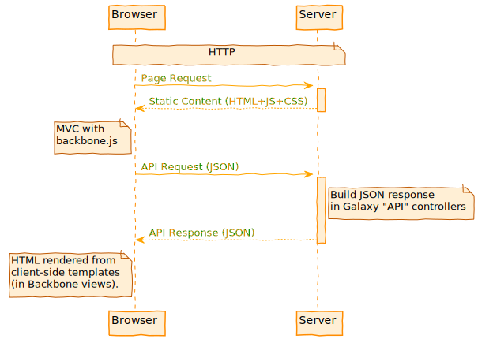

???

Workflow, Data Libraries, Visualization, History, Tool Menu,
Many Grids

---

class: white


### Backbone MVC

---

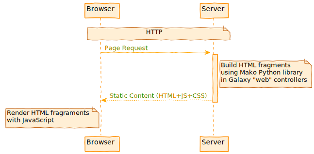

???

User management and admin things, Reports and Tool Shed
Webapp

---

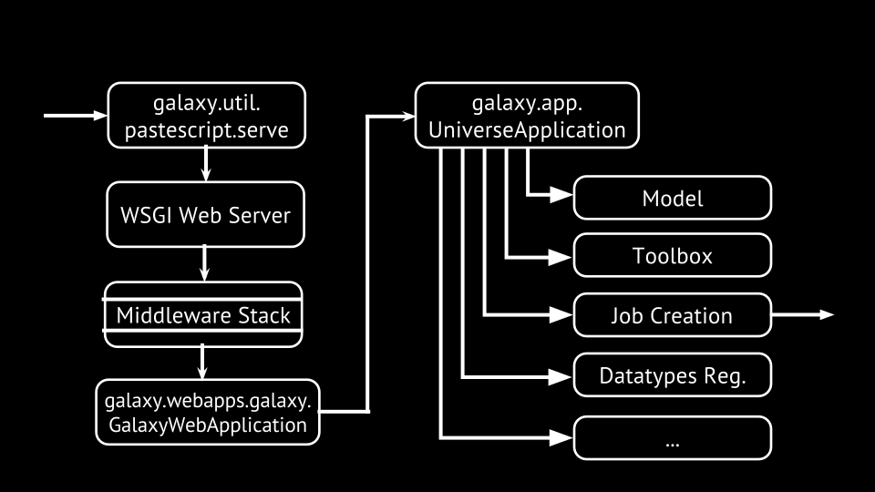

### Galaxy WSGI

---

### WSGI

- Python interface for web servers defined by PEP 333 - https://www.python.org/dev/peps/pep-0333/.
- Galaxy moving from Paster to uwsgi to host the application.
  - http://pythonpaste.org/
  - https://uwsgi-docs.readthedocs.io/

---

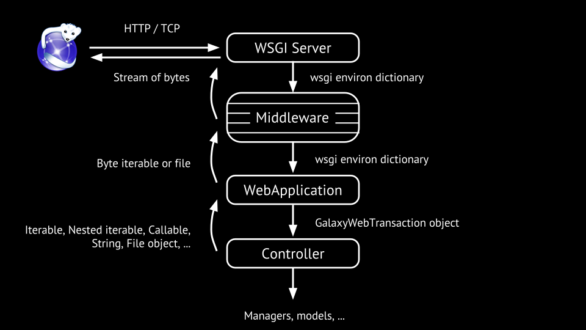

---

### Galaxy WSGI Middleware

A WSGI function:

`def app(environ, start_response):`

- Middleware act as filters, modify the `environ` and then pass through to the next webapp
- Galaxy uses several middleware components defined in the `wrap_in_middleware`
  function of `galaxy.webapps.galaxy.buildapp`.

---

class: normal

### Galaxy's WSGI Middleware

Middleware configured in `galaxy.webapps.galaxy.buildapp#wrap_in_middleware`.

- `paste.httpexceptions#make_middleware`
- `galaxy.web.framework.middleware.remoteuser#RemoteUser` (if configured)
- `paste.recursive#RecursiveMiddleware`
- `galaxy.web.framework.middleware.sentry#Sentry` (if configured)
- Various debugging middleware (linting, interactive exceptions, etc...)
- `galaxy.web.framework.middleware.statsd#StatsdMiddleware` (if configured)
- `galaxy.web.framework.middleware.xforwardedhost#XForwardedHostMiddleware`
- `galaxy.web.framework.middleware.request_id#RequestIDMiddleware`

---

background-image: url(images/webapp.plantuml.svg)

---

class: normal

### Routes

Setup on `webapp` in `galaxy.web.webapps.galaxy.buildapp.py`.

```python
webapp.add_route(
    '/datasets/:dataset_id/display/{filename:.+?}',
    controller='dataset', action='display',
    dataset_id=None, filename=None
)
```

URL `/datasets/278043/display` matches this route, so `handle_request` will

- lookup the controller named “dataset”
- look for a method named “display” that is exposed
- call it, passing dataset_id and filename as keyword arg

Uses popular Routes library (https://pypi.python.org/pypi/Routes).

---

class: normal

Simplified `handle_request` from `lib/galaxy/web/framework/base.py`.

```python
def handle_request(self, environ, start_response):
    path_info = environ.get( 'PATH_INFO', '' )
    map = self.mapper.match( path_info, environ )
    if path_info.startswith('/api'):
        controllers = self.api_controllers
    else:
        controllers = self.controllers

    trans = self.transaction_factory( environ )

    controller_name = map.pop( 'controller', None )
    controller = controllers.get( controller_name, None )

    # Resolve action method on controller
    action = map.pop( 'action', 'index' )
    method = getattr( controller, action, None )

    kwargs = trans.request.params.mixed()
    # Read controller arguments from mapper match
    kwargs.update( map )

    body = method( trans, **kwargs )
    # Body may be a file, string, etc... respond with it.
```

---

### API Controllers

- `lib/galaxy/webapps/galaxy/controllers/api/`
- Exposed method take `trans` and request parameters and return a JSON response.
- Ideally these are *thin*
  - Focused on "web things" - adapting parameters and responses and move
    "business logic" to components not bound to web functionality.

---

### Legacy Controllers

- `lib/galaxy/webapps/galaxy/controllers/`
- Return arbitrary content - JSON, HTML, etc...
- Render HTML components using [mako](http://www.makotemplates.org/) templates (see `templates/`)
- The usage of these should decrease over time.

---

## Application Components

---

### Galaxy Models

- Database interactions powered by SQLAlchemy - http://www.sqlalchemy.org/.
- Galaxy doesn't think in terms "rows" but "objects".
- Classes for Galaxy model objects in `lib/galaxy/model/__init__.py`.
- Classes mapped to tables in `lib/galaxy/model/mapping.py`
  - Describes table definitions and relationships.

---

class: white, widen_image


---

### Galaxy Model Migrations

- A migration describes a linear list of database "diff"s to
  end up with the current Galaxy model.
- Allow the schema to be migrated forward automatically.
- Powered by sqlalchemy-migrate - https://sqlalchemy-migrate.readthedocs.io/en/latest/.
- Each file in `lib/galaxy/model/migrate/versions/`
  - `0124_job_state_history.py`
  - `0125_workflow_step_tracking.py`
  - `0126_password_reset.py`

---

class: white, narrow_image


### Database Diagram

https://wiki.galaxyproject.org/Admin/Internals/DataModel

---

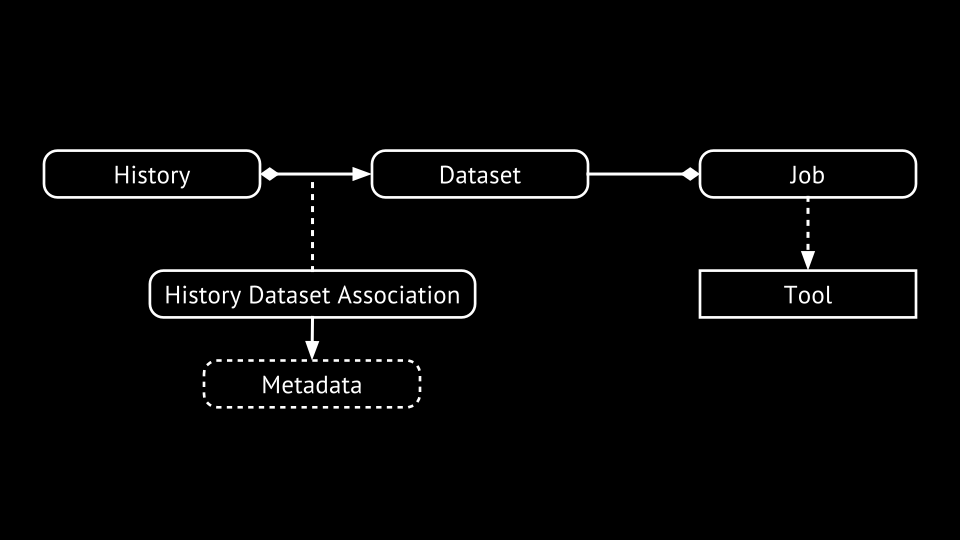

---

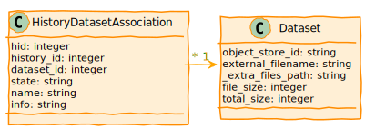

---

### Metadata

- Typed key-value pairs attached to HDA.
- Keys and types defined at the datatype level.
- Can be used by tools to dynamically control the tool form.

???

Slides for datatypes, example of meta data definitions...

---

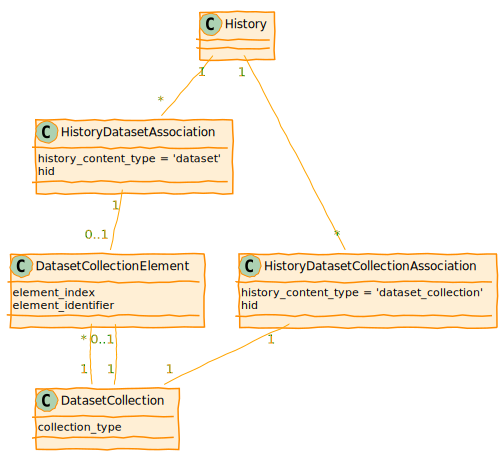

---

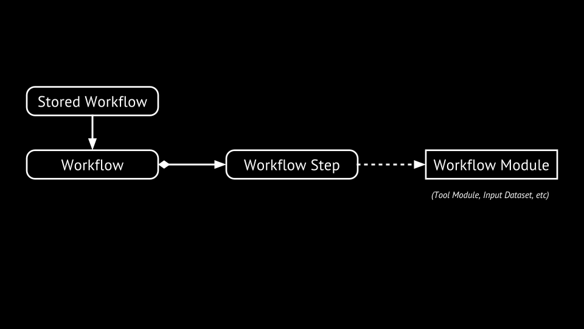

---

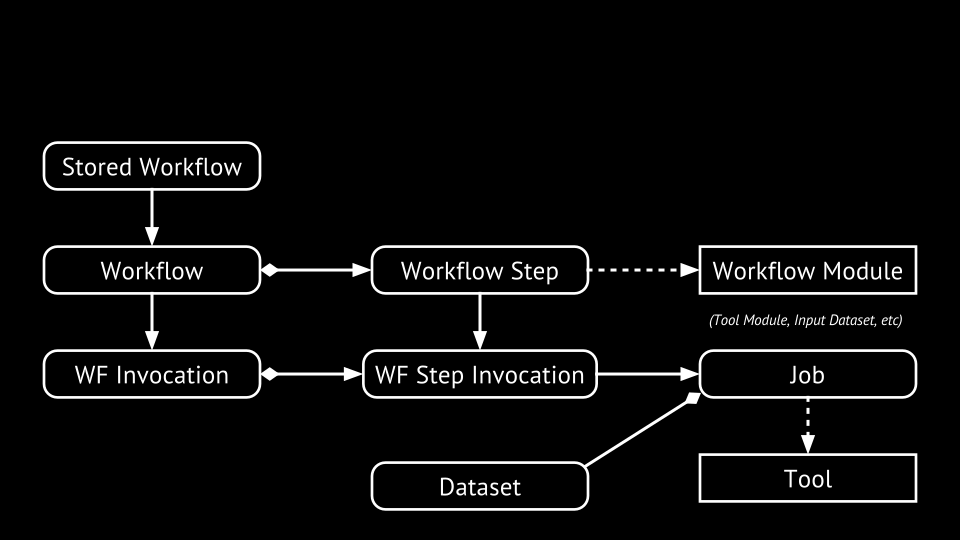

---

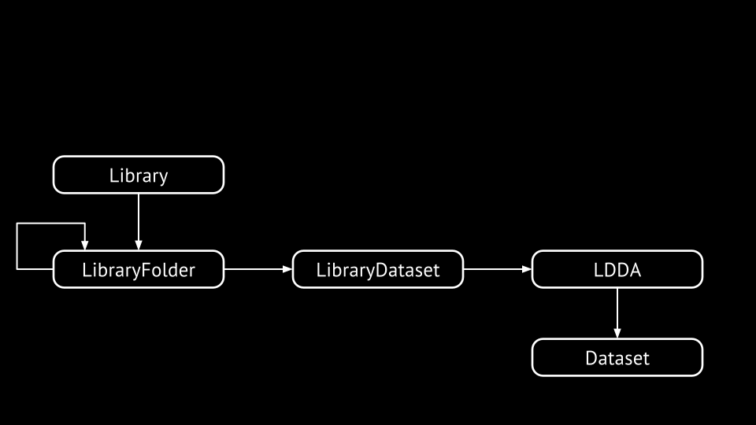

---

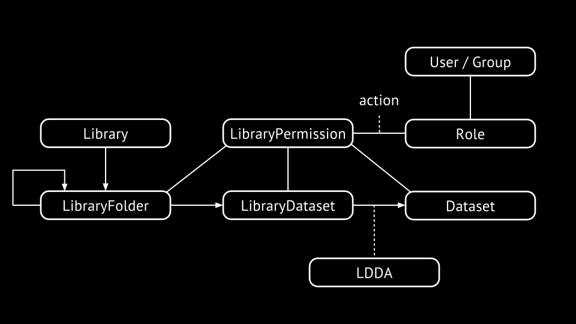

---

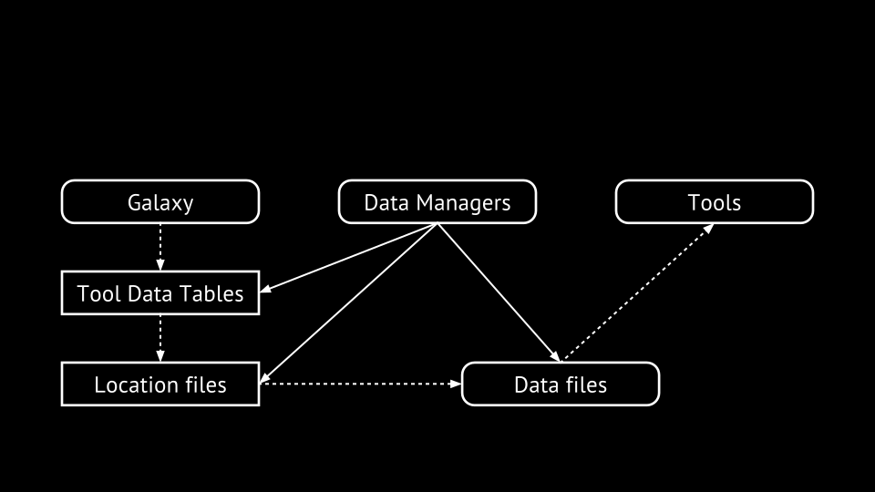

---

### Job Components

- Job is placed into the database and picked up by the job handler.
- Job handler (`JobHandler`) watches the job and transitions job's state - common startup and finishing.
- Job mapper (`JobRunnerMapper`) decides the "destination" for a job.
- Job runner (e.g. `DrammaJobRunner`) actual runs the job and provides an interface for checking status.

---

class: normal

### Object Store

.strike[```
>>> fh = open( dataset.file_path, 'w' )
>>> fh.write( ‘foo’ )
>>> fh.close()
>>> fh = open( dataset.file_path, ‘r’ )
>>> fh.read()
```]

```
>>> update_from_file( dataset, file_name=‘foo.txt’ )
>>> get_data( dataset )
>>> get_data( dataset, start=42, count=4096 )
```

---

background-image: url(images/objectstore.plantuml.svg)

---

### Visualization Plugins

Adding new visualizations to a Galaxy instance

- Configuration file (XML)
- Base template (Mako or JavaScript)
- Additional static data if needed (CSS, JS, …)

---

class: smaller

```xml
<?xml version="1.0" encoding="UTF-8"?>
<!DOCTYPE visualization SYSTEM "../../visualization.dtd">
<visualization name="Charts">
    <data_sources>
        <data_source>
            <model_class>HistoryDatasetAssociation</model_class>
            <test type="isinstance" test_attr="datatype" result_type="datatype">tabular.Tabular</test>
            <test type="isinstance" test_attr="datatype" result_type="datatype">tabular.CSV</test>
            <to_param param_attr="id">dataset_id</to_param>
        </data_source>
    </data_sources>
    <params>
        <param type="dataset" var_name_in_template="hda" required="true">dataset_id</param>
    </params>
    <entry_point entry_point_type="mako">charts.mako</entry_point>
</visualization>
```

---

### Visualization Examples

All in `config/plugins/visualizations`:

- `csg` - Chemical structure viewer
- `graphviz` - Visualize graph data using [cytoscape.js](http://www.cytoscape.org/)
- `charts` - A more elobrate builds on more Galaxy abstractions.
- `trackster` - Genome browser, deeply tied to Galaxy internals.

---

### Data Providers

Provide efficient access to data for viz & API

Framework provides direct link to read the raw dataset
or use data providers to adapt it

In config, assert that visualization requires a given type of data providers

Data providers process data before sending to browser - slice, filter, reformat, ...

---

### Interactive Environments

Similar to vizualizations: config and template

Within the base template, launch a Docker container running a web accessible
process

Build a UI that accesses that process through a proxy

---

### Interactive Environments - Examples

All in `config/plugins/interactive_environments`:

- `jupyter`
- `rstudio`
- `phinch`
- `bam_iobio`

---

### Managers

High-level business logic that tie all of these components together.

Controllers should ideally be thin wrappers around actions defined in managers.

Whenever model require more than just the database, the operation should be defined 
in a manager instead of in the model.

---

## Client Architecture

---

### Client Directories

- Source stylesheets and JavaScript in `client/galaxy/{style|scripts}`
- "Packed" scripts served by Galaxy stored in `static/{style|scripts}`
  - webpack builds these "compiled" artifacts

Upshot - modify files in `client` and rebuild with `make client` before
deployment.

---

class: normal

### Building the Client - Makefile Targets

```
client: grunt style ## Rebuild all client-side artifacts

grunt: npm-deps ## Calls out to Grunt to build client
  cd client && node_modules/grunt-cli/bin/grunt

style: npm-deps ## Calls the style task of Grunt
  cd client && node_modules/grunt-cli/bin/grunt style

npm-deps: ## Install NodeJS dependencies.
  cd client && npm install
```

---

### grunt

Build tool for node/JavaScript, tasks in `client/Gruntfile.js`. Default task is

.smaller[```grunt.registerTask( 'default', [ 'check-modules', 'uglify', 'webpack' ] );```]

- `check-modules` Verifies node dependencies are correct and exact.
- [`uglify`](https://github.com/mishoo/UglifyJS) Compresses JavaScript modules in `client` and move to `static` and creates source maps.
   - JavaScript loads much faster but difficult to debug by default
   - Source maps re-enable proper stack traces.
- `webpack` Bundles modules together into a single JavaScript file - quickly loadable.

---

### JavaScript Modules - The Problem

From http://requirejs.org/docs/why.html:

- Web sites are turning into Web apps
- Code complexity grows as the site gets bigger
- Assembly gets harder
- Developer wants discrete JS files/modules
- Deployment wants optimized code in just one or a few HTTP calls

---

### JavaScript Modules - The Solution

From http://requirejs.org/docs/why.html:

 - Some sort of #include/import/require
 - Ability to load nested dependencies
 - Ease of use for developer but then backed by an optimization tool that helps deployment

RequireJS an implementation of AMD.


---

class: normal

### JavaScript Modules - Galaxy AMD Example

```javascript
/**
    This is the workflow tool form.
*/
define(['utils/utils', 'mvc/tool/tool-form-base'],
    function(Utils, ToolFormBase) {

    // create form view
    var View = ToolFormBase.extend({
      ...
    });

    return {
        View: View
    };
});
```

---

class: white
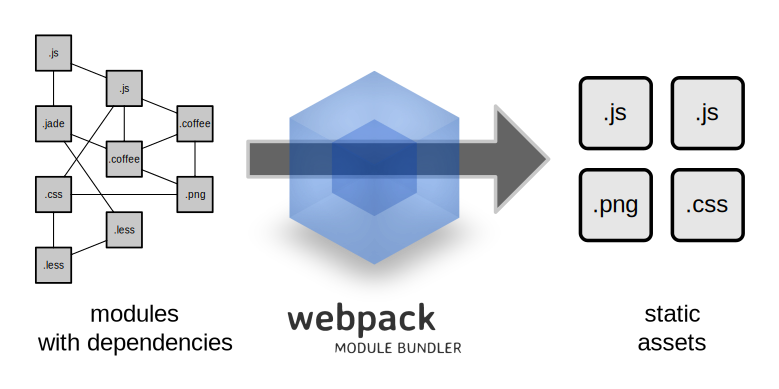

---

### webpack in Galaxy

- Turns Galaxy modules into an "app".
- Builds two bundles currently - a common set of libraries and an analysis "app".
- https://github.com/galaxyproject/galaxy/issues/1041
- https://github.com/galaxyproject/galaxy/pull/1144

---

class: white


---

### Stylesheets

- Galaxy uses the less CSS preprocessor - http://lesscss.org/
- Rebuild style with `make style`
- Less files in `client/galaxy/style/less`
- Build happens with grunt recipe in `client/grunt-tasks/style.js`

---

## Dependencies

---

### Dependencies - Python

`script/common_startup.sh` sets up a `virtualenv` with required dependencies in `$GALAXY_ROOT/.venv` (or `$GALAXY_VIRTUAL_ENV` if set).

- Check for existing virtual environment, if it doesn't exist check for `virtualenv`.
- If `virtualenv` exists, use it. Otherwise download it as a script and setup a virtual environment using it.
- `. "$GALAXY_VIRTUAL_ENV/bin/activate"`
- Upgrade to latest `pip` to allow use of binary wheels.
- `pip install -r requirements.txt --index-url https://wheels.galaxyproject.org/simple`
- Install dozens of dependencies.

---

### Dependencies - JavaScript

These come bundled with Galaxy, so do not need to be fetched at runtime.

- Dependencies are defined `galaxy/client/bower.json`.
- Bower (https://bower.io/) is used to re-fetch these.
- `cd client; grunt install-libs`

---

## Galaxy Startup Process

---

class: normal

### Cloning Galaxy

```
$ git clone https://github.com/galaxyproject/galaxy.git galaxy
Cloning into 'galaxy'...
remote: Counting objects: 173809, done.
remote: Total 173809 (delta 0), reused 0 (delta 0), pack-reused 173809
Receiving objects: 100% (173809/173809), 55.18 MiB | 11.08 MiB/s, done.
Resolving deltas: 100% (137885/137885), done.
Checking connectivity... done.
$ cd galaxy
$ git checkout -b master origin/master
Branch master set up to track remote branch master from origin.
Switched to a new branch 'master'
$ sh run.sh
```

---

class: normal

### Copying Configs

```
$ sh run.sh
Initializing config/migrated_tools_conf.xml from migrated_tools_conf.xml.sample
Initializing config/shed_tool_conf.xml from shed_tool_conf.xml.sample
Initializing config/shed_tool_data_table_conf.xml from shed_tool_data_table_conf.xml.sample
Initializing config/shed_data_manager_conf.xml from shed_data_manager_conf.xml.sample
Initializing tool-data/shared/ucsc/builds.txt from builds.txt.sample
Initializing tool-data/shared/ucsc/manual_builds.txt from manual_builds.txt.sample
Initializing tool-data/shared/ucsc/ucsc_build_sites.txt from ucsc_build_sites.txt.sample
Initializing tool-data/shared/igv/igv_build_sites.txt from igv_build_sites.txt.sample
Initializing tool-data/shared/rviewer/rviewer_build_sites.txt from rviewer_build_sites.txt.sample
Initializing static/welcome.html from welcome.html.sample
```

---

### Setting up `.venv` and `pip`

```
Using real prefix '/usr'
New python executable in .venv/bin/python
Installing setuptools, pip, wheel...done.
Activating virtualenv at .venv
Collecting pip>=8.1
  Using cached pip-8.1.2-py2.py3-none-any.whl
Installing collected packages: pip
  Found existing installation: pip 7.1.2
    Uninstalling pip-7.1.2:
      Successfully uninstalled pip-7.1.2
Successfully installed pip-8.1.2
```

---

class: normal

### Installing Dependencies

.code[```
Collecting bx-python==0.7.3 (from -r requirements.txt (line 2))
  Downloading https://wheels.galaxyproject.org/packages/bx_python-0.7.3-cp27-cp27mu-manylinux1_x86_64.whl (2.1MB)
Collecting MarkupSafe==0.23 (from -r requirements.txt (line 3))
  Downloading https://wheels.galaxyproject.org/packages/MarkupSafe-0.23-cp27-cp27mu-manylinux1_x86_64.whl
Collecting PyYAML==3.11 (from -r requirements.txt (line 4))
  Downloading https://wheels.galaxyproject.org/packages/PyYAML-3.11-cp27-cp27mu-manylinux1_x86_64.whl (367kB)
Collecting SQLAlchemy==1.0.8 (from -r requirements.txt (line 5))
  Downloading https://wheels.galaxyproject.org/packages/SQLAlchemy-1.0.8-cp27-cp27mu-manylinux1_x86_64.whl (1.0MB)
Collecting mercurial==3.7.3 (from -r requirements.txt (line 6))
  Downloading https://wheels.galaxyproject.org/packages/mercurial-3.7.3-cp27-cp27mu-manylinux1_x86_64.whl (1.5MB)
...
...
Building wheels for collected packages: repoze.lru
  Running setup.py bdist_wheel for repoze.lru: started
  Running setup.py bdist_wheel for repoze.lru: finished with status 'done'
  Stored in directory: /home/john/.cache/pip/wheels/b2/cd/b3/7e24400bff83325a01d492940eff6e9579f553f33348323d79
Successfully built repoze.lru
Installing collected packages: bx-python, MarkupSafe, PyYAML, SQLAlchemy, mercurial, numpy, pycrypto, six, Paste, PasteDeploy, docutils, wchartype, repoze.lru, Routes, WebOb, WebHelpers, Mako, pytz, Babel, Beaker, dictobj, nose, Parsley, Whoosh, Markdown, Cheetah, requests, boto, requests-toolbelt, bioblend, anyjson, amqp, kombu, psutil, PasteScript, pulsar-galaxy-lib, sqlparse, pbr, decorator, Tempita, sqlalchemy-migrate, pyparsing, svgwrite, ecdsa, paramiko, Fabric, pysam
Successfully installed Babel-2.0 Beaker-1.7.0 Cheetah-2.4.4 Fabric-1.10.2 Mako-1.0.2 Markdown-2.6.3 MarkupSafe-0.23 Parsley-1.3 Paste-2.0.2 PasteDeploy-1.5.2 PasteScript-2.0.2 PyYAML-3.11 Routes-2.2 SQLAlchemy-1.0.8 Tempita-0.5.3.dev0 WebHelpers-1.3 WebOb-1.4.1 Whoosh-2.7.4 amqp-1.4.8 anyjson-0.3.3 bioblend-0.7.0 boto-2.38.0 bx-python-0.7.3 decorator-4.0.2 dictobj-0.3.1 docutils-0.12 ecdsa-0.13 kombu-3.0.30 mercurial-3.7.3 nose-1.3.7 numpy-1.9.2 paramiko-1.15.2 pbr-1.8.0 psutil-4.1.0 pulsar-galaxy-lib-0.7.0.dev4 pycrypto-2.6.1 pyparsing-2.1.1 pysam-0.8.4+gx1 pytz-2015.4 repoze.lru-0.6 requests-2.8.1 requests-toolbelt-0.4.0 six-1.9.0 sqlalchemy-migrate-0.10.0 sqlparse-0.1.16 svgwrite-1.1.6 wchartype-0.1
```]

---

class: smaller

### Initial Debugging as App Starts

.code[```
Activating virtualenv at .venv
DEBUG:galaxy.app:python path is: /home/john/workspace/galaxy-clean/scripts,
/home/john/workspace/galaxy-clean/lib, /home/john/workspace/galaxy-clean/.venv/lib/python2.7,/home/john/workspace/galaxy-clean/.venv/lib/python2.7/plat-x86_64-linux-gnu,
/home/john/workspace/galaxy-clean/.venv/lib/python2.7/lib-tk, /home/john/workspace/galaxy-clean/.venv/lib/python2.7/lib-old, /home/john/workspace/galaxy-clean/.venv/lib/python2.7/lib-dynload,
/usr/lib/python2.7, /usr/lib/python2.7/plat-x86_64-linux-gnu, /usr/lib/python2.7/lib-tk, /home/john/workspace/galaxy-clean/.venv/local/lib/python2.7/site-packages
INFO:galaxy.config:Logging at '10' level to 'stdout'
galaxy.queue_worker INFO 2016-06-23 19:11:51,925 Initializing main Galaxy Queue Worker on sqlalchemy+sqlite:///./database/control.sqlite?isolation_level=IMMEDIATE
tool_shed.tool_shed_registry DEBUG 2016-06-23 19:11:51,951 Loading references to tool sheds from ./config/tool_sheds_conf.xml.sample
tool_shed.tool_shed_registry DEBUG 2016-06-23 19:11:51,951 Loaded reference to tool shed: Galaxy Main Tool Shed
galaxy.app DEBUG 2016-06-23 19:11:51,956 Using "galaxy.ini" config file:
/home/john/workspace/galaxy-clean/config/galaxy.ini.sample
```]

---

class: normal

### Database Migrations

.code[```
migrate.versioning.repository DEBUG 2016-06-23 19:11:51,993 Loading repository lib/galaxy/model/migrate...
migrate.versioning.script.base DEBUG 2016-06-23 19:11:51,994 Loading script lib/galaxy/model/migrate/versions/0001_initial_tables.py...
migrate.versioning.script.base DEBUG 2016-06-23 19:11:51,994 Script lib/galaxy/model/migrate/versions/0001_initial_tables.py loaded successfully
migrate.versioning.script.base DEBUG 2016-06-23 19:11:51,994 Loading script lib/galaxy/model/migrate/versions/0002_metadata_file_table.py...
migrate.versioning.script.base DEBUG 2016-06-23 19:11:52,009 Loading script lib/galaxy/model/migrate/versions/0131_subworkflow_and_input_parameter_modules.py...
...
galaxy.model.migrate.check INFO 2016-06-23 19:13:32,812 Migrating 128 -> 129... 
galaxy.model.migrate.check INFO 2016-06-23 19:13:33,436 
galaxy.model.migrate.check INFO 2016-06-23 19:13:33,437 Migration script to allow invalidation of job external output metadata temp files
galaxy.model.migrate.check INFO 2016-06-23 19:13:33,437 
galaxy.model.migrate.check INFO 2016-06-23 19:13:33,437 
galaxy.model.migrate.check INFO 2016-06-23 19:13:33,437 Migrating 129 -> 130... 
galaxy.model.migrate.check INFO 2016-06-23 19:13:34,325 
galaxy.model.migrate.check INFO 2016-06-23 19:13:34,325 Migration script to change the value column of user_preference from varchar to text.
galaxy.model.migrate.check INFO 2016-06-23 19:13:34,325 
galaxy.model.migrate.check INFO 2016-06-23 19:13:34,325 
galaxy.model.migrate.check INFO 2016-06-23 19:13:34,326 Migrating 130 -> 131... 
galaxy.model.migrate.check INFO 2016-06-23 19:13:35,633 
galaxy.model.migrate.check INFO 2016-06-23 19:13:35,633 Migration script to support subworkflows and workflow request input parameters
galaxy.model.migrate.check INFO 2016-06-23 19:13:35,633 
galaxy.model.migrate.check INFO 2016-06-23 19:13:35,633 
```]

---

Everything after here happens every time

---

class: smaller

.code[```
migrate.versioning.repository DEBUG 2016-06-23 19:13:35,635 Loading repository lib/tool_shed/galaxy_install/migrate...
migrate.versioning.script.base DEBUG 2016-06-23 19:13:35,635 Loading script lib/tool_shed/galaxy_install/migrate/versions/0001_tools.py...
migrate.versioning.script.base DEBUG 2016-06-23 19:13:35,636 Script lib/tool_shed/galaxy_install/migrate/versions/0001_tools.py loaded successfully
migrate.versioning.script.base DEBUG 2016-06-23 19:13:35,636 Loading script lib/tool_shed/galaxy_install/migrate/versions/0002_tools.py...
migrate.versioning.script.base DEBUG 2016-06-23 19:13:35,636 Script lib/tool_shed/galaxy_install/migrate/versions/0002_tools.py loaded successfully
migrate.versioning.script.base DEBUG 2016-06-23 19:13:35,636 Loading script lib/tool_shed/galaxy_install/migrate/versions/0003_tools.py...
migrate.versioning.script.base DEBUG 2016-06-23 19:13:35,636 Script lib/tool_shed/galaxy_install/migrate/versions/0003_tools.py loaded successfully
migrate.versioning.script.base DEBUG 2016-06-23 19:13:35,636 Loading script lib/tool_shed/galaxy_install/migrate/versions/0004_tools.py...
migrate.versioning.script.base DEBUG 2016-06-23 19:13:35,636 Script lib/tool_shed/galaxy_install/migrate/versions/0004_tools.py loaded successfully
migrate.versioning.script.base DEBUG 2016-06-23 19:13:35,636 Loading script lib/tool_shed/galaxy_install/migrate/versions/0005_tools.py...
migrate.versioning.script.base DEBUG 2016-06-23 19:13:35,636 Script lib/tool_shed/galaxy_install/migrate/versions/0005_tools.py loaded successfully
...
migrate.versioning.script.base DEBUG 2016-06-23 19:13:35,637 Script lib/tool_shed/galaxy_install/migrate/versions/0012_tools.py loaded successfully
migrate.versioning.repository DEBUG 2016-06-23 19:13:35,637 Repository lib/tool_shed/galaxy_install/migrate loaded successfully
tool_shed.galaxy_install.migrate.check DEBUG 2016-06-23 19:13:35,660 The main Galaxy tool shed is not currently available, so skipped tool migration 1 until next server startup
galaxy.config INFO 2016-06-23 19:13:35,679 Install database targetting Galaxy's database configuration.
```]

---

class: smaller

.code[```
galaxy.datatypes.registry DEBUG 2016-06-23 19:13:35,748 Loading datatypes from ./config/datatypes_conf.xml.sample
galaxy.datatypes.registry DEBUG 2016-06-23 19:13:35,749 Retrieved datatype module galaxy.datatypes.binary:Ab1 from the datatype registry.
galaxy.datatypes.registry DEBUG 2016-06-23 19:13:35,750 Retrieved datatype module galaxy.datatypes.assembly:Amos from the datatype registry.
galaxy.datatypes.registry DEBUG 2016-06-23 19:13:35,751 Retrieved datatype module galaxy.datatypes.text:Arff from the datatype registry.
galaxy.datatypes.registry DEBUG 2016-06-23 19:13:35,751 Retrieved datatype module galaxy.datatypes.data:GenericAsn1 from the datatype registry.
...
galaxy.datatypes.registry DEBUG 2016-06-23 19:13:35,822 Retrieved datatype module galaxy.datatypes.mothur:SquareDistanceMatrix from the datatype registry.
galaxy.datatypes.registry DEBUG 2016-06-23 19:13:35,822 Retrieved datatype module galaxy.datatypes.mothur:LowerTriangleDistanceMatrix from the datatype registry.
galaxy.datatypes.registry DEBUG 2016-06-23 19:13:35,822 Retrieved datatype module galaxy.datatypes.mothur:RefTaxonomy from the datatype registry.
galaxy.datatypes.registry DEBUG 2016-06-23 19:13:35,822 Retrieved datatype module galaxy.datatypes.mothur:RefTaxonomy from the datatype registry.
galaxy.datatypes.registry DEBUG 2016-06-23 19:13:35,823 Retrieved datatype module galaxy.datatypes.mothur:RefTaxonomy from the datatype registry.
galaxy.datatypes.registry DEBUG 2016-06-23 19:13:35,823 Retrieved datatype module galaxy.datatypes.mothur:ConsensusTaxonomy from the datatype registry.
galaxy.datatypes.registry DEBUG 2016-06-23 19:13:35,823 Retrieved datatype module galaxy.datatypes.mothur:TaxonomySummary from the datatype registry.
galaxy.datatypes.registry DEBUG 2016-06-23 19:13:35,823 Retrieved datatype module galaxy.datatypes.mothur:Frequency from the datatype registry.
galaxy.datatypes.registry DEBUG 2016-06-23 19:13:35,823 Retrieved datatype module galaxy.datatypes.mothur:Quantile from the datatype registry.
galaxy.datatypes.registry DEBUG 2016-06-23 19:13:35,823 Retrieved datatype module galaxy.datatypes.mothur:Quantile from the datatype registry.
galaxy.datatypes.registry DEBUG 2016-06-23 19:13:35,823 Retrieved datatype module galaxy.datatypes.mothur:Quantile from the datatype registry.
galaxy.datatypes.registry DEBUG 2016-06-23 19:13:35,823 Retrieved datatype module galaxy.datatypes.mothur:Quantile from the datatype registry.
galaxy.datatypes.registry DEBUG 2016-06-23 19:13:35,824 Retrieved datatype module galaxy.datatypes.mothur:Axes from the datatype registry.
galaxy.datatypes.registry DEBUG 2016-06-23 19:13:35,824 Retrieved datatype module galaxy.datatypes.mothur:SffFlow from the datatype registry.
galaxy.datatypes.registry DEBUG 2016-06-23 19:13:35,824 Retrieved datatype module galaxy.datatypes.mothur:CountTable from the datatype registry.
```]

---

class: smaller

.code[```
galaxy.datatypes.registry DEBUG 2016-06-23 19:13:35,824 Loaded sniffer for datatype 'galaxy.datatypes.mothur:Sabund'
galaxy.datatypes.registry DEBUG 2016-06-23 19:13:35,824 Loaded sniffer for datatype 'galaxy.datatypes.mothur:Otu'
galaxy.datatypes.registry DEBUG 2016-06-23 19:13:35,824 Loaded sniffer for datatype 'galaxy.datatypes.mothur:GroupAbund'
galaxy.datatypes.registry DEBUG 2016-06-23 19:13:35,824 Loaded sniffer for datatype 'galaxy.datatypes.mothur:SecondaryStructureMap'
galaxy.datatypes.registry DEBUG 2016-06-23 19:13:35,824 Loaded sniffer for datatype 'galaxy.datatypes.mothur:LowerTriangleDistanceMatrix'
galaxy.datatypes.registry DEBUG 2016-06-23 19:13:35,824 Loaded sniffer for datatype 'galaxy.datatypes.mothur:SquareDistanceMatrix'
galaxy.datatypes.registry DEBUG 2016-06-23 19:13:35,825 Loaded sniffer for datatype 'galaxy.datatypes.mothur:PairwiseDistanceMatrix'
galaxy.datatypes.registry DEBUG 2016-06-23 19:13:35,825 Loaded sniffer for datatype 'galaxy.datatypes.mothur:Oligos'
galaxy.datatypes.registry DEBUG 2016-06-23 19:13:35,825 Loaded sniffer for datatype 'galaxy.datatypes.mothur:Quantile'
galaxy.datatypes.registry DEBUG 2016-06-23 19:13:35,825 Loaded sniffer for datatype 'galaxy.datatypes.mothur:Frequency'
galaxy.datatypes.registry DEBUG 2016-06-23 19:13:35,825 Loaded sniffer for datatype 'galaxy.datatypes.mothur:LaneMask'
galaxy.datatypes.registry DEBUG 2016-06-23 19:13:35,825 Loaded sniffer for datatype 'galaxy.datatypes.mothur:RefTaxonomy'
galaxy.datatypes.registry DEBUG 2016-06-23 19:13:35,825 Loaded sniffer for datatype 'galaxy.datatypes.mothur:Axes'
galaxy.datatypes.registry DEBUG 2016-06-23 19:13:35,825 Loaded sniffer for datatype 'galaxy.datatypes.constructive_solid_geometry:PlyAscii'
galaxy.datatypes.registry DEBUG 2016-06-23 19:13:35,825 Loaded sniffer for datatype 'galaxy.datatypes.constructive_solid_geometry:PlyBinary'
galaxy.datatypes.registry DEBUG 2016-06-23 19:13:35,825 Loaded sniffer for datatype 'galaxy.datatypes.constructive_solid_geometry:VtkAscii'
galaxy.datatypes.registry DEBUG 2016-06-23 19:13:35,825 Loaded sniffer for datatype 'galaxy.datatypes.constructive_solid_geometry:VtkBinary'
galaxy.datatypes.registry DEBUG 2016-06-23 19:13:35,825 Loaded sniffer for datatype 'galaxy.datatypes.interval:ScIdx'
galaxy.datatypes.registry DEBUG 2016-06-23 19:13:35,825 Loaded sniffer for datatype 'galaxy.datatypes.tabular:Vcf'
galaxy.datatypes.registry DEBUG 2016-06-23 19:13:35,826 Loaded sniffer for datatype 'galaxy.datatypes.binary:TwoBit'
galaxy.datatypes.registry DEBUG 2016-06-23 19:13:35,826 Loaded sniffer for datatype 'galaxy.datatypes.binary:GeminiSQLite'
galaxy.datatypes.registry DEBUG 2016-06-23 19:13:35,826 Loaded sniffer for datatype 'galaxy.datatypes.binary:MzSQlite'
...
galaxy.datatypes.registry DEBUG 2016-06-23 19:13:35,832 Loaded sniffer for datatype 'galaxy.datatypes.images:Psd'
galaxy.datatypes.registry DEBUG 2016-06-23 19:13:35,832 Loaded sniffer for datatype 'galaxy.datatypes.images:Xbm'
galaxy.datatypes.registry DEBUG 2016-06-23 19:13:35,832 Loaded sniffer for datatype 'galaxy.datatypes.images:Rgb'
galaxy.datatypes.registry DEBUG 2016-06-23 19:13:35,832 Loaded sniffer for datatype 'galaxy.datatypes.images:Pbm'
galaxy.datatypes.registry DEBUG 2016-06-23 19:13:35,832 Loaded sniffer for datatype 'galaxy.datatypes.images:Pgm'
galaxy.datatypes.registry DEBUG 2016-06-23 19:13:35,832 Loaded sniffer for datatype 'galaxy.datatypes.images:Xpm'
galaxy.datatypes.registry DEBUG 2016-06-23 19:13:35,833 Loaded sniffer for datatype 'galaxy.datatypes.images:Eps'
galaxy.datatypes.registry DEBUG 2016-06-23 19:13:35,833 Loaded sniffer for datatype 'galaxy.datatypes.images:Rast'
galaxy.datatypes.registry DEBUG 2016-06-23 19:13:35,833 Loaded sniffer for datatype 'galaxy.datatypes.binary:OxliCountGraph'
galaxy.datatypes.registry DEBUG 2016-06-23 19:13:35,833 Loaded sniffer for datatype 'galaxy.datatypes.binary:OxliNodeGraph'
galaxy.datatypes.registry DEBUG 2016-06-23 19:13:35,833 Loaded sniffer for datatype 'galaxy.datatypes.binary:OxliTagSet'
galaxy.datatypes.registry DEBUG 2016-06-23 19:13:35,833 Loaded sniffer for datatype 'galaxy.datatypes.binary:OxliStopTags'
galaxy.datatypes.registry DEBUG 2016-06-23 19:13:35,833 Loaded sniffer for datatype 'galaxy.datatypes.binary:OxliSubset'
galaxy.datatypes.registry DEBUG 2016-06-23 19:13:35,833 Loaded sniffer for datatype 'galaxy.datatypes.binary:OxliGraphLabels'
```
]

---

class: smaller

.code[```
galaxy.datatypes.registry DEBUG 2016-06-23 19:13:35,833 Loaded build site 'ucsc': tool-data/shared/ucsc/ucsc_build_sites.txt with display sites: main,test,archaea,ucla
galaxy.datatypes.registry DEBUG 2016-06-23 19:13:35,834 Loaded build site 'gbrowse': tool-data/shared/gbrowse/gbrowse_build_sites.txt with display sites: modencode,sgd_yeast,tair,wormbase,wormbase_ws120,wormbase_ws140,wormbase_ws170,wormbase_ws180,wormbase_ws190,wormbase_ws200,wormbase_ws204,wormbase_ws210,wormbase_ws220,wormbase_ws225
galaxy.datatypes.registry DEBUG 2016-06-23 19:13:35,834 Loaded build site 'ensembl': tool-data/shared/ensembl/ensembl_sites.txt
galaxy.datatypes.registry DEBUG 2016-06-23 19:13:35,834 Loaded build site 'ensembl_data_url': tool-data/shared/ensembl/ensembl_sites_data_URL.txt
galaxy.datatypes.registry DEBUG 2016-06-23 19:13:35,834 Loaded build site 'igv': tool-data/shared/igv/igv_build_sites.txt
galaxy.datatypes.registry DEBUG 2016-06-23 19:13:35,834 Loaded build site 'rviewer': tool-data/shared/rviewer/rviewer_build_sites.txt
```]

---

class: smaller

.code[```
galaxy.tools.data INFO 2016-06-23 19:13:35,871 Could not find tool data tool-data/all_fasta.loc, reading sample
galaxy.tools.data DEBUG 2016-06-23 19:13:35,871 Loaded tool data table 'all_fasta'
galaxy.tools.data INFO 2016-06-23 19:13:35,871 Could not find tool data tool-data/bfast_indexes.loc, reading sample
galaxy.tools.data DEBUG 2016-06-23 19:13:35,871 Loaded tool data table 'bfast_indexes'
galaxy.tools.data WARNING 2016-06-23 19:13:35,871 Cannot find index file 'tool-data/blastdb_p.loc' for tool data table 'blastdb_p'
...
galaxy.tools.data DEBUG 2016-06-23 19:13:36,210 Loaded tool data table 'vcf_iobio'
galaxy.tools.data INFO 2016-06-23 19:13:36,211 Could not find tool data tool-data/biom_simple_display.loc, reading sample
galaxy.tools.data DEBUG 2016-06-23 19:13:36,211 Loaded tool data table 'biom_simple_display'

```]

---

class: normal

### Job Configuration, Citation Cache

.code[```
galaxy.jobs DEBUG 2016-06-23 19:13:36,233 Loading job configuration from /home/john/workspace/galaxy-clean/config/galaxy.ini.sample
galaxy.jobs DEBUG 2016-06-23 19:13:36,233 Done loading job configuration
beaker.container DEBUG 2016-06-23 19:13:36,278 data file ./database/citations/data/container_file/4/48/48e563f148dc04d8b31c94878c138019862e580d.cache
```]

---

class: smaller

### Load Toolbox

.code[```
galaxy.tools.toolbox.base INFO 2016-06-23 19:13:36,279 Parsing the tool configuration ./config/tool_conf.xml.sample
galaxy.tools.toolbox.base DEBUG 2016-06-23 19:13:36,291 Loaded tool id: upload1, version: 1.1.4 into tool panel..
galaxy.tools.toolbox.base DEBUG 2016-06-23 19:13:36,294 Loaded tool id: ucsc_table_direct1, version: 1.0.0 into tool panel..
galaxy.tools.toolbox.base DEBUG 2016-06-23 19:13:36,296 Loaded tool id: ucsc_table_direct_test1, version: 1.0.0 into tool panel..
galaxy.tools.toolbox.base DEBUG 2016-06-23 19:13:36,298 Loaded tool id: ucsc_table_direct_archaea1, version: 1.0.0 into tool panel..
...
galaxy.tools.toolbox.base DEBUG 2016-06-23 19:13:36,496 Loaded tool id: vcf_to_maf_customtrack1, version: 1.0.0 into tool panel..
galaxy.tools.toolbox.base INFO 2016-06-23 19:13:36,497 Parsing the tool configuration ./config/shed_tool_conf.xml
galaxy.tools.toolbox.base INFO 2016-06-23 19:13:36,497 Parsing the tool configuration ./config/migrated_tools_conf.xml
```]


---

class: smaller

### Tool Dependency Resolution and Indexing 

.code[```
galaxy.tools.deps WARNING 2016-06-23 19:13:36,498 Path './database/dependencies' does not exist, ignoring
galaxy.tools.deps WARNING 2016-06-23 19:13:36,498 Path './database/dependencies' is not directory, ignoring
galaxy.tools.deps DEBUG 2016-06-23 19:13:36,503 Unable to find config file './dependency_resolvers_conf.xml'
galaxy.tools.search DEBUG 2016-06-23 19:13:36,560 Starting to build toolbox index.
galaxy.tools.search DEBUG 2016-06-23 19:13:37,789 Toolbox index finished. It took: 0:00:01.229406
```]

---

class: smaller

### Display Applications

.code[```
galaxy.datatypes.registry DEBUG 2016-06-23 19:13:37,795 Loaded display application 'ucsc_bam' for datatype 'bam', inherit=False.
galaxy.datatypes.registry DEBUG 2016-06-23 19:13:37,797 Loaded display application 'ensembl_bam' for datatype 'bam', inherit=False.
galaxy.datatypes.registry DEBUG 2016-06-23 19:13:37,833 Loaded display application 'igv_bam' for datatype 'bam', inherit=False.
galaxy.datatypes.registry DEBUG 2016-06-23 19:13:37,834 Loaded display application 'igb_bam' for datatype 'bam', inherit=False.
...
galaxy.datatypes.registry DEBUG 2016-06-23 19:13:38,002 Loaded display application 'igv_vcf' for datatype 'vcf_bgzip', inherit=False.
galaxy.datatypes.registry DEBUG 2016-06-23 19:13:38,003 Loaded display application 'biom_simple' for datatype 'biom1', inherit=False.
galaxy.datatypes.registry DEBUG 2016-06-23 19:13:38,003 Adding inherited display application 'ensembl_gff' to datatype 'gtf'
galaxy.datatypes.registry DEBUG 2016-06-23 19:13:38,004 Adding inherited display application 'igv_gff' to datatype 'gtf'
...
galaxy.datatypes.registry DEBUG 2016-06-23 19:13:38,007 Adding inherited display application 'gbrowse_interval_as_bed' to datatype 'bed6'
galaxy.datatypes.registry DEBUG 2016-06-23 19:13:38,007 Adding inherited display application 'rviewer_interval' to datatype 'bed6'
galaxy.datatypes.registry DEBUG 2016-06-23 19:13:38,007 Adding inherited display application 'igv_interval_as_bed' to datatype 'bed6'
```]

---

class: smaller

### Datatype Converters

.code[```
galaxy.datatypes.registry DEBUG 2016-06-23 19:13:38,010 Loaded converter: CONVERTER_Bam_Bai_0
galaxy.datatypes.registry DEBUG 2016-06-23 19:13:38,011 Loaded converter: CONVERTER_bam_to_bigwig_0
galaxy.datatypes.registry DEBUG 2016-06-23 19:13:38,012 Loaded converter: CONVERTER_bed_to_gff_0
galaxy.datatypes.registry DEBUG 2016-06-23 19:13:38,012 Loaded converter: CONVERTER_bed_to_bgzip_0
galaxy.datatypes.registry DEBUG 2016-06-23 19:13:38,013 Loaded converter: CONVERTER_bed_to_tabix_0
...
galaxy.datatypes.registry DEBUG 2016-06-23 19:13:38,096 Loaded converter: CONVERTER_cml_to_inchi
galaxy.datatypes.registry DEBUG 2016-06-23 19:13:38,097 Loaded converter: CONVERTER_cml_to_sdf
galaxy.datatypes.registry DEBUG 2016-06-23 19:13:38,098 Loaded converter: CONVERTER_cml_to_mol2
galaxy.datatypes.registry DEBUG 2016-06-23 19:13:38,099 Loaded converter: CONVERTER_ref_to_seq_taxomony
```]

---

class: normal

### Special Tools

.code[```
galaxy.datatypes.registry DEBUG 2016-06-23 19:13:38,101 Loaded external metadata tool: __SET_METADATA__
galaxy.tools.special_tools DEBUG 2016-06-23 19:13:38,107 Loaded history import tool: __IMPORT_HISTORY__
galaxy.tools.special_tools DEBUG 2016-06-23 19:13:38,108 Loaded history export tool: __EXPORT_HISTORY__
```]

---

class: normal

### Vizualization Plugins

.code[```
galaxy.web.base.pluginframework INFO 2016-06-23 19:13:38,109 VisualizationsRegistry, loaded plugin: charts
galaxy.visualization.plugins.config_parser INFO 2016-06-23 19:13:38,110 Visualizations plugin disabled: Circster. Skipping...
galaxy.visualization.plugins.config_parser INFO 2016-06-23 19:13:38,111 template syntax is deprecated: use entry_point instead
galaxy.web.base.pluginframework INFO 2016-06-23 19:13:38,111 VisualizationsRegistry, loaded plugin: csg
galaxy.visualization.plugins.config_parser INFO 2016-06-23 19:13:38,111 template syntax is deprecated: use entry_point instead
galaxy.web.base.pluginframework INFO 2016-06-23 19:13:38,112 VisualizationsRegistry, loaded plugin: graphviz
galaxy.web.base.pluginframework INFO 2016-06-23 19:13:38,112 VisualizationsRegistry, loaded plugin: phyloviz
galaxy.web.base.pluginframework INFO 2016-06-23 19:13:38,113 VisualizationsRegistry, loaded plugin: scatterplot
galaxy.visualization.plugins.config_parser INFO 2016-06-23 19:13:38,113 Visualizations plugin disabled: Sweepster. Skipping...
galaxy.web.base.pluginframework INFO 2016-06-23 19:13:38,114 VisualizationsRegistry, loaded plugin: trackster
```]

---

class: normal

### Tours

.code[```
galaxy.tours INFO 2016-06-23 19:13:38,125 Loaded tour 'core.scratchbook'
galaxy.tours INFO 2016-06-23 19:13:38,158 Loaded tour 'core.galaxy_ui'
galaxy.tours INFO 2016-06-23 19:13:38,183 Loaded tour 'core.history'
```]

---

class: normal

### Job Handler and Runners

.code[```
galaxy.jobs.manager DEBUG 2016-06-23 19:13:38,196 Starting job handler
galaxy.jobs INFO 2016-06-23 19:13:38,196 Handler 'main' will load all configured runner plugins
galaxy.jobs.runners.state_handler_factory DEBUG 2016-06-23 19:13:38,198 Loaded 'failure' state handler from module galaxy.jobs.runners.state_handlers.resubmit
galaxy.jobs.runners DEBUG 2016-06-23 19:13:38,198 Starting 5 LocalRunner workers
galaxy.jobs DEBUG 2016-06-23 19:13:38,200 Loaded job runner 'galaxy.jobs.runners.local:LocalJobRunner' as 'local'
galaxy.jobs DEBUG 2016-06-23 19:13:38,200 Legacy destination with id 'local:///', url 'local:///' converted, got params:
galaxy.jobs.handler DEBUG 2016-06-23 19:13:38,200 Loaded job runners plugins: local
galaxy.jobs.handler INFO 2016-06-23 19:13:38,200 job handler stop queue started
galaxy.jobs.handler INFO 2016-06-23 19:13:38,222 job handler queue started
```]

---

class: normal

### Ignore this...

.code[```
galaxy.sample_tracking.external_service_types DEBUG 2016-06-23 19:13:38,229 Loaded external_service_type: Simple unknown sequencer 1.0.0
galaxy.sample_tracking.external_service_types DEBUG 2016-06-23 19:13:38,230 Loaded external_service_type: Applied Biosystems SOLiD 1.0.0
```]

---

class: normal

### Workflow Scheduler

.code[```
galaxy.workflow.scheduling_manager DEBUG 2016-06-23 19:13:38,254 Starting workflow schedulers
```]

---

class: normal

### Controllers

.code[```
galaxy.web.framework.base DEBUG 2016-06-23 19:13:38,347 Enabling 'external_service' controller, class: ExternalService
galaxy.web.framework.base DEBUG 2016-06-23 19:13:38,347 Enabling 'requests_common' controller, class: RequestsCommon
galaxy.web.framework.base DEBUG 2016-06-23 19:13:38,375 Enabling 'library_common' controller, class: LibraryCommon
galaxy.web.framework.base DEBUG 2016-06-23 19:13:38,390 Enabling 'visualization' controller, class: VisualizationController
galaxy.web.framework.base DEBUG 2016-06-23 19:13:38,398 Enabling 'page' controller, class: PageController
galaxy.web.framework.base DEBUG 2016-06-23 19:13:38,400 Enabling 'async' controller, class: ASync
...
galaxy.web.framework.base DEBUG 2016-06-23 19:13:38,728 Enabling 'history_content_tags' API controller, class: HistoryContentTagsController
galaxy.web.framework.base DEBUG 2016-06-23 19:13:38,728 Enabling 'history_tags' API controller, class: HistoryTagsController
galaxy.web.framework.base DEBUG 2016-06-23 19:13:38,728 Enabling 'workflow_tags' API controller, class: WorkflowTagsController
```]

---

class: normal

### Middleware

.code[```
galaxy.webapps.galaxy.buildapp DEBUG 2016-06-23 19:13:39,036 Enabling 'httpexceptions' middleware
galaxy.webapps.galaxy.buildapp DEBUG 2016-06-23 19:13:39,037 Enabling 'recursive' middleware
galaxy.webapps.galaxy.buildapp DEBUG 2016-06-23 19:13:39,042 Enabling 'error' middleware
galaxy.webapps.galaxy.buildapp DEBUG 2016-06-23 19:13:39,043 Enabling 'trans logger' middleware
galaxy.webapps.galaxy.buildapp DEBUG 2016-06-23 19:13:39,044 Enabling 'x-forwarded-host' middleware
galaxy.webapps.galaxy.buildapp DEBUG 2016-06-23 19:13:39,044 Enabling 'Request ID' middleware
```]

---

class: normal

### Static Paths for Viz

.code[```
galaxy.webapps.galaxy.buildapp DEBUG 2016-06-23 19:13:39,048 added url, path to static middleware: /plugins/visualizations/charts/static, ./config/plugins/visualizations/charts/static
galaxy.webapps.galaxy.buildapp DEBUG 2016-06-23 19:13:39,048 added url, path to static middleware: /plugins/visualizations/csg/static, ./config/plugins/visualizations/csg/static
galaxy.webapps.galaxy.buildapp DEBUG 2016-06-23 19:13:39,049 added url, path to static middleware: /plugins/visualizations/graphviz/static, ./config/plugins/visualizations/graphviz/static
galaxy.webapps.galaxy.buildapp DEBUG 2016-06-23 19:13:39,049 added url, path to static middleware: /plugins/visualizations/scatterplot/static, ./config/plugins/visualizations/scatterplot/static
```]

---

### It is Up!

.code[```
galaxy.queue_worker INFO 2016-06-23 19:13:39,049 Binding and starting galaxy control worker for main
Starting server in PID 21102.
serving on http://127.0.0.1:8080
```]

---

## Production Galaxy - usegalaxy.org

---

class: centered

.pull-left[
#### Default

SQLite

Paste#http

Single process

Single host

Local jobs

]

.pull-right[
#### Production

PostgreSQL

uWSGI / nginx

Multiple processes

Multiple hosts

Jobs across many clusters
]

*http://usegalaxy.org/production*

---

### postgres

- Database server can scale way beyond default sqlite
- https://www.postgresql.org/
- github.com/galaxyproject/usegalaxy-playbook -> `roles/galaxyprojectdotorg.postgresql`

---

### nginx (or Apache)

- Optimized servers for static content
- https://www.nginx.com/resources/wiki/
- github.com/galaxyproject/usegalaxy-playbook -> `templates/nginx/usegalaxy.j2`

---

### Multi-processes

Threads in Python are limited by the [GIL](https://wiki.python.org/moin/GlobalInterpreterLock).

Running multiple processes of Galaxy and seperate processes for web handling
and job processing works around this.

This used to be an important detail - but uWSGI makes things a lot easier.

---


### Cluster Support

---

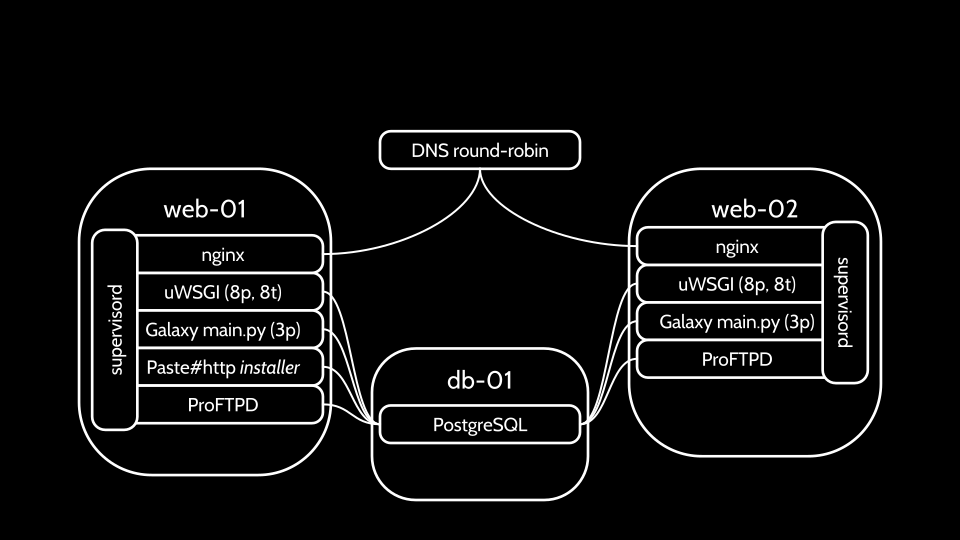

---

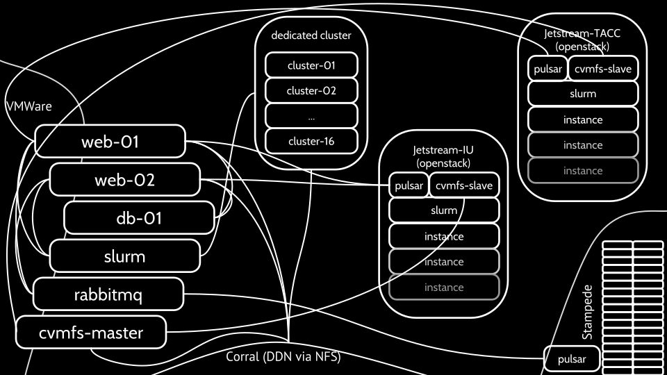

---

## Q & A

---
