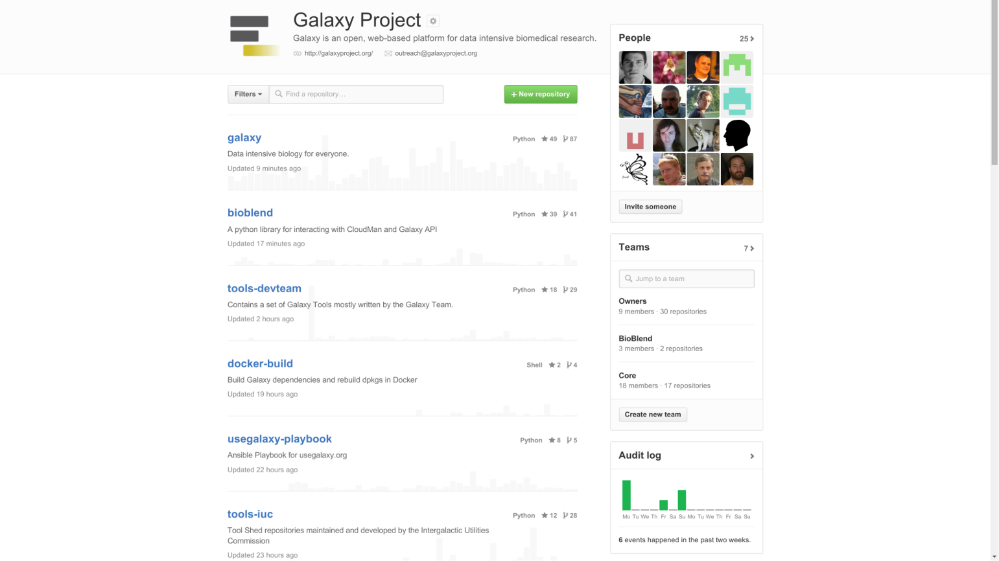

layout: true
class: inverse, center, middle
---
class: special
# Galaxy Architecture 2015

Nate, James

<!--- Add the logo and the Twitter / IRC  mentions --->

---

class: inverse, center, middle

### Please Interrupt!

We're here to answer your question about Galaxy architecture!

---

## 0. Getting involved in Galaxy

---

**IRC**: irc.freenode.net#galaxyproject
 
.emphasis_2_galaxy[**GitHub**].special[:] github.com/galaxyproject
 
**Trello**: https://trello.com/b/75c1kASa/
 
**Twitter**: #usegalaxy, @galaxyproject

---

### Contributing

All Galaxy development has moved to GitHub
 
over the last year
 
New official contribution guidelines:  https://github.git com/galaxyproject/galaxy/blob/dev/CONTRIBUTING.md

---

## 1. The family of /galaxyproject projects

---

<!-- TODO: Work again on the image -->

---

github.com/galaxyproject/**galaxy**
 
#### The main Galaxy application. Web interface, database model, job running, etc. Also includes other web applications including the **ToolShed** and **Reports**

---

github.com/galaxyproject/**cloudlaunch**
#### CloudLaunch web application to make it wasy to launch images on a cloud, drives *http://launch.usegalaxy.org*

---

github.com/galaxyproject/**tools-{devteam,iuc}**
#### Galaxy tools maintained by *devteam* (ths PSU/Hopkins group) and *iuc* (the "Intergalactic Utilities Commission"). A variety of tools, generally of high qualitym including the core tools for Galaxy main. Demonstrates **current tool development best practices** - development on github and then deployed to test/main ToolSheds

---

github.com/galaxyproject/**docker-build**
#### Build Galaxy Tool dependencies for the ToolShed in Docker containers
#### Build Galaxy framework dependencies as Python wheels

---

github.com/galaxyproject/**planemo**
#### Commande line utilities to assist in the development of Galaxy tools. Linting, testing, deploying to ToolSheds... ***The best practice approach for Galaxy tool development!***
github.com/galaxyproject/**planemo-machine**
#### Builds Galaxy environments for Galaxy tool development including Docker container, virtual machines, Google compute images

---

github.com/galaxyproject/**{ansible-\*, \*-playbook}**
#### Ansible components to automate almost every aspect of Galaxy installation and maintenance.
#### Ansible is an advanced configuration management system
#### These playbooks are used to maintain Galaxy main, cloud images, virtual machines, ...

---

github.com/galaxyproject/**pulsar**
#### Distributed job execution engine for Galaxy. Allows staging data, scripts, configuration. Can run jobs on Windows machines. Can act as its own queuing system or access an existing cluster DRM

---

github.com/galaxyproject/**bioblend**
#### Official Python client for the Galaxy and CloudMan APIs

---

## 2. Galaxy app architecture

---

<!-- TODO: Work again on the image -->
background-image: url(images/app_architecture/client_server.png)
background-position: center;
background-repeat: no-repeat;
background-size: contain;

---

<!-- Image to fetch and add -->

---

<!-- Image to fetch and add -->

---

<!-- Image to fetch and add -->

---

<!-- Image to fetch and add -->

---

<!-- Image to fetch and add -->

---

## 3. Galaxy components and object model

---

Galaxy data model is not database entity driven

Entities are defined in galaxy.model as objects

SQLAlchemy is used for object relation mapping

Mappings are defined in galaxy.model.mapping in two
 
parts - a table definition and a mapping between
 
objects and table including relationships

Migrations allow the schema to be migrated forward automatically

---

<!-- Image to fetch and add -->
https://wiki.galaxyproject.org/Admin/Internals/DataModel

---

<!-- Image to fetch and add -->

---

### Core components
<!-- Image to fetch and add -->

---

### Core components: run analysis
<!-- Image to fetch and add -->

---

### Metadata
Structured data

Different keys/types for different datatypes

Can be used by tools to dynamically control the tool form

---

### Core components: workflow
<!-- Image to fetch and add -->

---

### Core components: workflow run
<!-- Image to fetch and add -->

---

### Data Libraries
<!-- Image to fetch and add -->

---

### Data Libraries: Permissions
<!-- Image to fetch and add -->

---

### Reference data "cache"
<!-- Image to fetch and add -->

---

### **Visualization Plugins**

Adding new visualizatons to a Galaxy instance:
- Configuration file (XML)
- Base template (Mako)
- Additional static data *if needed* (CSS, JS, ...)

---

### Visualization Plugins: Charts
<!-- Image to fetch and add -->

---

### Visualization Plugins: Data

How do I *efficiently* access data for my viz?
- Framework provides direct link to read the raw dataset
- *or* use Data providers
    - In config, assert that visualization requires a given type of data provider
    - Data providers process data before sending to browser. Slice, filter, reformat, ...

---

### **Interactive Environments**
Galaxy side is identical to interactive
 
environments: config and base template
- Within the base template, launch a Docker container running a web accessible process
- Build a UI that accesses that process through a proxy

---

### Dataset Collections
Hundreds or thousands of similar datasets are
 
unwiedly, how do you get a handle on them?
- Group datasets into a single unit
- Perform complex operations on that unit
    - Operations are performed on each group element
    - Output of each operation is a new group

---

<!-- Image to fetch and add -->

---

### Map/reduce in workflows
<!-- Image to fetch and add -->

---

### Histories
<!-- Image to fetch and add -->

---

### Dataset Collections
<!-- Image to fetch and add -->

---

### Object Store
<!-- Image to fetch and add -->

---

### Object Store
<!-- Image to fetch and add -->

---

## 4. Galaxy startup

---

### Pre-startup
<!-- Image to fetch and add -->

---

### First run: Initialize configs
<!-- Image to fetch and add -->

---

### First run: Fetch eggs
<!-- Image to fetch and add -->

---

### Every run: Load the application
<!-- Image to fetch and add -->

---

### Every run: Load database migrations
<!-- Image to fetch and add -->

---

### First run: Initialize database
<!-- Image to fetch and add -->

---

Everything after here happens every time

---

### Load tool migrations
<!-- Image to fetch and add -->

---

### Load datatypes
<!-- Image to fetch and add -->

---

### Load datatypes sniffers
<!-- Image to fetch and add -->

---

### Load build (display) sites
<!-- Image to fetch and add -->

---

### Load data tables
<!-- Image to fetch and add -->

---

### Read job configuration file
<!-- Image to fetch and add -->
* config/job_conf.xml will automatically be read if created, see
 
job_conf_xml.sample_advanced for fully documented examples of all
 
possible configurations

---

### Load tools
<!-- Image to fetch and add -->
* shed_tool_conf.xml is empty on the first run so
 
only tools provided with Galaxy are loaded, but
 
after tools are installed from the Tool Shed, they
 
will load here

---

### Associate display apps with datatypes
<!-- Image to fetch and add -->

---

### Load implicit datatype converters
<!-- Image to fetch and add -->
* A few internal operations are defined as tools to allow them to run via Galaxy'
 
s job system, and are loaded here as well

---

### Load visualization plugins
<!-- Image to fetch and add -->

---

### Initialize job handlers
<!-- Image to fetch and add -->

---

### Initialize web controllers
<!-- Image to fetch and add -->

---

### Load WSGI middleware
<!-- Image to fetch and add -->

---

serving on http://127.0.0.1:8080

---

## 5. A Galaxy request

---

### Beginning of request
- TCP connection from client on port 80
- WSGI server is responsible for picking up the
 
connection, parsing HTTP headers, and
 
reformatting them into a dictionary according
 
to the WSGI spec, this dict is called "environ"
- In a default Galaxy install this is *currently*
Paste#http

---

### Middleware
- The WSGI interface is based around function
 
calls: def app( environ, start_response ): ...
- Middleware act as filters, modify the environ
 
and then pass through to the next webapp
- Galaxy uses several middleware components
galaxy.webapps.galaxy.buildapp#wrap_in_middleware
 
error handling, logging, proxy hostname, debug, static, ...

---

### WebApplication (galaxy.web.framework.base#WebApplication)
- Galaxy's custom web framework, shares a lot
 
of ideas with Pylons
- __call__ method supports the WSGI spec
    - Takes environ and creates a wrapper object
     
    GalaxyWebTransaction -- ** this is the ubiquitous trans! **

---

---

---

---

---

---

---

---

---

---

---

---

---

---
