layout: true
class: inverse, middle

---
class: special
# Galaxy Architecture

Nate, James, John, Rémi

.footnote[\#usegalaxy/@galaxyproject]

---

class: middle

### Please Interrupt!

We're here to answer your question about Galaxy architecture!

---

## Getting involved in Galaxy

---

**IRC**: irc.freenode.net#galaxyproject
 
.special2[**GitHub**].special[:] github.com/galaxyproject
 
**Twitter**: #usegalaxy, @galaxyproject

---

### Contributing

All Galaxy development happens on GitHub

Contribution guidelines: https://github.com/galaxyproject/galaxy/blob/dev/CONTRIBUTING.md

---

## 1. The family of /galaxyproject projects

---

<!-- TODO: Work again on the image -->

---

github.com/galaxyproject/**galaxy**
 
#### The main Galaxy application. Web interface, database model, job running, etc. Also includes other web applications including the **ToolShed** and **Reports**

---

github.com/galaxyproject/**cloudman**
#### Galaxy CloudMan 

github.com/galaxyproject/**cloudlaunch**
#### CloudLaunch web application to make it wasy to launch images on a cloud, drives *https://launch.usegalaxy.org*

---

github.com/galaxyproject/**tools-{devteam,iuc}**
#### Galaxy tools maintained by *devteam* (ths PSU/Hopkins group) and *iuc* (the "Intergalactic Utilities Commission"). A variety of tools, generally of high quality including the core tools for Galaxy main. Demonstrates **current tool development best practices** - development on github and then deployed to test/main ToolSheds

---

github.com/galaxyproject/**starforge**
#### Build Galaxy Tool dependencies for the ToolShed in Docker containers
#### Build Galaxy framework dependencies as Python wheels

---

github.com/galaxyproject/**planemo**
#### Commande line utilities to assist in the development of Galaxy tools. Linting, testing, deploying to ToolSheds... ***The best practice approach for Galaxy tool development!***
github.com/galaxyproject/**planemo-machine**
#### Builds Galaxy environments for Galaxy tool development including Docker container, virtual machines, Google compute images

---

github.com/galaxyproject/**{ansible-\*, \*-playbook}**
#### Ansible components to automate almost every aspect of Galaxy installation and maintenance.
#### Ansible is an advanced configuration management system
#### These playbooks are used to maintain Galaxy main, cloud images, virtual machines, ...

---

github.com/galaxyproject/**pulsar**
#### Distributed job execution engine for Galaxy. Allows staging data, scripts, configuration. Can run jobs on Windows machines. Can act as its own queuing system or access an existing cluster DRM

---

github.com/galaxyproject/**bioblend**
#### Official Python client for the Galaxy, ToolShed, and CloudMan APIs

---

## Galaxy app architecture

---

### Aspirational Principles of Galaxy Architecture

Whereas the architecture of the frontend (Web UI) aims for consistency and is
highly opinionated, the backend (Python server) is guided by flexibility and is meant to be driven by plugins whenever possible.

???

Though an imperfect abstraction... maybe it is beneficial to think of the organizational
principles that guide frontend and backend development of Galaxy as
diametrically opposite.

The frontend architecture is guided by the principle that the end user experience
should be as simple and consistent as possible. The backend has been deployed at
so many different sites and targetting so many different technologies - that 
flexibility is paramount.

---

### An Opinionated Frontend

- The target audience is a bench scientist - no knowledge of programming, paths, or command lines should be assumed.
- Consistent colors, fonts, themes, etc...
- Reusable libraris for presenting common widgets such as forms and grids.
- Tied to specific technologies:
  - JavaScript driven.
  - Backbone for MVC.
  - RequireJS for module loading.

---

### A Plugin Driven Backend

A deployer of Galaxy can plug

---

### A Plugin Driven Backend but...

Galaxy has long been guided by the principle that cloning it and calling
the `run.sh` should "just work" and should work quickly.

So by default Galaxy does not require:

 - Compilation - it fetches binary wheels.
 - A job manager - Galaxy can act as one.
 - An external database server - Galaxy can use an sqlite database.
 - A web proxy or external Python web server.

---

layout: false

background-image: url(images/server_client_old.mermaid.svg)
background-position: center;
background-repeat: no-repeat;
background-size: contain;

???

User management and admin things, Reports and Tool Shed 
Webapp

---

layout: false

background-image: url(images/server_client.mermaid.svg)
background-position: center;
background-repeat: no-repeat;
background-size: contain;

???

Workflow, Data Libraries, Visualization, History, Tool Menu, 
Many Grids

---

background-image: url(images/backbone-model-view.svg)
background-position: center;
background-repeat: no-repeat;
background-size: contain;
 
---

background-image: url(images/wsgi_app.svg)
background-position: center;
background-repeat: no-repeat;
background-size: contain;

---

## Galaxy Models

- Database interactions powered by SQLAlchemy - http://www.sqlalchemy.org/.
- Galaxy doesn't think in terms "rows" but "objects".
- Classes for Galaxy model objects in `lib/galaxy/model/__init__.py`.
- Classes mapped to objects in `lib/galaxy/model/mapping.py`
  - Describes table definitions and relationships.

---

background-image: url(images/sqla_arch_small.png)
background-position: center;
background-repeat: no-repeat;
background-size: contain;

---

## Galaxy Model Migrations

- A migration describes a linear list of database "diff"s to
  end up with the current Galaxy model.
- Allow the schema to be migrated forward automatically.
- Powered by sqlalchemy-migrate - https://sqlalchemy-migrate.readthedocs.io/en/latest/.
- Each file in `lib/galaxy/model/migrate/versions/`
  - `0124_job_state_history.py`
  - `0125_workflow_step_tracking.py`
  - `0126_password_reset.py`

---

## Database Diagram

background-image: url(images/sqla_arch_small.png)
background-position: center;
background-repeat: no-repeat;
background-size: contain;

https://wiki.galaxyproject.org/Admin/Internals/DataModel

---

background-image: url(images/app_architecture/chunks.png)
background-position: center;
background-repeat: no-repeat;
background-size: contain;

---

background-image: url(images/app_architecture/chunks_2.png)
background-position: center;
background-repeat: no-repeat;
background-size: contain;

---

background-image: url(images/app_architecture/engine.png)
background-position: center;
background-repeat: no-repeat;
background-size: contain;

---

background-image: url(images/app_architecture/job_management.png)
background-position: center;
background-repeat: no-repeat;
background-size: contain;

---

## 3. Galaxy components and object model

---

Galaxy data model is not database entity driven

Entities are defined in galaxy.model as objects

SQLAlchemy is used for object relation mapping

Mappings are defined in galaxy.model.mapping in two
 
parts - a table definition and a mapping between
 
objects and table including relationships

Migrations allow the schema to be migrated forward
 
automatically

---

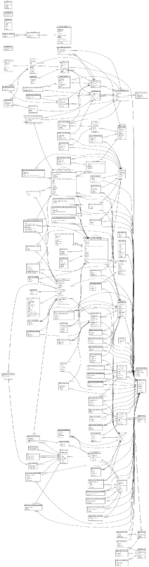
https://wiki.galaxyproject.org/Admin/Internals/DataModel

---

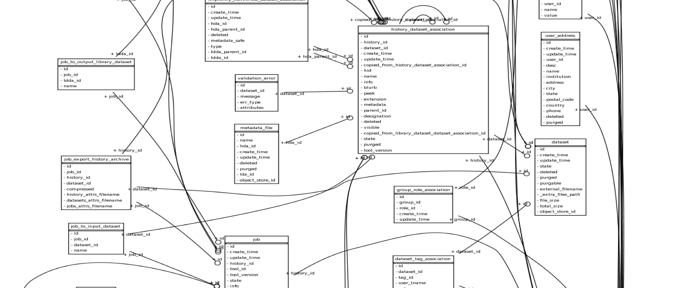

---

### Core components

---

### Core components: run analysis
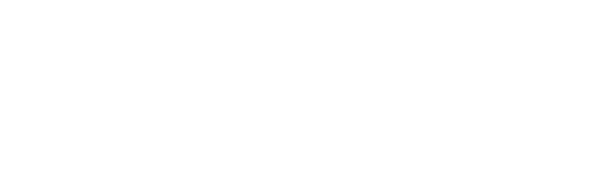

---

### Metadata
Structured data

Different keys/types for different datatypes

Can be used by tools to dynamically control the
 
tool form

---

### Core components: workflow

---

### Core components: workflow run
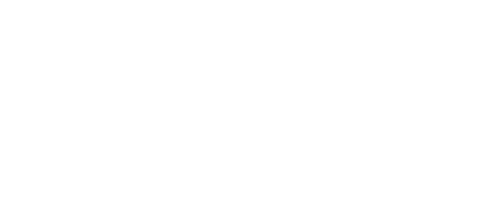

---

### Data Libraries
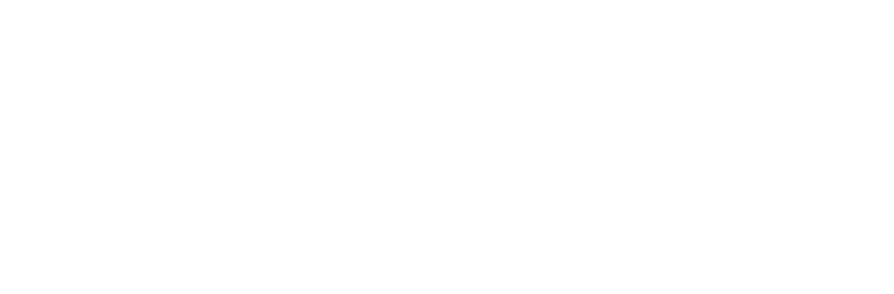

---

### Data Libraries: Permissions
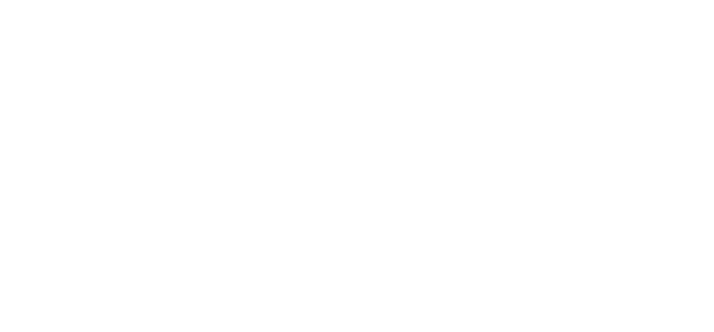

---

### Reference data "cache"
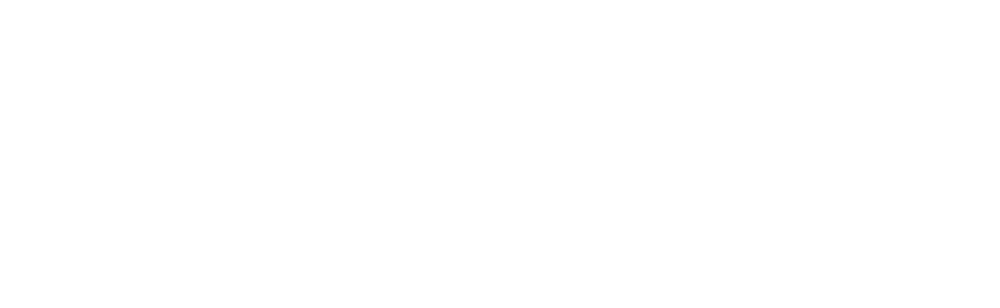

---

### .special2[Visualization Plugins]

Adding new visualizatons to a Galaxy instance:
- Configuration file (XML)
- Base template (Mako)
- Additional static data *if needed* (CSS, JS, ...)

---

### .special2[Visualization Plugins: Charts]
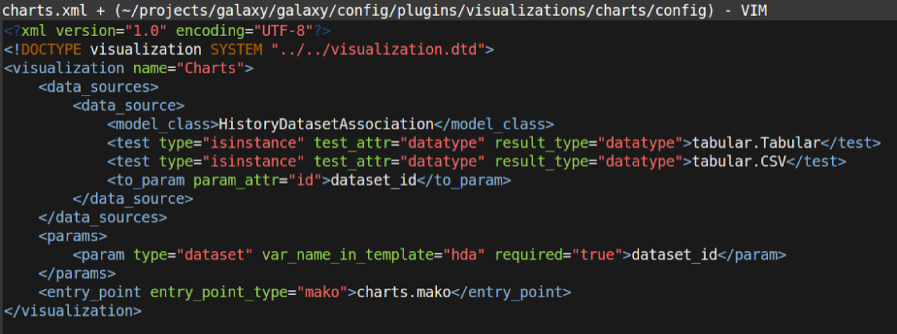

---

### .special2[Visualization Plugins: Data]

How do I *efficiently* access data for my viz?
- Framework provides direct link to read the raw dataset
- *or* use Data providers
    - In config, assert that visualization requires a given type of data provider
    - Data providers process data before sending to browser. Slice, filter, reformat, ...

---

### .special2[Interactive Environments]
Galaxy side is identical to interactive
 
environments: config and base template
- Within the base template, launch a Docker container running a web accessible process
- Build a UI that accesses that process through a proxy

---

### .special2[Dataset Collections]
Hundreds or **thousands** of similar datasets are
 
unwiedly, how do you get a handle on them?
- Group datasets into a single unit
- Perform complex operations on that unit
    - Operations are performed on each group element
    - Output of each operation is a new group

---

---

### Map/reduce in workflows
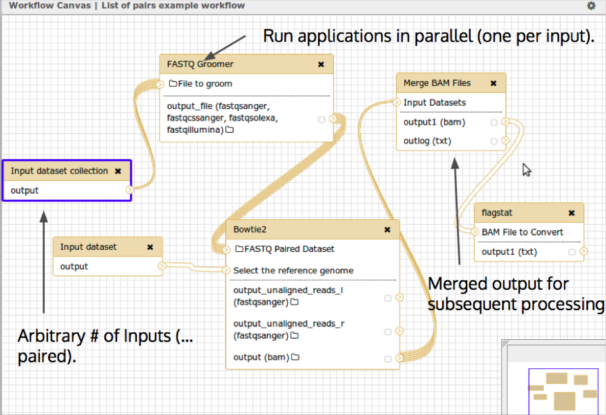

---

### Histories

---

### .special2[Dataset Collections]
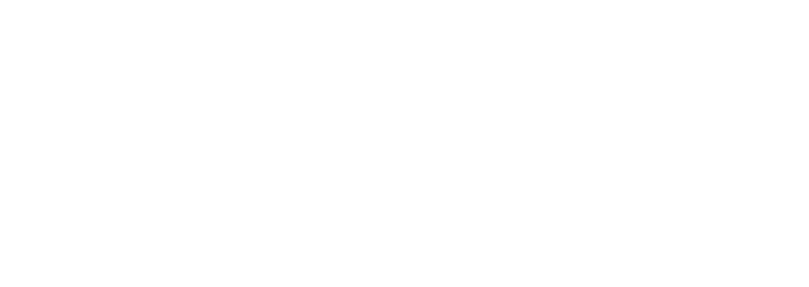

---

### Object Store
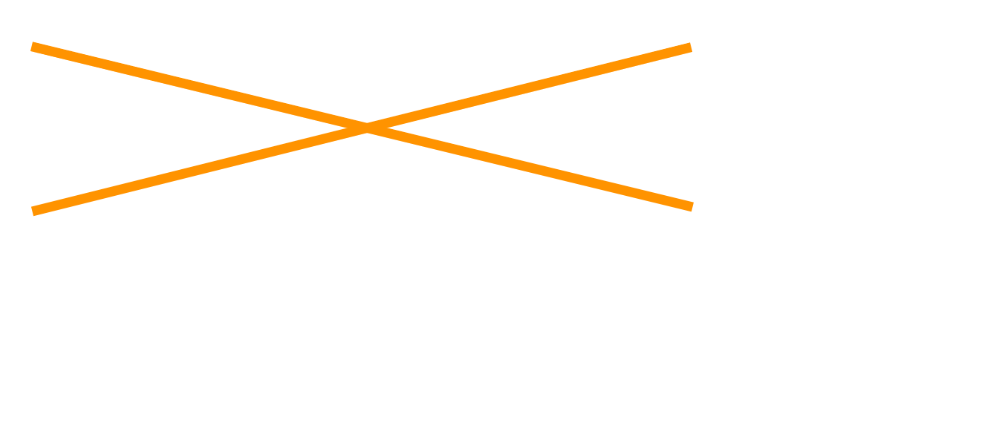

---

### Object Store
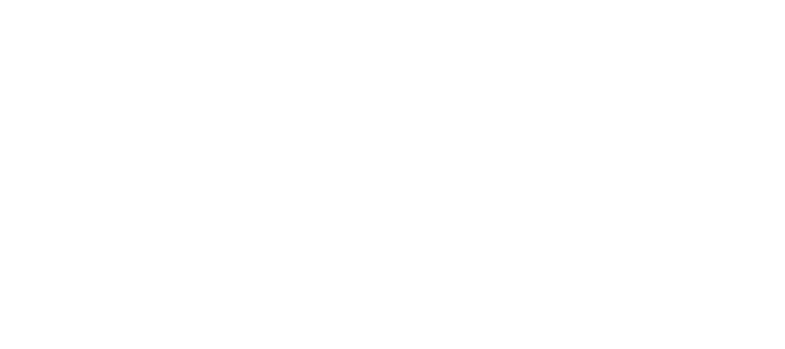

---

## 4. Galaxy startup

---

### Pre-startup

---

### First run: Initialize configs

---

### First run: Fetch eggs

---

### Every run: Load the application

---

### Every run: Load database migrations

---

### First run: Initialize database

---

Everything after here happens every time

---

### Load tool migrations

---

### Load datatypes

---

### Load datatypes sniffers

---

### Load build (display) sites

---

### Load data tables

---

### Read job configuration file

* config/job_conf.xml will automatically be read if created, see
 
job_conf_xml.sample_advanced for fully documented examples of all
 
possible configurations

---

### Load tools

* shed_tool_conf.xml is empty on the first run so
 
only tools provided with Galaxy are loaded, but
 
after tools are installed from the Tool Shed, they
 
will load here

---

### Associate display apps with datatypes

---

### Load implicit datatype converters

* A few internal operations are defined as tools to allow them to run via Galaxy'
 
s job system, and are loaded here as well

---

### Load visualization plugins

---

### Initialize job handlers

---

### Initialize web controllers

---

### Load WSGI middleware

---

serving on http://127.0.0.1:8080

---

## 5. A Galaxy request

---

### Beginning of request
- TCP connection from client on port 80
- WSGI server is responsible for picking up the
 
connection, parsing HTTP headers, and
 
reformatting them into a dictionary according
 
to the WSGI spec, this dict is called "environ"
- In a default Galaxy install this is *currently*
Paste#http

---

### Middleware
- The WSGI interface is based around function
 
calls: def app( environ, start_response ): ...
- Middleware act as filters, modify the environ
 
and then pass through to the next webapp
- Galaxy uses several middleware components
galaxy.webapps.galaxy.buildapp#wrap_in_middleware
 
error handling, logging, proxy hostname, debug, static, ...

---

### WebApplication (galaxy.web.framework.base#WebApplication)
- Galaxy's custom web framework, shares a lot
 
of ideas with Pylons
- __call__ method supports the WSGI spec
    - Takes environ and creates a wrapper object
     
    GalaxyWebTransaction -- ** this is the ubiquitous trans! **

---

---

---

---

---

---

---

---

---

---

---

---

---

---
