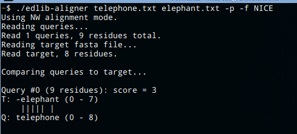

Edlib
=====
[](https://github.com/Martinsos/edlib/releases/latest)
[](https://travis-ci.org/Martinsos/edlib)
[](https://ci.appveyor.com/project/Martinsos/edlib/branch/master)
[](https://gitter.im/Martinsos/edlib)
[](https://doi.org/10.1093/bioinformatics/btw753)

A lightweight and super fast C/C++ library for sequence alignment using [edit distance](https://en.wikipedia.org/wiki/Edit_distance).

Calculating edit distance of two strings is as simple as:
```c
edlibAlign("hello", 5, "world!", 6, edlibDefaultAlignConfig()).editDistance;
```

## Features
* Calculates **edit distance (Levehnstein distance)**.
* It can find **optimal alignment path** (instructions how to transform first sequence into the second sequence).
* It can find just the **start and/or end locations of alignment path** - can be useful when speed is more important than having exact alignment path.
* Supports **multiple [alignment methods](#alignment-methods)**: global(**NW**), prefix(**SHW**) and infix(**HW**), each of them useful for different scenarios.
* You can **extend character equality definition**, enabling you to e.g. have wildcard characters, to have case insensitive alignment or to work with degenerate nucleotides.
* It can easily handle small or **very large sequences**, even when finding alignment path, while consuming very little memory.
* **Super fast** thanks to Myers's bit-vector algorithm.

Edlib is also available for **Python** [](https://pypi.python.org/pypi/edlib) and **Node.js** [](https://www.npmjs.com/package/node-edlib).


## Contents
- [Features](#features)
- [Building](#building)
- [Using Edlib in your project](#using-edlib-in-your-project)
- [Usage and examples](#usage-and-examples)
- [API documentation](#api-documentation)
- [Alignment methods](#alignment-methods)
- [Aligner](#aligner)
- [Running tests](#running-tests)
- [Time and space complexity](#time-and-space-complexity)
- [Test data](#test-data)
- [Development and contributing](#development-and-contributing)
- [Publication](#publication)
- [Acknowledgements](#acknowledgements)


## Building
Edlib uses CMAKE to build libraries (static and shared) and binaries (apps and tests).
Execute following commands to build Edlib using CMAKE:

1. `cd build`
2. `cmake -D CMAKE_BUILD_TYPE=Release ..`
3. `make`

This will create binaries in `bin/` directory and libraries (static and shared) in `lib/` directory.
You can run `./bin/runTests` to confirm that it works!

Optionally, you can run `sudo make install` to install edlib library on your machine (on Linux, this will usually install it to `usr/local/lib` and `usr/local/include`).

You may also install edlib using Conda [](https://conda.anaconda.org/bioconda): `conda install edlib`.


## Using Edlib in your project
You can use Edlib in you project by either directly copying header and source files from [edlib/](edlib/), or by linking Edlib library (see [Building](#building) for instructions how to build Edlib libraries).
In any case, only thing that you have to do in your source files is to include `edlib.h`.

To get you started quickly, let's take a look at a few ways to get simple Hello World project working.

Our Hello World project has just one source file, `helloWorld.cpp` file, and it looks like this:
```cpp
#include <cstdio>
#include "edlib.h"

int main() {
    EdlibAlignResult result = edlibAlign("hello", 5, "world!", 6, edlibDefaultAlignConfig());
    if (result.status == EDLIB_STATUS_OK) {
        printf("edit_distance('hello', 'world!') = %d\n", result.editDistance);
    }
    edlibFreeAlignResult(result);
}
```

Running it should output `edit_distance('hello', 'world!') = 5`.

### Approach #1: Directly copying edlib source and header files.
Here we directly copied [edlib/](edlib/) directory to our project, to get following project structure:
```
edlib/  -> copied from edlib/
  include/
    edlib.h
  src/
    edlib.cpp
helloWorld.cpp -> your program
```

Since `helloWorld` is a c++ program, we can compile it with just one line: `c++ helloWorld.cpp edlib/src/edlib.cpp -o helloWorld -I edlib/include`.

If hello world was a C program, we would compile it like this:
```
    c++ -c edlib/src/edlib.cpp -o edlib.o -I edlib/include
    cc -c helloWorld.c -o helloWorld.o -I edlib/include
    c++ helloWorld.o edlib.o -o helloWorld
```

### Approach #2: Copying edlib header file and static library.
Instead of copying edlib source files, you could copy static library (check [Building](#building) on how to create static library). We also need to copy edlib header files. We get following project structure:
```
edlib/  -> copied from edlib
  include/
    edlib.h
  edlib.a
helloWorld.cpp -> your program
```

Now you can compile it with `c++ helloWorld.cpp -o helloWorld -I edlib/include -L edlib -ledlib_static`.

### Approach #3: Install edlib library on machine.
Alternatively, you could avoid copying any Edlib files and instead install libraries by running `sudo make install` (check [Building](#building)). Now, all you have to do to compile your project is `c++ helloWorld.cpp -o helloWorld -ledlib`.
If you get error message like `cannot open shared object file: No such file or directory`, make sure that your linker includes path where edlib was installed.

### Approach #4: Use edlib in your project via CMake.
If you are using CMake for compilation, we suggest adding edlib as a git submodule with the command `git submodule add https://github.com/martinsos/edlib vendor/edlib`. Afterwards, modify your top level CMakeLists.txt file accordingly:
```
add_subdirectory(vendor/edlib EXCLUDE_FROM_ALL)
target_link_libraries(your_exe edlib) # or target_link_libraries(your_exe edlib_static)
```
The `add_subdirectory` command adds a folder to the build tree, meaning it will run CMakeLists.txt from the included folder as well. Flag `EXCLUDE_FROM_ALL` disables building (and instalment) of targets in the added folder which are not needed in your project. In the above example only the library `edlib` (or `edlib_static`) will be build, while `edlib-aligner`, `hello_world` and the rest won't. In order to access the `edlib` API, add `#include "edlib.h"` in your source file (CMake will automatically update your include path).


For more example projects take a look at applications in [apps/](apps/).


## Usage and examples
Main function in edlib is `edlibAlign`. Given two sequences (and their lengths), it will find edit distance, alignment path or its end and start locations.

```c
char* query = "ACCTCTG";
char* target = "ACTCTGAAA"
EdlibAlignResult result = edlibAlign(query, 7, target, 9, edlibDefaultAlignConfig());
if (result.status == EDLIB_STATUS_OK) {
    printf("%d", result.editDistance);
}
edlibFreeAlignResult(result);
```

### Configuring edlibAlign()
`edlibAlign` takes configuration object (it is a struct `EdlibAlignConfig`), which allows you to further customize how alignment will be done. You can choose [alignment method](#alignment-methods), tell edlib what to calculate (just edit distance or also path and locations) and set upper limit for edit distance.

For example, if you want to use infix(HW) alignment method, want to find alignment path (and edit distance), are interested in result only if edit distance is not larger than 42 and do not want to extend character equality definition, you would call it like this:
```c
edlibAlign(seq1, seq1Length, seq2, seq2Length,
           edlibNewAlignConfig(42, EDLIB_MODE_HW, EDLIB_TASK_PATH, NULL, 0));
```
Or, if you want to use suffix(SHW) alignment method, want to find only edit distance, do not have any limits on edit distance and want character '?' to match both itself and characters 'X' and 'Y', you would call it like this:
```c
EdlibEqualityPair additionalEqualities[2] = {{'?', 'X'}, {'?', 'Y'}};
edlibAlign(seq1, seq1Length, seq2, seq2Length,
           edlibNewAlignConfig(-1, EDLIB_MODE_SHW, EDLIB_TASK_DISTANCE, additionalEqualities, 2));
```

We used `edlibNewAlignConfig` helper function to easily create config, however we could have also just created an instance of it and set its members accordingly.

### Handling result of edlibAlign()
`edlibAlign` function returns a result object (`EdlibAlignResult`), which will contain results of alignment (corresponding to the task that you passed in config).

```c
EdlibAlignResult result = edlibAlign(seq1, seq1Length, seq2, seq2Length,
                                     edlibNewAlignConfig(-1, EDLIB_MODE_HW, EDLIB_TASK_PATH, NULL, 0));
if (result.status == EDLIB_STATUS_OK) {
    printf("%d\n", result.editDistance);
    printf("%d\n", result.alignmentLength);
    printf("%d\n", result.endLocations[0]);
}
edlibFreeAlignResult(result);
```

It is important to remember to free the result object using `edlibFreeAlignResult` function, since Edlib allocates memory on heap for certain members. If you decide to do the cleaning manually and not use `edlibFreeAlignResult`, do not forget to manually `free()` required members.

### Turning alignment to cigar
Cigar is a standard way to represent alignment path.
Edlib has helper function that transforms alignment path into cigar.
```c
char* cigar = edlibAlignmentToCigar(result.alignment, result.alignmentLength, EDLIB_CIGAR_STANDARD);
printf("%s", cigar);
free(cigar);
```

## API documentation

For complete documentation of Edlib library API, visit [http://martinsos.github.io/edlib](https://martinsos.github.io/edlib) (should be updated to the latest release).

To generate the latest API documentation yourself from the source, you need to have [doxygen](www.doxygen.org) installed.
Position yourself in the root directory and run `doxygen`, this will generate `docs/` directory. Then open `docs/html/index.html` file with you favorite browser.

Alternatively, you can directly check [edlib.h](edlib/include/edlib.h).

## Alignment methods

Edlib supports 3 alignment methods:
* **global (NW)** - This is the standard method, when we say "edit distance" this is the method that is assumed.
  It tells us the smallest number of operations needed to transform first sequence into second sequence.
  *This method is appropriate when you want to find out how similar is first sequence to second sequence.*
* **prefix (SHW)** - Similar to global method, but with a small twist - gap at query end is not penalized. What that means is that deleting elements from the end of second sequence is "free"!
  For example, if we had `AACT` and `AACTGGC`, edit distance would be 0, because removing `GGC` from the end of second sequence is "free" and does not count into total edit distance.
  *This method is appropriate when you want to find out how well first sequence fits at the beginning of second sequence.*
* **infix (HW)**: Similar as prefix method, but with one more twist - gaps at query end **and start** are not penalized. What that means is that deleting elements from the start and end of second sequence is "free"!
  For example, if we had `ACT` and `CGACTGAC`, edit distance would be 0, because removing `CG` from the start and `GAC` from the end of second sequence is "free" and does not count into total edit distance.
  *This method is appropriate when you want to find out how well first sequence fits at any part of second sequence.* For example, if your second sequence was a long text and your first sequence was a sentence from that text, but slightly scrambled, you could use this method to discover how scrambled it is and where it fits in that text.
  *In bioinformatics, this method is appropriate for aligning read to a sequence.*


## Aligner
Edlib comes with a standalone aligner cli app, which can be found at [apps/aligner/](apps/aligner).



Aligner reads sequences from fasta files, and it can display alignment path in graphical manner or as a cigar.
It also measures calculation time, so it can be useful for testing speed and comparing Edlib with other tools.

Check [Building](#building) to see how to build binaries (including `edlib-aligner`).
Run `./build/bin/edlib-aligner` with no params for help and detailed instructions.

Example of usage:
`./build/bin/edlib-aligner -p apps/aligner/test_data/query.fasta apps/aligner/test_data/target.fasta`

**NOTE**: Aligner currently does not work on Windows, because it uses `getopt` to parse command line arguments, which is not supported on Windows.


## Running tests
Check [Building](#building) to see how to build binaries (including binary `runTests`).
To run tests, just run `./runTests`. This will run random tests for each alignment method, and also some specific unit tests.


## Time and space complexity
Edlib is based on [Myers's bit-vector algorithm](http://www.gersteinlab.org/courses/452/09-spring/pdf/Myers.pdf) and extends from it.
It calculates a dynamic programming matrix of dimensions `Q x T`, where `Q` is the length of the first sequence (query), and `T` is the length of the second sequence (target). It uses Ukkonen's banded algorithm to reduce the space of search, and there is also parallelization from Myers's algorithm, however time complexity is still quadratic.
Edlib uses Hirschberg's algorithm to find alignment path, therefore space complexity is linear.

Time complexity: `O(T * Q)`.

Space complexity: `O(T + Q)`.

It is worth noting that Edlib works best for large, similar sequences, since such sequences get the highest speedup from banded approach and bit-vector parallelization.


## Test data
In [test_data/](test_data) directory there are different genome sequences, ranging from 10 kbp to 5 Mbp in length. They are ranging in length and similarity, so they can be useful for testing and measuring speed in different scenarios.


## Development and contributing
Feel free to send pull requests and raise issues.

When developing, you may want to use `-D CMAKE_BUILD_TYPE=Debug` flag when calling `cmake` in order to get debugging flags passed to compiler. This should also happen if you just run `cmake ..` with no flags, but I think I have noticed it does not always works as expected (probably has something to do with cmake cache). To check which flags is compiler using, run `make` with `VERBOSE=1`: `make VERBOSE=1`.


## Publication

Martin Šošić, Mile Šikić; Edlib: a C/C ++ library for fast, exact sequence alignment using edit distance. Bioinformatics 2017 btw753. doi: [10.1093/bioinformatics/btw753](https://doi.org/10.1093/bioinformatics/btw753)


## Acknowledgements

Mile Šikić (@msikic) - Mentoring and guidance through whole project.

Ivan Sović (@isovic) - Help with testing and prioritizing features, valuable comments on the manuscript.
